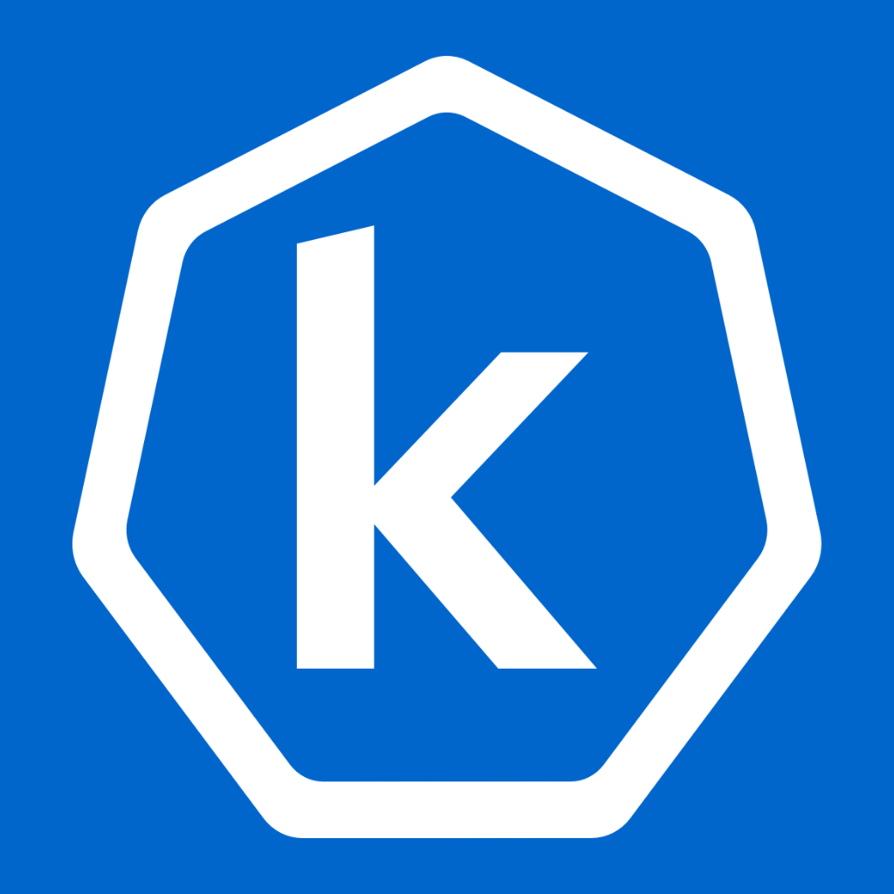

  
    

  kobs is an **application-centric** observability platform for your **Kubernetes and Cloud** workloads, based on Custom Resource Definitions.

  

kobs brings your metrics, logs, traces and Kubernetes into one place, to provide a better observability for your applications running in your clusters. kobs provides various Custom Resource Definition with which you can describe and group your applications across multiple clusters. You can extend kobs via plugin, to customize it for your needs or you can use one of the available plugins to improve your developer experience.

## Features

- **Multi-Cluster Support:** kobs has built-in multi cluster support. The clusters are configured via the available [providers](https://kobs.io/main/configuration/clusters/#provider).
- **Manage all your Kubernetes Resources:** All major resources like Deployments, StatefulSets, DaemonSets, Pods, etc. are supported.
- **Custom Resource Definitions:** View all Custom Resource Definitions and mange Custom Resources.
- **Modify Resources:** Edit and delete all available resources or scale your Deployments and StatefulSets.
- **Resource Usage, Logs and Terminal:** View the CPU and Memory usage and logs of your Pods or exec into them.
- **Topology:** Add your applications, teams and users to kobs via the available Custom Resource Definitions or create dashboards to see how your applications are connected.
- **Extendible:** Customize your kobs instance via plugins.
- **Prometheus:** Access your Prometheus directly in kobs next to your Kubernetes resources.
- **Elasticsearch and Jaeger:** View the logs from Elasticsearch and traces from Jaeger, where it matters.
- **Istio:** Get the topology graph from Kiali for your Istio service mesh directly in kobs.
- **Authentication and Authorization:** Manage the access to kobs via OIDC and provide your developers the permissions they need via Teams and Users CRs.

## Contributing

Every contribution to kobs is welcome, whether it is reporting a bug, submitting a fix, proposing new features or becoming a maintainer. To make contributing to kobs as easy as possible you will find more details for the development flow in our [Contribution Guideline](https://github.com/kobsio/kobs/blob/master/CONTRIBUTING.md).

Please also follow our [Code of Conduct](https://github.com/kobsio/kobs/blob/master/CODE_OF_CONDUCT.md) in all your interactions with the project.

## Sponsors

<table>
  <tr>
    <td>
      
    </td>
    <td>
      <b>Staffbase GmbH</b>
       Staffbase is an internal communications platform built to revolutionize the way you work and unite your company. Staffbase is hiring: <a href="https://jobs.staffbase.com" target="_blank" rel="noreferrer">jobs.staffbase.com</a>
       <a href="https://github.com/Staffbase" target="_blank" rel="noreferrer">GitHub</a> | <a href="https://staffbase.com/" target="_blank" rel="noreferrer">Website</a> | <a href="https://jobs.staffbase.com" target="_blank" rel="noreferrer">Jobs</a>
    </td>
  </tr>
</table>
