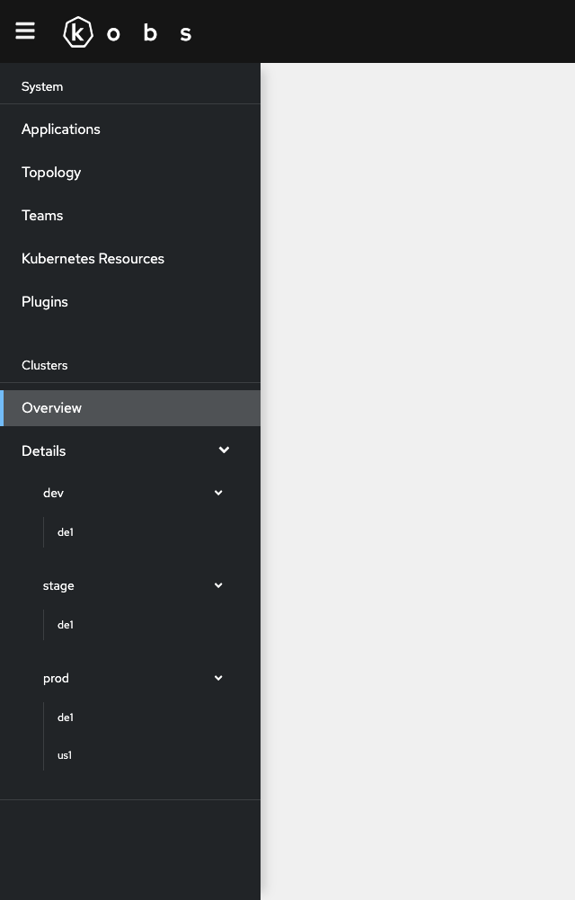

# Navigation

The sidebar of kobs can be extended with custom navigation items. The navigation groups and items are configured in the [`hub configuration file`](./hub.md). The navigation items can be used to directly link to a configured dashboard.

The following example adds a new group named "Clusters" to the sidebar. This group contains an "Overview" and "Details" item. While the "Overview" item contains a link to the `clusters-overview` dashboard the "Details" item contains a link to the `clusters-details` dashboard for multiple clusters.

```yaml
api:
  navigation:
    groups:
      - title: Clusters
        items:
          - title: Overview
            dashboard:
              satellite: kobs
              cluster: kobs
              namespace: kobs
              name: clusters-overview
          - title: Details
            childs:
              - title: dev
                childs:
                  - title: de1
                    dashboard:
                      satellite: kobs
                      cluster: kobs
                      namespace: kobs
                      name: clusters-details
                      placeholders:
                        cluster: dev-de1
              - title: stage
                childs:
                  - title: de1
                    dashboard:
                      satellite: kobs
                      cluster: kobs
                      namespace: kobs
                      name: clusters-details
                      placeholders:
                        cluster: stage-de1
              - title: prod
                childs:
                  - title: de1
                    dashboard:
                      satellite: kobs
                      cluster: kobs
                      namespace: kobs
                      name: clusters-details
                      placeholders:
                        cluster: prod-de1
                  - title: us1
                    dashboard:
                      satellite: kobs
                      cluster: kobs
                      namespace: kobs
                      name: clusters-details
                      placeholders:
                        cluster: prod-us1

```


