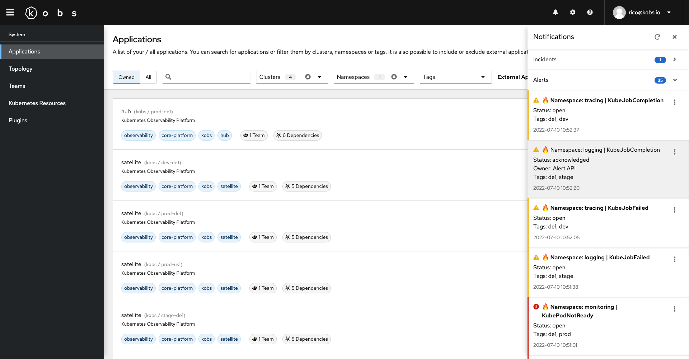

# Notifications

It is possible to show notifications within kobs. Notifications are configured in the [`hub configuration file`](./hub.md). They can be retrieved via supported [plugins](#plugins). When notifications are configured a new **notification bell** icon will be displayed in the header. When a user clicks on this icon a drawer with the configured notifications will be shown.

The global notification settings can be overwritten via a [User CR](../../resources/users.md) or [Team CR](../../resources/teams.md). The ranking of the used notifications is as follow: If a user has a CR with a list of defined notification groups, these groups are used. If a user does not have any specific notification groups, the groups of the teams he is part of will be used. If none of these conditions match the global notification groups from the configuration file are used.



The following example uses the Opsgenie plugin to show all open alerts and incidents and the RSS plugin to show the status of GitHub.

```yaml
api:
  notifications:
    groups:
      - title: Incidents
        plugin:
          satellite: global
          name: opsgenie
          type: opsgenie
          options:
            type: incidents
            query: "status: open"
      - title: Alerts
        plugin:
          satellite: global
          name: opsgenie
          type: opsgenie
          options:
            type: alerts
            query: "status: open"
      - title: GitHub Status
        plugin:
          satellite: global
          name: rss
          type: rss
          options:
            urls:
              - https://www.githubstatus.com/history.rss
      - title: Unhealthy Workloads
        plugin:
          name: resources
          type: app
          options:
            satellites:
              - dev-de1
            clusters:
              - dev-de1
            namespaces:
              - ""
            resources:
              - pods
            filter: $.status.containerStatuses[?(@.state.waiting || @.state.terminated && @.state.terminated.reason!='Completed')]
```

Each plugin is identified by a `satellite`, `name` and `type`. The options for each plugin can be found in the **Notification Options** section of the corresponding plugin documentation.
