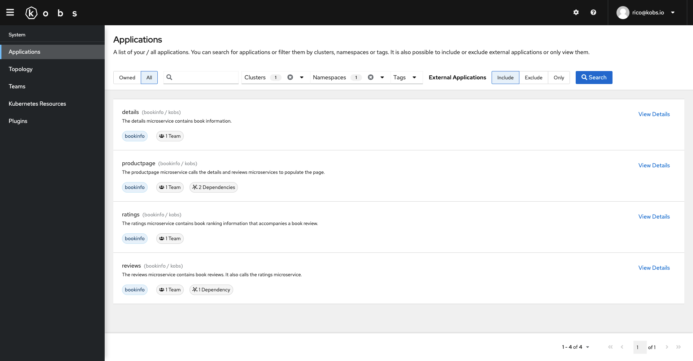
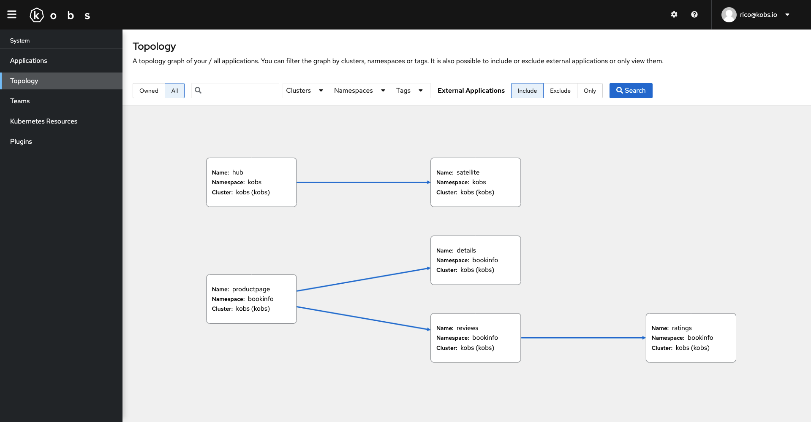
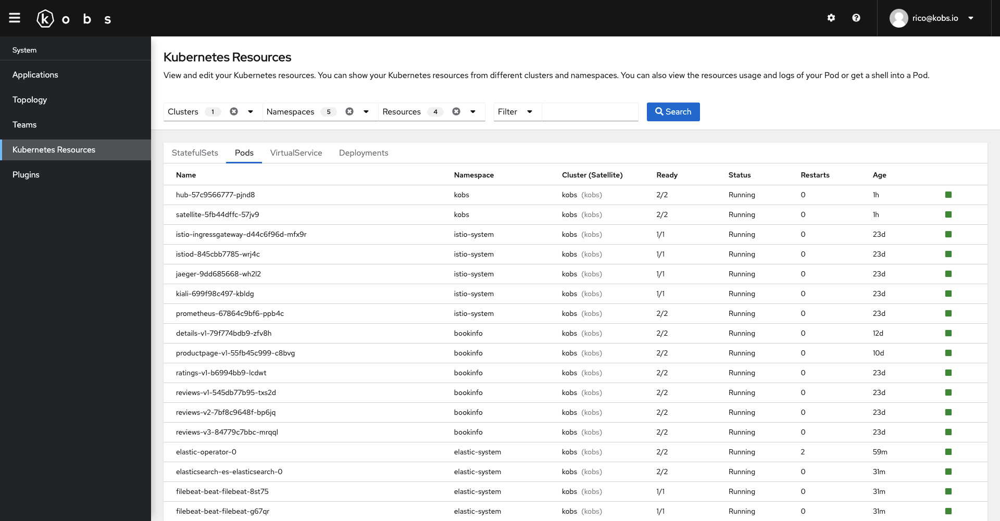
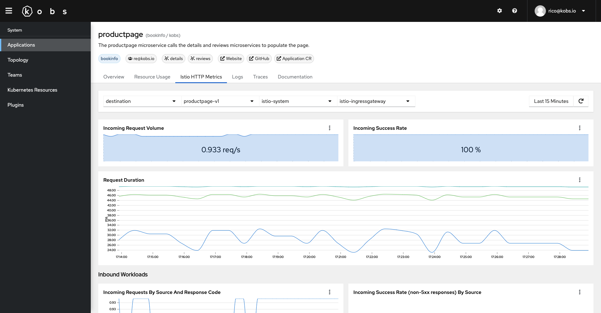
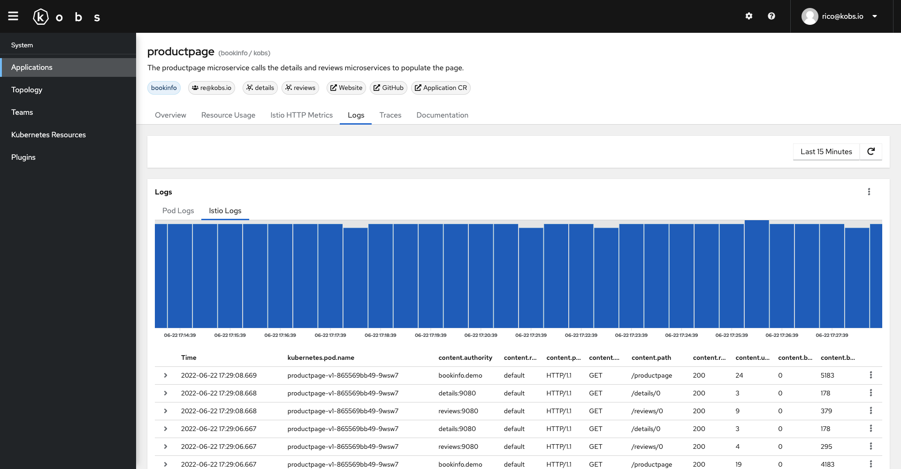
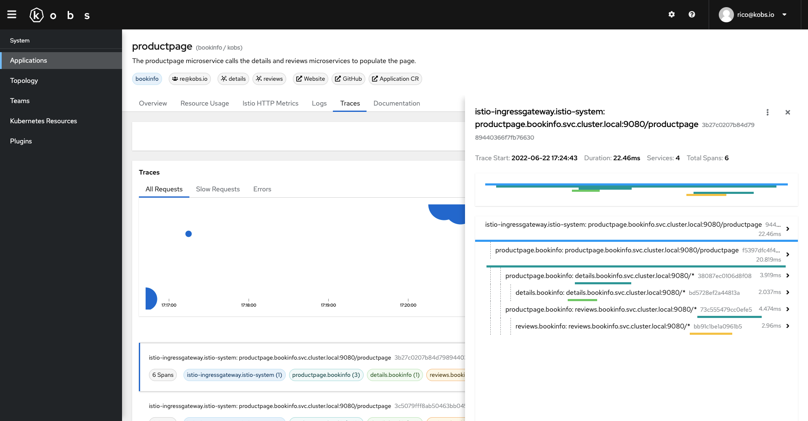
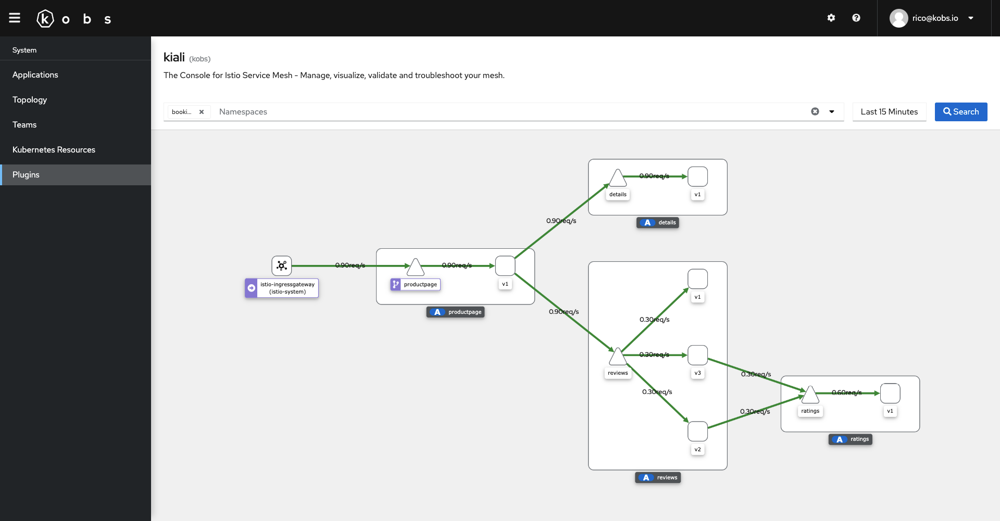

# Demo

The kobs demo can be used to try out the kobs. Within the demo you will deploy [Istio](https://istio.io) via the [Istio Operator](https://istio.io/latest/docs/setup/install/operator/), [Prometheus](https://prometheus.io), [Elasticsearch](https://www.elastic.co/guide/en/cloud-on-k8s/current/k8s-quickstart.html), [Jaeger](https://www.jaegertracing.io), [Kiali](https://kiali.io) and the [Bookinfo Application](https://istio.io/latest/docs/examples/bookinfo/).

## Create a Kubernetes Cluster using Kind

The demo uses [kind](https://kind.sigs.k8s.io) to create a local Kubernetes cluster, to deploy the mentioned services.

!!! note
    If you are using [minikube](https://minikube.sigs.k8s.io/docs/), please check the minikube and Istio documentation to expose kobs and the Bookinfo Application to access them via your browser.

To create a Kubernetes cluster using kind your can run the [`kind-with-registry.sh`](https://github.com/kobsio/kobs/blob/main/deploy/demo/kind-with-registry.sh) script. The script will create a kind cluster with one node, configures a local Docker registry and sets the correct port mappings, so that you can access kobs via your browser later.

```sh
deploy/demo/kind-with-registry.sh
```

When your cluster is ready, you should see the following message:

```txt
Creating cluster "kobs" ...
 ✓ Ensuring node image (kindest/node:v1.19.1) 🖼
 ✓ Preparing nodes 📦
 ✓ Writing configuration 📜
 ✓ Starting control-plane 🕹️
 ✓ Installing CNI 🔌
 ✓ Installing StorageClass 💾
Set kubectl context to "kind-kobs"
You can now use your cluster with:

kubectl cluster-info --context kind-kobs
```

To use the cluster you can switch your `kubectl` context using `kubectl cluster-info --context kind-kobs`.

## Install all Services

Now we can deploy the [metrics-server](https://github.com/kubernetes-sigs/metrics-server) and the [kube-state-metrics](https://github.com/kubernetes/kube-state-metrics) to get some Prometheus metrics:

```sh
kustomize build deploy/demo/kube-system | kubectl apply -f -
```

When the `metrics-server` and `kube-state-metrics` are ready, we can continue with the `istio-operator` and `istio-system` namespace. Within the `istio-system` namespace we are also deploying Prometheus, Jaeger and Kiali:

```sh
kustomize build deploy/demo/istio-operator | kubectl apply -f -
kustomize build deploy/demo/istio-system | kubectl apply -f -
```

When Istio is up and running, we can install Elasticsearch and Filebeat to collect the logs in the kind cluster:

```sh
kustomize build deploy/demo/elastic-system | kubectl apply -f -
```

Once all our observability tools are ready we can deploy the bookinfo applications:

```sh
kustomize build deploy/demo/bookinfo | kubectl apply -f -
```

Finally we are deploying the Custom Resource Definitions for kobs and the hub and satellite component:

```sh
kustomize build deploy/kustomize/crds | kubectl apply -f -
kustomize build deploy/demo/kobs/main | kubectl apply -f -
```

If all components were installed correctly you can run `kubectl get pods -A` to get a list of all Pods. The output should look similar to the following:

```txt
NAMESPACE            NAME                                              READY   STATUS    RESTARTS   AGE
bookinfo             details-v1-789f56cd8f-qwhmp                       2/2     Running   0          2m10s
bookinfo             productpage-v1-58889757cf-75f4z                   2/2     Running   0          2m10s
bookinfo             ratings-v1-6bb88c887c-4p7gd                       2/2     Running   0          2m10s
bookinfo             reviews-v1-6d9cd465c6-znl5z                       2/2     Running   0          2m10s
bookinfo             reviews-v2-5b5f79977b-gzwxh                       2/2     Running   0          2m10s
bookinfo             reviews-v3-57cd59df96-5vtfw                       2/2     Running   0          2m10s
elastic-system       elastic-operator-0                                2/2     Running   0          8m10s
elastic-system       elasticsearch-es-elasticsearch-0                  2/2     Running   0          7m8s
elastic-system       filebeat-beat-filebeat-bjd5s                      1/1     Running   0          7m7s
istio-operator       istio-operator-86cd56f99f-g6n9k                   1/1     Running   0          10m
istio-system         istio-ingressgateway-74fbb47646-z7nz7             1/1     Running   0          9m54s
istio-system         istiod-7c8d96f664-nvlgb                           1/1     Running   0          10m
istio-system         jaeger-7f78b6fb65-mg5tz                           1/1     Running   0          10m
istio-system         kiali-85c8cdd5b5-4r5mw                            1/1     Running   0          10m
istio-system         prometheus-69f7f4d689-fcqmt                       2/2     Running   0          10m
kobs                 kobs-69995cbd79-6z4nl                             2/2     Running   0          2m39s
kube-system          coredns-f9fd979d6-7gmkr                           1/1     Running   0          12m
kube-system          coredns-f9fd979d6-7j79d                           1/1     Running   0          12m
kube-system          etcd-kobs-control-plane                           1/1     Running   0          12m
kube-system          kindnet-55dl6                                     1/1     Running   0          12m
kube-system          kube-apiserver-kobs-control-plane                 1/1     Running   0          12m
kube-system          kube-controller-manager-kobs-control-plane        1/1     Running   0          12m
kube-system          kube-proxy-4ppq2                                  1/1     Running   0          12m
kube-system          kube-scheduler-kobs-control-plane                 1/1     Running   0          12m
kube-system          kube-state-metrics-5f694c7886-dbvfw               1/1     Running   0          12m
kube-system          metrics-server-6778f49766-x88mz                   1/1     Running   0          12m
local-path-storage   local-path-provisioner-78776bfc44-59fhc           1/1     Running   0          12m
```

## Access kobs and the Bookinfo Application

If you want to access kobs and the Bookinfo Application via your browser, you have to add the following entries to your `/etc/hosts` file:

```txt
127.0.0.1 kobs.demo
127.0.0.1 bookinfo.demo
```

After you have adjusted the hosts file, you can open [http://bookinfo.demo/productpage](http://bookinfo.demo/productpage) in your browser. You should see the productpage for the Bookinfo Application. When you refresh the page, the reviews section of the page should change with every request. To generate some traffic to get more metrics, logs and traces you can run the following command in your terminal:

```sh
while :; do curl -s "http://bookinfo.demo/productpage" | grep -o "<title>.*</title>"; sleep 1; done
```

Now you can take a look at kobs. Open [http://kobs.demo](http://kobs.demo) to view the kobs UI.

<figure markdown>
  
  <figcaption>On the applications page, you can view all the applications in the bookinfo namespace</figcaption>
</figure>

<figure markdown>
  
  <figcaption>On the topology page, you can view the topology of the bookinfo and kobs applications</figcaption>
</figure>

<figure markdown>
  
  <figcaption>On the Kubernetes resources page, you can view all deployed Kubernetes resources</figcaption>
</figure>

<figure markdown>
  
  <figcaption>On the details page of the productpage application you can view the Istio request metrics in the Istio HTTP Metrics dashboard</figcaption>
</figure>

<figure markdown>
  
  <figcaption>On the details page of the productpage application you can view the Istio access log in the Logs dashboard</figcaption>
</figure>

<figure markdown>
  
  <figcaption>On the details page of the productpage application you can view all traces in the Traces dashboard</figcaption>
</figure>

<figure markdown>
  
  <figcaption>On the page of the Kiali plugin you can view the topology graph generated by Kiali</figcaption>
</figure>

## Cleanup

To delete the created Kubernetes cluster and the local Docker registry, when you are done with the demo, you can run the following commands. This will delete the kind cluster and the Docker container for the local Docker registry:

```sh
kind delete cluster --name kobs
docker stop kind-registry
docker rm kind-registry
```
