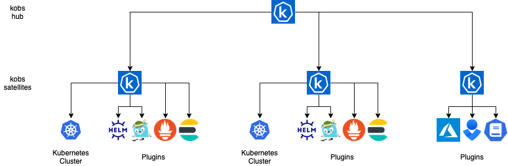

# Getting Started

**kobs** consists of two components, which are named hub and satellite. A **satellite** can be used to access the Kubernetes API and several services via plugins. To access one or multiple satellites the **hub** component is required. It connects to one or multiple satellites to work with the Kubernetes resources or to access the data served by plugins. It also watches the satellites for our resources like Applications, Teams, Users and Dashboards. The hub is also responsible for serving the UI for kobs.

