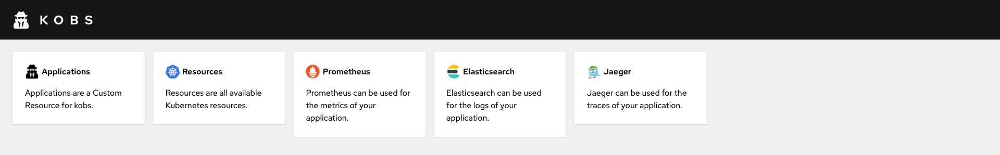
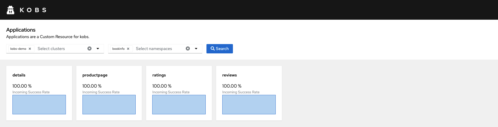
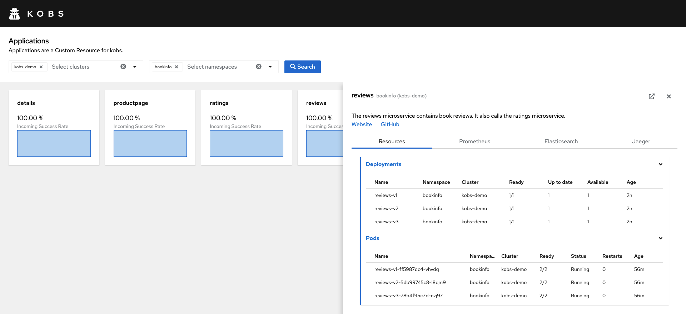
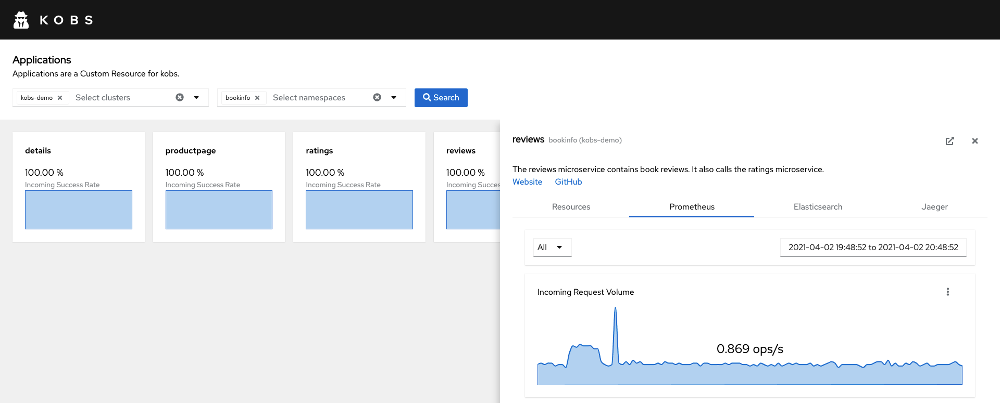
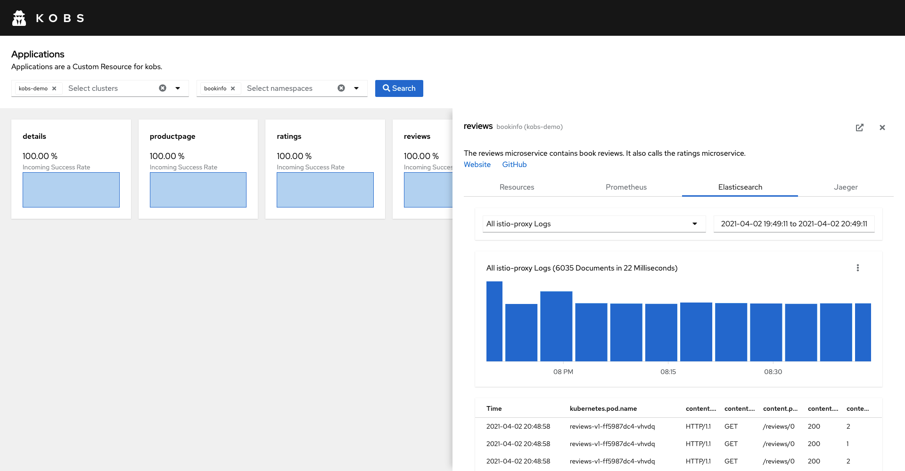
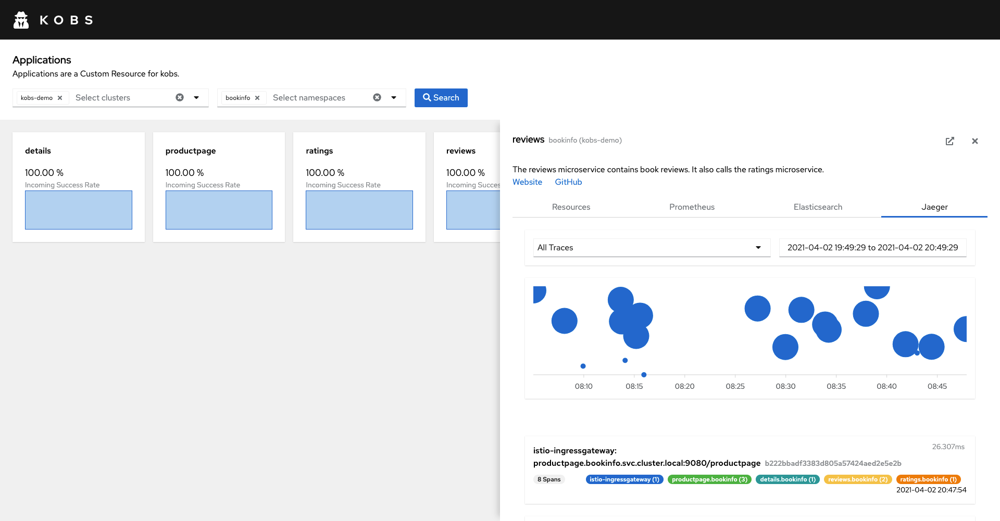

# Demo

The kobs demo can be used to try out the kobs. Within the demo you will deploy [Istio](https://istio.io) via the [Istio Operator](https://istio.io/latest/docs/setup/install/operator/), [Prometheus](https://prometheus.io), [Elasticsearch](https://www.elastic.co/guide/en/cloud-on-k8s/current/k8s-quickstart.html), [Jaeger](https://www.jaegertracing.io) and the [Bookinfo Application](https://istio.io/latest/docs/examples/bookinfo/).

## Create a Kubernetes Cluster using Kind

The demo uses [kind](https://kind.sigs.k8s.io) to create a local Kubernetes cluster, to deploy the mentioned services.

!!! note
    If you are using [minikube](https://minikube.sigs.k8s.io/docs/), please check the minikube and Istio documentation to expose kobs and the Bookinfo Application to access them via your browser.

To create a Kubernetes cluster using kind your can run the [`kind-with-registry.sh`](https://github.com/kobsio/kobs/blob/main/deploy/demo/kind-with-registry.sh) script. The script will create a kind cluster with one node, configures a local Docker registry and sets the correct port mappings, so that you can access kobs via your browser later.

```sh
curl -s https://raw.githubusercontent.com/kobsio/kobs/main/deploy/demo/kind-with-registry.sh | sh
```

When your cluster is ready, you should see the following message:

```txt
Creating cluster "kobs-demo" ...
 ✓ Ensuring node image (kindest/node:v1.19.1) 🖼
 ✓ Preparing nodes 📦
 ✓ Writing configuration 📜
 ✓ Starting control-plane 🕹️
 ✓ Installing CNI 🔌
 ✓ Installing StorageClass 💾
Set kubectl context to "kind-kobs-demo"
You can now use your cluster with:

kubectl cluster-info --context kind-kobs-demo
```

To use the cluster you can switch your `kubectl` context using `kubectl cluster-info --context kind-kobs-demo`.

## Install all Services

Now we can deploy the CRDs and install the Istio Operator and Istio. We are using Istio to get some nice Prometheus metrics for the Bookinfo Application and for the integration with Jaeger to get some traces. To install the Operator and Istio run the following commands:

```sh
kustomize build github.com/kobsio/kobs/deploy/kustomize/crds | kubectl apply -f -

kustomize build github.com/kobsio/kobs/deploy/demo/istio-operator | kubectl apply -f -
kustomize build github.com/kobsio/kobs/deploy/demo/istio-system | kubectl apply -f -
```

When Istio is up and running, we can install our monitoring tools Prometheus, Elasticsearch and Jaeger to get metrics, logs and traces for the Bookinfo Application.

```sh
kustomize build github.com/kobsio/kobs/deploy/demo/elastic-system | kubectl apply -f -
kustomize build github.com/kobsio/kobs/deploy/demo/observability | kubectl apply -f -
```

The above commands are also installing kobs, with the `incluster` provider and the correct configuration for the Prometheus, Elasticsearch and Jaeger plugin. The complete configuration file looks as follows:

```yaml
clusters:
  providers:
    - provider: incluster
      incluster:
        name: kobs-demo

prometheus:
  - name: Prometheus
    description: Prometheus can be used for the metrics of your application.
    address: http://prometheus:9090

elasticsearch:
  - name: Elasticsearch
    description: Elasticsearch can be used for the logs of your application.
    address: http://elasticsearch-es-http:9200

jaeger:
  - name: Jaeger
    description: Jaeger can be used for the traces of your application.
    address: http://tracing:80/jaeger
```

The last step, befor you can explore the functions of kobs, is to install the Bookinfo Application. The application displays information about a book, similar to a single catalog entry of an online book store. Displayed on the page is a description of the book, book details (ISBN, number of pages, and so on), and a few book reviews. To deploy the application run the following command:

```sh
kustomize build github.com/kobsio/kobs/deploy/demo/bookinfo | kubectl apply -f -
```

If all components were installed correctly you can run `kubectl get pods -A` to get a list of all Pods. The output should look similar to the following:

```txt
NAMESPACE            NAME                                              READY   STATUS    RESTARTS   AGE
bookinfo             details-v1-5d94bc9798-xjfsl                       2/2     Running   0          17m
bookinfo             productpage-v1-64bfdff46-lqkcg                    2/2     Running   0          17m
bookinfo             ratings-v1-999f8486b-wlb6g                        2/2     Running   0          17m
bookinfo             reviews-v1-ff5987dc4-vhvdq                        2/2     Running   0          17m
bookinfo             reviews-v2-5db99745c8-l8qm9                       2/2     Running   0          17m
bookinfo             reviews-v3-78b4f95c7d-nzj97                       2/2     Running   0          17m
elastic-system       elastic-operator-0                                1/1     Running   1          69m
istio-operator       istio-operator-58c65c5cdf-675fh                   1/1     Running   1          69m
istio-system         istio-ingressgateway-66885bb655-h57rh             1/1     Running   0          17m
istio-system         istiod-6cdbf6bdb8-4kq8x                           1/1     Running   0          17m
kube-system          coredns-f9fd979d6-mlb6n                           1/1     Running   0          69m
kube-system          coredns-f9fd979d6-qppmh                           1/1     Running   0          69m
kube-system          etcd-kobs-demo-control-plane                      1/1     Running   0          69m
kube-system          kindnet-9ntpr                                     1/1     Running   0          69m
kube-system          kube-apiserver-kobs-demo-control-plane            1/1     Running   0          69m
kube-system          kube-controller-manager-kobs-demo-control-plane   1/1     Running   1          69m
kube-system          kube-proxy-wlr26                                  1/1     Running   0          69m
kube-system          kube-scheduler-kobs-demo-control-plane            1/1     Running   1          69m
local-path-storage   local-path-provisioner-78776bfc44-zgrj4           1/1     Running   0          69m
observability        elasticsearch-es-elasticsearch-0                  2/2     Running   0          63m
observability        filebeat-beat-filebeat-5q8bd                      1/1     Running   0          42m
observability        jaeger-cb4d9756b-smdfc                            1/1     Running   0          63m
observability        kobs-6ff8d96b7b-tbs5v                             2/2     Running   0          63m
observability        prometheus-77bc9df5dc-dzbqq                       2/2     Running   0          63m
```

## Access kobs and the Bookinfo Application

If you want to access kobs and the Bookinfo Application via your browser, you have to add the following entries to your `/etc/hosts` file:

```txt
127.0.0.1 kobs.demo
127.0.0.1 bookinfo.demo
```

After you have adjusted the hosts file, you can open [http://bookinfo.demo/productpage](http://bookinfo.demo/productpage) in your browser. You should see the productpage for the Bookinfo Application. When you refresh the page, the reviews section of the page should change with every request. To generate some traffic to get more metrics, logs and traces you can run the following command in your terminal:

```sh
while :; do curl -s "http://bookinfo.demo/productpage" | grep -o "<title>.*</title>"; sleep 1; done
```

Now you can take a look at kobs. Open [http://kobs.demo](http://kobs.demo) to view the kobs frontend. You should see the home page with the five items:

- **Applications:** Is the section to view all applications, which are define via the Application CRD.
- **Resources:** Can be used to view all Kubernetes resources, like Deployments, Pods, StatefulSets and Custom Resources.
- **Prometheus:** Is the page for the Prometheus plugin, which can be used to directly query the configured Prometheus instance.
- **Elasticsearch:** Can be used to retrieve the logs of the Pods via the Elasticsearch plugin.
- **Jaeger:** View the traces of the Bookinfo Application via the Jaeger plugin.



Let's concentrate on the **Applications** section for this demo. When you select the `bookinfo` namespace you should see four applications: [details](https://github.com/kobsio/kobs/blob/main/deploy/demo/bookinfo/details-application.yaml), [productpage](https://github.com/kobsio/kobs/blob/main/deploy/demo/bookinfo/productpage-application.yaml), [rating](https://github.com/kobsio/kobs/blob/main/deploy/demo/bookinfo/rating-application.yaml) and [reviews](https://github.com/kobsio/kobs/blob/main/deploy/demo/bookinfo/reviews-application.yaml). You can click on the links to view the corresponding Application CR.



Each application uses the Prometheus plugin to display the *Incoming Success Rate* in the overview page. When you select an application (e.g. **reviews**) you can view the defined resources, metrics and logs. The **Resources** tab shows the Deployments and Pods, which are related to the reviews application. The resources are selected via the label selector `app=reviews`.



The **Prometheus** tab uses the configured Prometheus plugin to show different metrics for the application: *Incoming Request Volume*, *Incoming Success Rate*, *Request Duration*, *Incoming Requests By Source And Response Code* and *Incoming Success Rate (non-5xx responses) By Source*. In the toolbar for the plugin you can also select the workload, for which you want to retrieve the metrics. The workload reflects the different versions of the reviews service.



The **Elasticsearch** tab uses the configured Elasticsearch plugin to show the logs for the reviews service. You can select between *All Logs* and *All istio-proxy Logs*. The latter one shows the logs of the `istio-proxy` container view the following query: `kubernetes.namespace: bookinfo AND kubernetes.labels.app: reviews AND kubernetes.container.name: istio-proxy`. Instead of the whole document we also defined the fields *kubernetes.pod.name*, *content.protocol*, *content.method*, *content.path*, *content.response_code*, *content.duration* which should be shown for this query.



The last tab **Jaeger** uses the configured Jaeger plugin to show all traces, which are related to the reviews service. The traces are selected by specifying the *service: reviews.bookinfo* in the Application CR. When you select a trace you will be redirected to the details view for this trace. The same can be done with the Prometheus and Elasticsearch plugin, where you can view the metric or query by selecting the **Explore** option in one of the charts.



Feel free to dive deeper into the demo by your own. If you want to define your own queries for metrics or logs or if you want to write your own Application CR check out the different section in the kobs documentation.

## Cleanup

To delete the created Kubernetes cluster and the local Docker registry, when you are done with the demo, you can run the following commands. This will delete the kind cluster and the Docker container for the local Docker registry:

```sh
kind delete cluster --name kobs-demo
docker stop kind-registry
docker rm kind-registry
```
