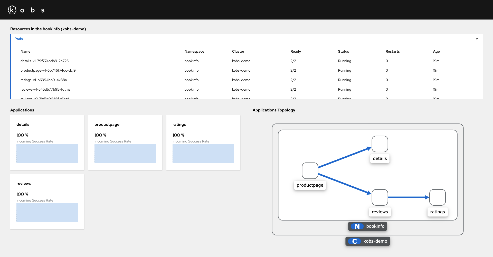

# Applications

The applications plugin allows you to show a list of application on a dashboard. More information can be found on the [Applications Page](../resources/applications.md).

## Configuration

The following configuration can be used to configure the cache duration for applications and to customize the topology graph.

```yaml
plugins:
  applications:
    cache:
      topologyDuration: 5m
      teamsDuration: 5m
      tagsDuration: 5m
    topology:
      - type: custom
        shape: round-diamond
        color: "#c9190b"

```

| Field | Type | Description | Required |
| ----- | ---- | ----------- | -------- |
| cache | [Cache](#cache) | Customize the caching behaviour for applications. | No |
| topology | [[]Topology](#topology) | Add custom node types for the topology graph, which can then selected in the Applications CRs via the `topology.type` option. | No |

### Cache

| Field | Type | Description | Required |
| ----- | ---- | ----------- | -------- |
| topologyDuration | [duration](https://pkg.go.dev/time#ParseDuration) | The duration for how long the topology graph should be cached. The default value is `1h`. | No |
| teamsDuration | [duration](https://pkg.go.dev/time#ParseDuration) | The duration for how long the teams for an application should be cached. The default value is `1h`. | No |
| tagsDuration | [duration](https://pkg.go.dev/time#ParseDuration) | The duration for how long the tags for all applications should be cached. The default value is `1h`. | No |

### Topology

| Field | Type | Description | Required |
| ----- | ---- | ----------- | -------- |
| type | string | The name of the node type. The node type can be selected via the `topology.type` field in the Application CRs. | No |
| color | string | A color for the node in the topology chart. Every CSS color code is allowed, but we recommend to use an color from [Patternfly](https://www.patternfly.org/v4/guidelines/colors), so the topology graph matches the overall style of kobs. The default value is `#0066cc`. | No |
| shape | string | The shape of the node in the topology chart. Allowed values are `rectangle`, `roundrectangle`, `ellipse`, `triangle`, `pentagon`, `hexagon`, `heptagon`, `octagon`, `star`, `barrel`, `diamond`, `vee`, `rhomboid`, `polygon`, `tag`, `round-rectangle`, `round-triangle`, `round-diamond`, `round-pentagon`, `round-hexagon`, `round-heptagon`, `round-octagon`, `round-tag`, `cut-rectangle`, `bottom-round-rectangle` and `concave-hexagon`. The default value is `roundrectangle`.  | No |

## Options

| Field | Type | Description | Required |
| ----- | ---- | ----------- | -------- |
| view | string | The view, which should be used to show the applications. This must be `gallery` or `topology`. The default will be `gallery`. | No |
| clusters | []string | A list of clusters. If this value isn't provided, it will be the cluster from the team or application where the dashboard is used. | No |
| namespaces | []string | A list of namespaces. If this value isn't provided, it will be the namespace from the team or application where the dashboard is used. | No |
| tags | []string | An optional list of tags. | No |
| team | [Team](#team) | Get the applications for a team instead of clusters and namespaces. | No |

### Team

It is also possible to show all applications for a team. If a team is provided the `clusters` and `namespaces` from above are ignored.

| Field | Type | Description | Required |
| ----- | ---- | ----------- | -------- |
| cluster | string | The cluster of the team. | No |
| namespace | string | The namespace of the team. | No |
| name | string | The name of the team. | Yes |

## Examples

The following dashboard contains two panels for application, one shows the applications in the gallery view and the other one in the topology view.

```yaml
---
apiVersion: kobs.io/v1beta1
kind: Dashboard
spec:
  description: Resources for an Application
  placeholders:
    - name: namespace
      description: Namespace for the Application
  variables:
    - name: cluster
      label: Cluster
      plugin:
        name: core
        options:
          type: clusters
  rows:
    - size: 4
      panels:
        - title: Applications
          colSpan: 6
          plugin:
            name: applications
            options:
              view: gallery
              clusters:
                - ""
              namespaces:
                - "{{ .namespace }}"
        - title: Applications Topology
          colSpan: 6
          plugin:
            name: applications
            options:
              view: topology
              clusters:
                - ""
              namespaces:
                - "{{ .namespace }}"
```

The following example shows all applications for `team-diablo`.

```yaml
---
apiVersion: kobs.io/v1beta1
kind: Dashboard
spec:
  rows:
    - panels:
        - title: Applications for Team Diablo
          plugin:
            name: applications
            options:
              view: gallery
              team:
                namespace: kobs
                name: team-diablo
```


