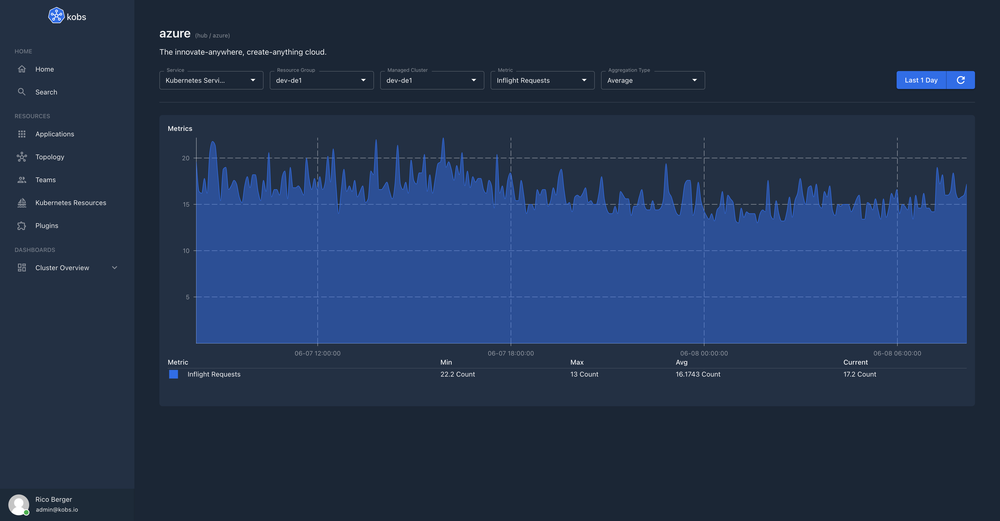
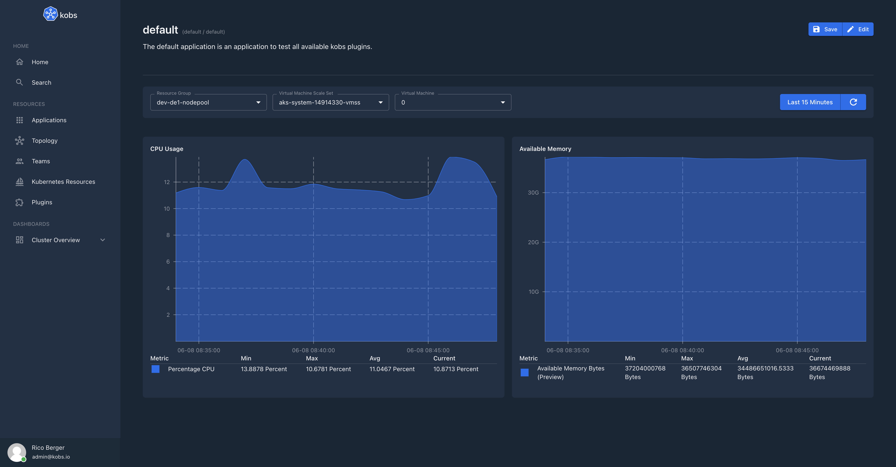

# Azure

The Azure plugin can be used to view your Azure resources like Container Instances within kobs.



## Configuration

The Azure plugin can only be used within the `hub`. To use the Azure plugin the following configuration is needed:

| Field | Type | Description | Required |
| ----- | ---- | ----------- | -------- |
| name | string | The name of the Azure plugin instance. | Yes |
| type | `azure` | The type for the Azure plugin. | Yes |
| options.credentials.subscriptionID | string | The id of your Azure subscription. | Yes |
| options.credentials.tenantID | string | The tenant id. | Yes |
| options.credentials.clientID | string | The client id. | Yes |
| options.credentials.clientSecret | string | The client secret. | Yes |

```yaml
plugins:
  - name: azure
    type: azure
    options:
      credentials:
        subscriptionID:
        tenantID:
        clientID:
        clientSecret:
```

## Insight Options

!!! note
    The Azure plugin can not be used within the insights section of an application.

## Variable Options

| Field | Type | Description | Required |
| ----- | ---- | ----------- | -------- |
| type | string | The type of the variable, this could be `Resource Groups`, `Kubernetes Services`, `Virtual Machine Scale Sets` or `Virtual Machine Scale Sets - Virtual Machines`.  | Yes |
| resourceGroup | string | The name of the resource group for which the resources should be retrieved. | No |
| virtualMachineScaleSet | string | The name of the Virtual Machine Scale Set, when the type is `Virtual Machine Scale Sets - Virtual Machines`. | No |

## Panel Options

The following options can be used for a panel with the Azure plugin:

| Field | Type | Description | Required |
| ----- | ---- | ----------- | -------- |
| service | string | The service which should be used within the panel. This must be `Cost Management` or `Metrics`. | Yes |
| resourceGroup | string | The name of the resource group for which the resources should be retrieved. | No |
| provider | string | The metrics provider when the selected service is `Metrics`. | No |
| metric | string | The name of the metric which should be shown in a panel when the selected service is `Metrics`. | No |
| aggregationType | string | The aggregation type of the metric. This could be `None`, `Average`, `Count`, `Minimum`, `Maximum` or `Total`. | No |

## Usage

kobs supports all Azure metrics in the dashboard panels. To get a metric the provider, metric name and aggregation type must be provided. To get a list of all metrics the Azure Cli can be used, e.g.:

- Container Instances: `az monitor metrics list-definitions --resource /subscriptions/<SUBSCRIPTION>/resourceGroups/<RESOURCE-GROUP>/providers/Microsoft.ContainerInstance/containerGroups/<CONTAINER-GROUP>`
- Kubernetes Services: `az monitor metrics list-definitions --resource /subscriptions/<SUBSCRIPTION>/resourceGroups/<RESOURCE-GROUP>/providers/Microsoft.ContainerService/managedClusters/<MANAGED-CLUSTER>`
- Virtual Machine Scale Sets: `az monitor metrics list-definitions --resource /subscriptions/<SUBSCRIPTION>/resourceGroups/<RESOURCE-GROUP>/providers/Microsoft.Compute/virtualMachineScaleSets/<VIRTUAL-MACHINE-SCALE-SET>`
- Virtual Machine Scale Sets (Virtual Machine): `az monitor metrics list-definitions --resource /subscriptions/<SUBSCRIPTION>/resourceGroups/<RESOURCE-GROUP>/providers/Microsoft.Compute/virtualMachineScaleSets/<VIRTUAL-MACHINE-SCALE-SET>/virtualMachines/<VIRTUAL-MACHINE>`

??? note "Example 1"

    ```yaml
    ---
    apiVersion: kobs.io/v1
    kind: Application
    metadata:
      name: default
      namespace: default
    spec:
      description: The default application is an application to test all available kobs plugins.
      dashboards:
        - title: Azure
          inline:
            variables:
              - name: var_resource_group
                label: Resource Group
                includeAllOption: false
                plugin:
                  name: azure
                  type: azure
                  cluster: hub
                  options:
                    type: Resource Groups
              - name: var_vmss
                label: Virtual Machine Scale Set
                includeAllOption: false
                plugin:
                  name: azure
                  type: azure
                  cluster: hub
                  options:
                    type: Virtual Machine Scale Sets
                    resourceGroup: ''
              - name: var_vm
                label: Virtual Machine
                includeAllOption: false
                plugin:
                  name: azure
                  type: azure
                  cluster: hub
                  options:
                    type: Virtual Machine Scale Sets - Virtual Machines
                    resourceGroup: ''
                    virtualMachineScaleSet: ''
            rows:
              - autoHeight: true
                panels:
                  - title: CPU Usage
                    plugin:
                      name: azure
                      type: azure
                      cluster: hub
                      options:
                        service: Metrics
                        resourceGroup: ''
                        provider: >-
                          Microsoft.Compute/virtualMachineScaleSets//virtualMachines/
                        metric: Percentage CPU
                        aggregationType: Average
                    h: 6
                    w: 6
                    x: 0
                    'y': 0
                  - title: Available Memory
                    plugin:
                      name: azure
                      type: azure
                      cluster: hub
                      options:
                        service: Metrics
                        resourceGroup: ''
                        provider: >-
                          Microsoft.Compute/virtualMachineScaleSets//virtualMachines/
                        metric: Available Memory Bytes
                        aggregationType: Average
                    h: 6
                    w: 6
                    x: 6
                    'y': 0
    ```


