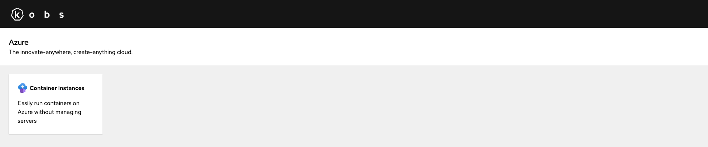
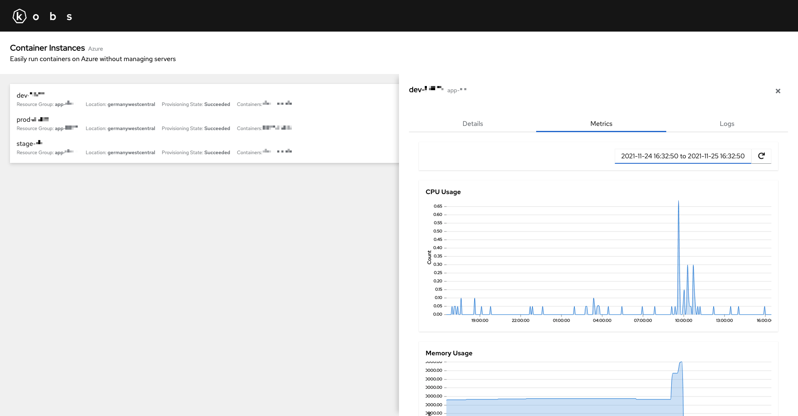
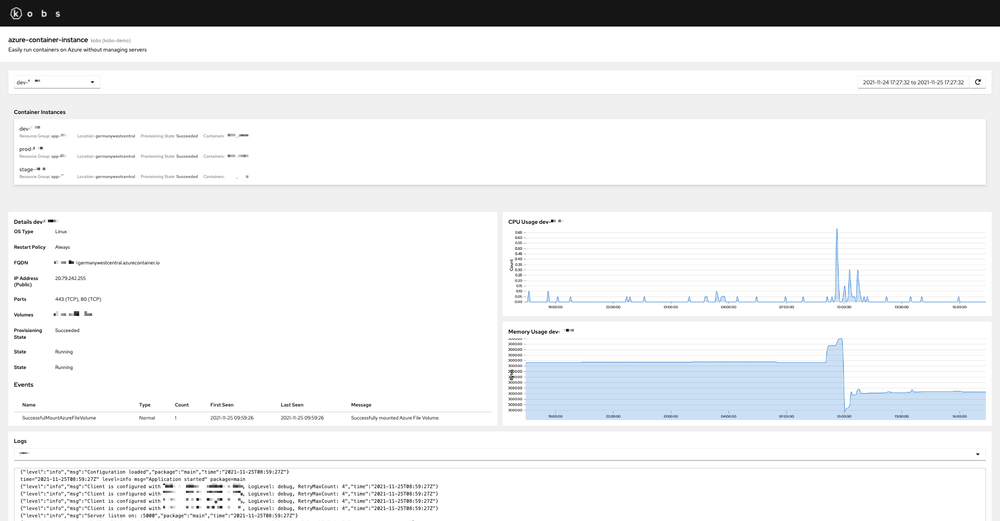

# Azure

The Azure plugin can be used to view your Azure resources like Container Instances within kobs.





## Configuration

The following configuration can be used to access Azure.

```yaml
plugins:
  azure:
    - name: azure
      displayName: Azure
      description: The innovate-anywhere, create-anything cloud.
```

| Field | Type | Description | Required |
| ----- | ---- | ----------- | -------- |
| name | string | Name of the Azure instance. | Yes |
| displayName | string | Name of the Azure instance as it is shown in the UI. | Yes |
| descriptions | string | Description of the Azure instance. | No |

To authenticate against the Azure API you have to set the following environment variables:

- `AZURE_SUBSCRIPTION_ID`
- `AZURE_TENANT_ID`
- `AZURE_CLIENT_ID`
- `AZURE_CLIENT_SECRET`

## Options

The following options can be used for a panel with the Azure plugin:

| Field | Type | Description | Required |
| ----- | ---- | ----------- | -------- |
| type | string | The service type which should be used for the panel Currently only `containerinstances` is supported. | Yes |
| containerinstances | [Container Instances](#container-instances) | The configuration for the panel if the type is `containerinstances`. | No |

### Container Instances

| Field | Type | Description | Required |
| ----- | ---- | ----------- | -------- |
| type | string | The type of the panel for which the Container Instances data should be displayed. This can be `list`, `details`, `logs` or `metrics`. | Yes |
| resourceGroup | string | The name of the resource group for the Container Instance. This is not required if the type is `list`. | No |
| containerGroup | string | The name of the container group. This is not required if the type is `list`. | No |
| containers | string[] | A list of container names. This is only required if the type is `logs`. | No |
| metric | string | The name of the metric for which the data should be displayed. Supported values are `CPUUsage`, `MemoryUsage`, `NetworkBytesReceivedPerSecond` and `NetworkBytesTransmittedPerSecond`. This is only required if the type is `metrics`. | No |

## Examples

### Container Instances Dashboard

The following dashboards displays a list of container instances and the details for one container instance, which can be selected via a variable.

```yaml
---
apiVersion: kobs.io/v1beta1
kind: Dashboard
metadata:
  name: azure-container-instance
  namespace: kobs
spec:
  description: Easily run containers on Azure without managing servers
  variables:
    - name: var_container_group
      label: Container Group
      plugin:
        name: core
        options:
          type: static
          items:
            - dev-myciservice
            - stage-myciservice
            - prod-myciservice
  rows:
    - size: 2
      panels:
        - title: Container Instances
          colSpan: 12
          plugin:
            name: azure
            options:
              type: containerinstances
              containerinstances:
                type: list

    - size: 2
      panels:
        - title: Details 
          colSpan: 6
          rowSpan: 2
          plugin:
            name: azure
            options:
              type: containerinstances
              containerinstances:
                type: details
                resourceGroup: app-myciservice
                containerGroup: ""
        - title: CPU Usage 
          colSpan: 6
          rowSpan: 1
          plugin:
            name: azure
            options:
              type: containerinstances
              containerinstances:
                type: metrics
                resourceGroup: app-myciservice
                containerGroup: ""
                metric: CPUUsage
        - title: Memory Usage 
          colSpan: 6
          rowSpan: 1
          plugin:
            name: azure
            options:
              type: containerinstances
              containerinstances:
                type: metrics
                resourceGroup: app-myciservice
                containerGroup: ""
                metric: MemoryUsage

    - size: 4
      panels:
        - title: Logs
          colSpan: 12
          plugin:
            name: azure
            options:
              type: containerinstances
              containerinstances:
                type: logs
                resourceGroup: app-myciservice
                containerGroup: ""
                containers:
                  - mycicontainer1
                  - mycicontainer2
```


