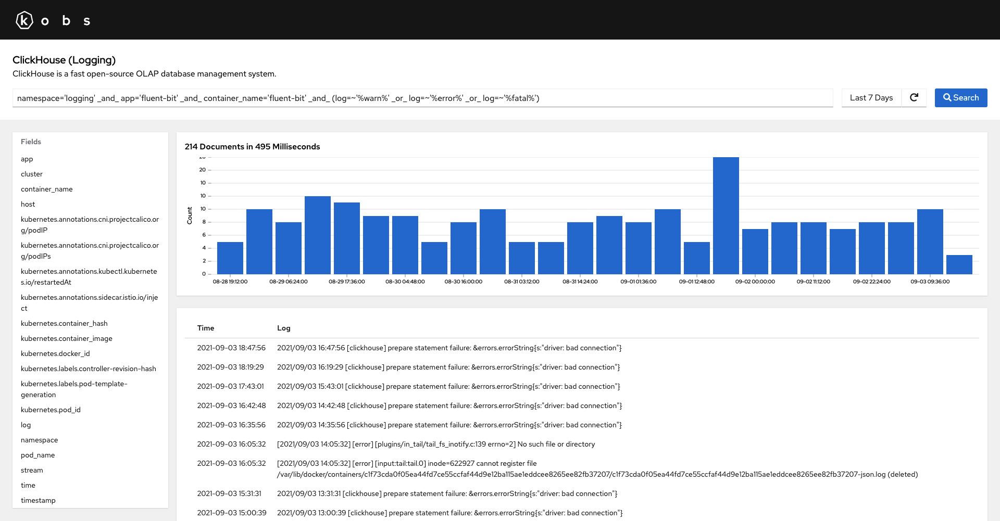

# ClickHouse

!!! note
    The ClickHouse plugin can only be used with the [kobsio/fluent-bit-clickhouse](https://github.com/kobsio/fluent-bit-clickhouse) Fluent Bit plugin. If you want to use kobs to run raw SQL commands against a ClickHouse instance you can use the [SQL plugin](sql.md).

The ClickHouse plugin can be used together with the [kobsio/fluent-bit-clickhouse](https://github.com/kobsio/fluent-bit-clickhouse) output plugin for [Fluent Bit](https://fluentbit.io). You can then use the specified [Query Syntax](#query-syntax) to get the logs from ClickHouse.



## Options

The following options can be used for a panel with the ClickHouse plugin:

| Field | Type | Description | Required |
| ----- | ---- | ----------- | -------- |
| type | string | Set the type which should be used to visualize your logs. This can be `logs` or `aggregation`. | Yes |
| queries | [[]Query](#query) | A list of queries, which can be selected by the user. This is only required for type `logs`. | Yes |
| aggregation | [Aggregation](#aggregation) | Options for the aggregation. This is only required for type `aggregation`. | Yes |

### Query

| Field | Type | Description | Required |
| ----- | ---- | ----------- | -------- |
| name | string | A name for the ClickHouse query, which is displayed in the select box. | Yes |
| query | string | The query which should be run against ClickHouse. See [Query Syntax](#query-syntax) for more information on the syntax, when ClickHouse is used in the `logs` mode. | Yes |
| fields | []string | A list of fields to display in the results table. If this field is omitted, the whole document is displayed in the results table. This field is only available for the `logs`. | No |
| order | string | Order for the returned logs. Must be `ascending` or `descending`. The default value for this field is `descending`. | No |
| orderBy | string | The name of the field, by which the results should be orderd. The default value for this field is `timestamp`. | No |

```yaml
---
apiVersion: kobs.io/v1beta1
kind: Dashboard
spec:
  rows:
    - size: -1
      panels:
        - title: Istio Logs
          colSpan: 12
          plugin:
            name: clickhouse
            options:
              type: logs
              queries:
                - name: Istio Logs
                  query: "namespace='bookinfo' _and_ app='bookinfo' _and_ container_name='istio-proxy' _and_ content.upstream_cluster~'inbound.*'"
                  fields:
                    - "pod_name"
                    - "content.authority"
                    - "content.route_name"
                    - "content.protocol"
                    - "content.method"
                    - "content.path"
                    - "content.response_code"
                    - "content.upstream_service_time"
                    - "content.bytes_received"
                    - "content.bytes_sent"
```

### Aggregation

| Field | Type | Description | Required |
| ----- | ---- | ----------- | -------- |
| query | string | The query, which should be used for the aggregation. | Yes |
| chart | string | The visualization type for the aggregation. This can be `pie`, `bar`, `line` or `area`. | Yes |
| options | [Aggregation Options](#aggregation-options) | Options for the aggregation. | Yes |

The following dashboard, shows an example of how to use aggregations within a dashboard:

```yaml
---
apiVersion: kobs.io/v1beta1
kind: Dashboard
metadata:
  name: logs
  namespace: kobs
spec:
  title: Logs
  description: The dashboard shows some examples of aggregation based on logs.
  rows:
    - size: 3
      panels:
        - title: Number of Logs per App
          colSpan: 6
          plugin:
            name: clickhouse-logging
            options:
              type: aggregation
              aggregation:
                query: "cluster='kobs-demo'"
                chart: bar
                options:
                  horizontalAxisOperation: top
                  horizontalAxisField: app
                  horizontalAxisOrder: descending
                  horizontalAxisLimit: "10"
                  verticalAxisOperation: count
        - title: Log Levels for MyApplication
          colSpan: 6
          plugin:
            name: clickhouse-logging
            options:
              type: aggregation
              aggregation:
                query: "cluster='kobs-demo' _and_ app='myapplication' _and_ container_name='myapplication'"
                chart: pie
                options:
                  sliceBy: content.level
                  sizeByOperation: count
    - size: 3
      panels:
        - title: Request Duration for MyApplication by Response Code
          colSpan: 12
          plugin:
            name: clickhouse-logging
            options:
              type: aggregation
              aggregation:
                query: "cluster='kobs-demo' _and_ app='myapplication' _and_ container_name='istio-proxy' _and_ content.response_code>0"
                chart: line
                options:
                  horizontalAxisOperation: time
                  verticalAxisOperation: avg
                  verticalAxisField: content.duration
                  breakDownByFields:
                    - content.response_code
```


### Aggregation Options

| Field | Type | Description | Required |
| ----- | ---- | ----------- | -------- |
| sliceBy | string | Field which should be used for slicing in a `pie` chart. | No |
| sizeByOperation | string | Operation to size the slices. This can be `count`, `min`, `max`, `sum` or `avg`. | No |
| sizeByField | string | When the sizeByOperation is `min`, `max`, `sum` or `avg`, this must be the name of a field for the sizing of the slices. | No |
| horizontalAxisOperation | string | The operation for the chart. This must be `time` or `top`. | No |
| horizontalAxisField | string | The name of the field for the horizontal axis. | No |
| horizontalAxisOrder | string | The order of the top values. Must be `ascending` or `descending`. | No |
| horizontalAxisLimit | string | The maximum number of top values, which should be shown. | No |
| verticalAxisOperation | string | The operation for the vertical axis. This can be `count`, `min`, `max`, `sum` or `avg`. | No |
| verticalAxisField | string | When the verticalAxisOperation is `min`, `max`, `sum` or `avg`, this must be the name of a field for the vertical axis. | No |
| breakDownByFields | []string | A list of field names, which should be used to break down the data. | No |
| breakDownByFilters | []string | A list of filters, which should be used to break down the data. | No |

## Query Syntax

### Operators

kobs supports multiple operators which can be used in a query to retrieve logs from ClickHouse:

| Operator | Description | Example |
| -------- | ----------- | ------- |
| `(` and `)` | Multiple terms or clauses can be grouped together with parentheses, to form sub-queries. | `cluster='kobs-demo' _and_ (namespace='bookinfo' _or_ namespace='istio-system')` |
| `_not_` | Exclude the term from the query. | `cluster='kobs-demo' _and_ _not_ namespace='bookinfo'` |
| `_and_` | Both terms must be included in the results. | `namespace='bookinfo' _and_ app='bookinfo'` |
| `_or_` | The result can contain one of the given terms. | `namespace='bookinfo' _or_ namespace='istio-system'` |
| `_exists_` | The field can not be `null` | `container_name='istio-proxy' _and_ _exists_ content.request_id` |
| `=` | The field must have this value. | `namespace='bookinfo'` |
| `!=` | The field should not have this value. | `namespace!='bookinfo'` |
| `>` | The value of the field must be greater than the specified value. | `content.response_code>499` |
| `>=` | The value of the field must be greater than or equal to the specified value. | `content.response_code>=500` |
| `<` | The value of the field must be lower than the specified value. | `content.response_code<500` |
| `<=` | The value of the field must be lower than or equal to the specified value. | `content.response_code<=499` |
| `=~` | The value of the field is compared using `ILIKE`. | `content.upstream_cluster=~'inbound%'` |
| `!~` | The value of the field is compared using `NOT ILIKE`. | `content.upstream_cluster!~'inbound%'` |
| `~` | The value of the field must match the regular expression. The syntax of the `re2` regular expressions can be found [here](https://github.com/google/re2/wiki/Syntax). | `content.upstream_cluster~'inbound.*'` |

### Default Fields

In the following you can find a list of fields which are available for each log line. Consider to filter you logs by these fields, to keep your queries fast:

- `timestamp`: The timestamp for when the log line was written.
- `cluster`: The name of the cluster as it is set by Fluent Bit.
- `namespace`: The namespace of the Pod.
- `app`: The value of the `app` or `k8s-app` label of the Pod.
- `pod_name`: The name of the Pod.
- `container_name`: The name of the container from the Pod.
- `host`: The name of the host where the Pod is running on.
- `log`: The complete log line as it was written by the container.

### Examples

- `namespace='bookinfo' _and_ app='bookinfo' _and_ container_name='istio-proxy' _and_ content.upstream_cluster~'inbound.*'`: Select all inbound Istio logs from the bookinfo app in the bookinfo namespace.
