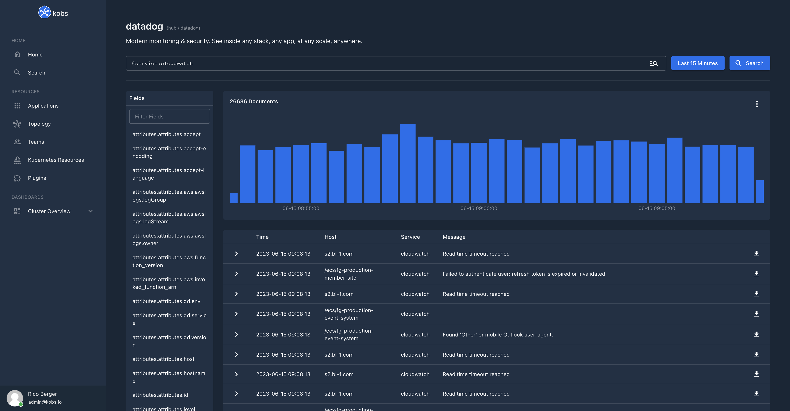

# Datadog

The Datadog plugin can be used to access your logs and metrics from Datadog.



## Configuration

The Datadog plugin can only be used within the `hub`. To use the Datadog plugin the following configuration is needed:

| Field | Type | Description | Required |
| ----- | ---- | ----------- | -------- |
| name | string | The name of the Datadog plugin instance. | Yes |
| type | `datadog` | The type for the Datadog plugin. | Yes |
| options.address | string | The address of the Datadog instance (e.g. `datadoghq.com` or `datadoghq.eu`). | Yes |
| options.apiKey | string | The API Key for your Datadog instance. | Yes |
| options.appKey | string | The App Key for your Datadog instance. | Yes |

```yaml
plugins:
  - name: datadog
    type: datadog
    options:
      address:
      apiKey:
      appKey:
```

## Insight Options

!!! note
    The Datadog plugin can not be used within the insights section of an application.

## Variable Options

!!! note
    The Datadog plugin can not be used to get a list of variable values.

## Panel Options

The following options can be used for a panel with the Datadog plugin:

| Field | Type | Description | Required |
| ----- | ---- | ----------- | -------- |
| type | string | The panel type. This could be `logs`. | Yes |
| showChart | boolean | If this is `true` the chart with the distribution of the log lines in the selected time range will be shown. | No |
| queries | [[]Query](#query) | A list of queries, which can be selected by the user. This is only required for type `logs`. | Yes |

### Query

| Field | Type | Description | Required |
| ----- | ---- | ----------- | -------- |
| name | string | A name for the Datadog query. | Yes |
| query | string | The query which should be run against Datadog. | Yes |
| fields | []string | A list of fields to display in the results table. If this field is omitted, the whole document is displayed in the results table. | No |
