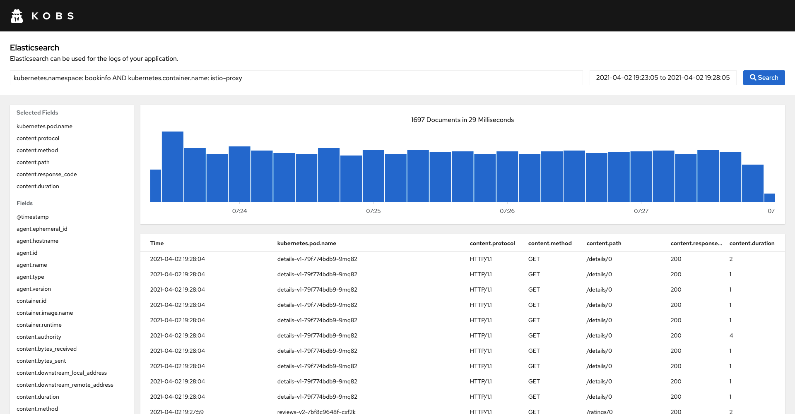
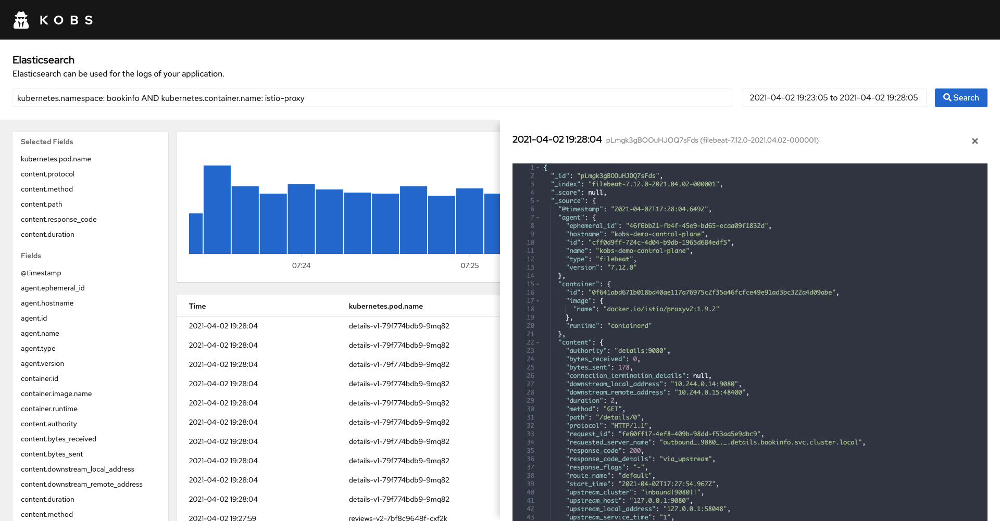

# Elasticsearch

The Elasticsearch plugin can be used to retrieve logs from a configured Elasticsearch instance. You can specify a query, which is used to retireve all documents from Elasticsearch. You can also select a list of fields, to display the results in a table. From this table you can also select a single document to view the complete json representation of this document.






## Configuration

To use the Elasticsearch plugin the following configuration is needed in the satellites configuration file:

| Field | Type | Description | Required |
| ----- | ---- | ----------- | -------- |
| name | string | The name of the Elasticsearch plugin instance. | Yes |
| type | `elasticsearch` | The type for the Elasticsearch plugin. | Yes |
| options.address | string | Address of the Elasticsearch instance. | Yes |
| options.username | string | Username to access an Elasticsearch instance via basic authentication. | No |
| options.password | string | Password to access an Elasticsearch instance via basic authentication. | No |
| options.token | string | Token to access an Elasticsearch instance via token based authentication. | No |

```yaml
plugins:
  - name: elasticsearch
    type: elasticsearch
    options:
      address:
      username:
      password:
      token:
```

## Insight Options

!!! note
    The Elasticsearch plugin can not be used within the insights section of an application.

## Variable Options

!!! note
    The Elasticsearch plugin can not be used to get a list of variable values.

## Panel Options

The following options can be used for a panel with the Elasticsearch plugin:

| Field | Type | Description | Required |
| ----- | ---- | ----------- | -------- |
| showChart | boolean | If this is `true` the chart with the distribution of the Documents over the selected time range will be shown | No |
| queries | [[]Query](#query) | A list of Elasticsearch queries, which can be selected by the user. | Yes |

### Query

| Field | Type | Description | Required |
| ----- | ---- | ----------- | -------- |
| name | string | A name for the Elasticsearch query, which is displayed in the select box. | Yes |
| query | string | The Elasticsearch query. We are using the [Query String Syntax](#query-string-syntax) for Elasticsearch. | Yes |
| fields | []string | A list of fields to display in the results table. If this field is omitted, the whole document is displayed in the results table. | No |

## Usage

### Query String Syntax

The Elasticsearch plugins uses the [query string syntax](https://www.elastic.co/guide/en/elasticsearch/reference/current/query-dsl-query-string-query.html#query-string-syntax) for filtering log lines.

#### Field Names

You can specify fields to search in the query syntax:

- where the `status` field contains `active`

```txt
status:active
```

- where the `title` field contains `quick` or `brown`

```txt
title:(quick OR brown)
```

- where the `author` field contains the exact phrase `"john smith"`

```txt
author:"John Smith"
```

- where the `first name` field contains `Alice` (note how we need to escape the space with a backslash)

```txt
first\ name:Alice
```

- where any of the fields `book.title`, `book.content` or `book.date` contains `quick` or `brown` (note how we need to escape the `*` with a backslash):

```txt
book.\*:(quick OR brown)
```

- where the field `title` has any non-null value:

```txt
_exists_:title
```

#### Wildcards

Wildcard searches can be run on individual terms, using `?` to replace a single character, and `*` to replace zero or more characters:

```txt
qu?ck bro*
```

#### Regular Expressions

[Regular expression](https://www.elastic.co/guide/en/elasticsearch/reference/current/regexp-syntax.html) patterns can be embedded in the query string by wrapping them in forward-slashes (`"/"`):

```txt
name:/joh?n(ath[oa]n)/
```

#### Fuzziness

We can search for terms that are similar to, but not exactly like our search terms, using the "fuzzy" operator:

```txt
quikc~ brwn~ foks~
```

#### Ranges

Ranges can be specified for date, numeric or string fields. Inclusive ranges are specified with square brackets `[min TO max]` and exclusive ranges with curly brackets `{min TO max}`.

- All days in 2012:

```txt
date:[2012-01-01 TO 2012-12-31]
```

- Numbers 1..5

```txt
count:[1 TO 5]
```

- Tags between `alpha` and `omega`, excluding `alpha` and `omega`:

```txt
tag:{alpha TO omega}
```

- Numbers from 10 upwards

```txt
count:[10 TO *]
```

- Dates before 2012

```txt
date:{* TO 2012-01-01}
```

#### Boolean operators

By default, all terms are optional, as long as one term matches.  A search for `foo bar baz` will find any document that contains one or more of `foo` or `bar` or `baz`.  We have already discussed the `default_operator` above which allows you to force all terms to be required, but there are also boolean operators which can be used in the query string itself
to provide more control.

The preferred operators are `+` (this term *must* be present) and `-` (this term *must not* be present). All other terms are optional. For example, this query:

```txt
quick brown +fox -news
```

#### Grouping

Multiple terms or clauses can be grouped together with parentheses, to form sub-queries:

```txt
(quick OR brown) AND fox
```

### Example Dashboard

```yaml
---
apiVersion: kobs.io/v1
kind: Dashboard
spec:
  placeholders:
    - name: namespace
      description: The workload namespace
    - name: app
      description: The workloads app label
  rows:
    - size: -1
      panels:
        - title: Istio Logs
          colSpan: 12
          plugin:
            name: elasticsearch
            type: elasticsearch
            options:
              showChart: true
              queries:
                - name: Istio Logs
                  query: "kubernetes.namespace:  AND kubernetes.labels.app:  AND kubernetes.container.name: istio-proxy AND _exists_: content.method"
                  fields:
                    - "kubernetes.pod.name"
                    - "content.authority"
                    - "content.route_name"
                    - "content.protocol"
                    - "content.method"
                    - "content.path"
                    - "content.response_code"
                    - "content.upstream_service_time"
                    - "content.bytes_received"
                    - "content.bytes_sent"
```
