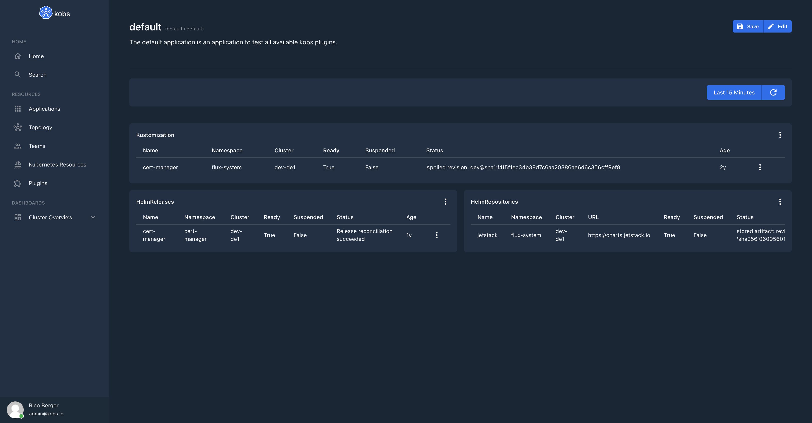

# Flux

The Flux plugin can be used to retrieve, display and reconcile [Flux](https://fluxcd.io) resources.


## Configuration

The Flux plugin can only be used within the `hub`. To use the Flux plugin the following configuration is needed:

| Field | Type | Description | Required |
| ----- | ---- | ----------- | -------- |
| name | string | The name of the Flux plugin instance. | Yes |
| type | `flux` | The type for the Flux plugin. | Yes |

```yaml
plugins:
  - name: flux
    type: flux
```

## Insight Options

!!! note
    The Flux plugin can not be used within the insights section of an application.

## Variable Options

!!! note
    The Flux plugin can not be used to get a list of variable values.

## Panel Options

The following options can be used for a panel with the Flux plugin:

| Field | Type | Description | Required |
| ----- | ---- | ----------- | -------- |
| type | string | The Flux resource which should be displayed. This must be `gitrepositories`, `helmrepositories`, `buckets`, `kustomizations` or `helmreleases`. | Yes |
| clusters | []string | The cluster for which the resources should be displayed. | Yes |
| namespace | []string | The namespace for which the resources should be displayed. | Yes |
| paramName | string | The name of the parameter which should be used for filtering the resources. Must be `labelSelector` or `fieldSelector`. | No |
| param | string | The parameter which is used to filter the resources. | No |

## Usage

For example the following dashboard shows the Kustomization, Helm Release and Helm Repository for the `cert-manager`:

```yaml
---
apiVersion: kobs.io/v1
kind: Application
metadata:
  name: default
  namespace: default
spec:
  description: The default application is an application to test all available kobs plugins.
  dashboards:
    - title: Flux
      inline:
        rows:
          - autoHeight: true
            panels:
              - title: Kustomization
                plugin:
                  name: flux
                  type: flux
                  cluster: hub
                  options:
                    type: kustomizations
                    clusters:
                      - "<% $.cluster %>"
                    namespaces:
                      - flux-system
                    paramName: fieldSelector
                    param: metadata.name=cert-manager
                h: 6
                w: 12
                x: 0
                'y': 0
              - title: HelmReleases
                plugin:
                  name: flux
                  type: flux
                  cluster: hub
                  options:
                    type: helmreleases
                    clusters:
                      - "<% $.cluster %>"
                    namespaces:
                      - cert-manager
                h: 6
                w: 6
                x: 6
                'y': 6
              - title: HelmRepositories
                plugin:
                  name: flux
                  type: flux
                  cluster: hub
                  options:
                    type: helmrepositories
                    clusters:
                      - "<% $.cluster %>"
                    namespaces:
                      - flux-system
                    paramName: fieldSelector
                    param: metadata.name=jetstack
                h: 6
                w: 6
                x: 0
                'y': 6
```


