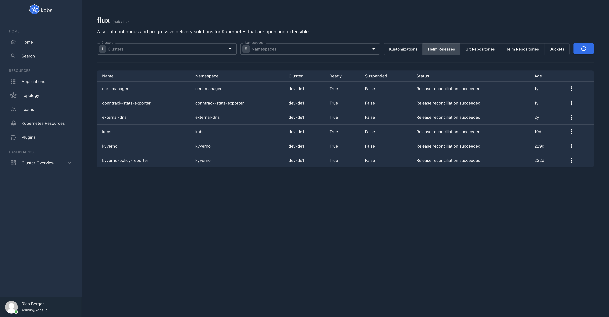

# Flux

The Flux plugin can be used to retrieve, display and reconcile [Flux](https://fluxcd.io) resources.



## Configuration

| Field | Type | Description | Required |
| ----- | ---- | ----------- | -------- |
| home | boolean | When this is `true` the plugin will be added to the home page. | No |

## Options

The following options can be used for a panel with the Flux plugin:

| Field | Type | Description | Required |
| ----- | ---- | ----------- | -------- |
| type | string | The Flux resource which should be displayed. This must be `gitrepositories.source.toolkit.fluxcd.io/v1beta1`, `helmrepositories.source.toolkit.fluxcd.io/v1beta1`, `buckets.source.toolkit.fluxcd.io/v1beta1`, `kustomizations.kustomize.toolkit.fluxcd.io/v1beta1` or `helmreleases.helm.toolkit.fluxcd.io/v2beta1`. | Yes |
| cluster | string | The cluster for which the resources should be displayed. | Yes |
| namespace | string | The namespace for which the resources should be displayed. | Yes |
| selector | string | An optional selector for the selection of Flux resources. | No |

For example the following dashboard shows all Kustomizations, Helm Releases, Git Repositories and Helm Repositories from the cluster and namespace, where the dashboard is used as reference:

```yaml
---
apiVersion: kobs.io/v1
kind: Dashboard
spec:
  rows:
    - size: -1
      panels:
        - title: Kustomizations
          plugin:
            name: flux
            options:
              type: kustomizations.kustomize.toolkit.fluxcd.io/v1beta1
              cluster: ""
              namespace: ""
    - size: -1
      panels:
        - title: Helm Releases
          plugin:
            name: flux
            options:
              type: helmreleases.helm.toolkit.fluxcd.io/v2beta1
              cluster: ""
              namespace: ""
    - size: -1
      panels:
        - title: Git Repositories
          plugin:
            name: flux
            options:
              type: gitrepositories.source.toolkit.fluxcd.io/v1beta1
              cluster: ""
              namespace: ""
    - size: -1
      panels:
        - title: Helm Repositories
          plugin:
            name: flux
            options:
              type: helmrepositories.source.toolkit.fluxcd.io/v1beta1
              cluster: ""
              namespace: ""
```
