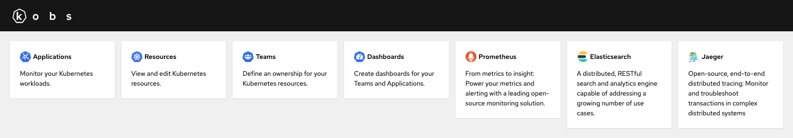

# Getting Started

Plugins can be used to extend the functionality of kobs. For example you can use Prometheus to display metrics, Elasticsearch to display logs or Jaeger to display traces for your application within kobs.

All the configured plugins can be found on the home page of kobs. From this page you can use the configured plugins directly.

## Specification

Plugins can also be used within an Application CR to enhance the information for an application.

| Field | Type | Description | Required |
| ----- | ---- | ----------- | -------- |
| name | string | The name of the plugin as it is defined in the [configuration file](../configuration/plugins.md). The special name `Template` can be used to reference a template. | Yes |
| displayName | string | An optional name for the plugin tab, which should be displayed instead of the plugin name. | No |
| template | [Template](#template) (oneof) | Template configuration | Yes |
| elasticsearch | [Elasticsearch](elasticsearch.md#specification) (oneof) | Elasticsearch configuration for the application. | Yes |
| jaeger | [Jaeger](jaeger.md#specification) (oneof) | Jaeger configuration for the application. | Yes |
| prometheus | [Prometheus](prometheus.md#specification) (oneof) | Prometheus configuration for the application. | Yes |
| opsgenie | [Opsgenie](opsgenie.md#specification) (oneof) | Opsgenie configuration for the application. | Yes |

### Template

| Field | Type | Description | Required |
| ----- | ---- | ----------- | -------- |
| name | string | The name of the template, which should be used. | Yes |
| variables | map<string, string> | A map of variables, with the variable name as key and the passed value as value. When the template is used within the `kobs.io/plugins` annotation, the value can also be a JSONPath, e.g. `<< $.metadata.namespace >>`. | Yes |

An example for the usage of templates within an Application or a Kubernetes resource can be found in the [Templates](../resources/templates.md) documentation.
