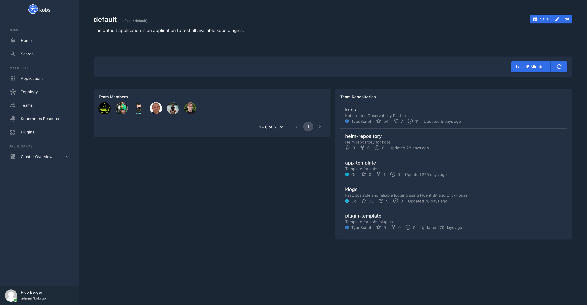

# GitHub

The GitHub plugin can be used to access the Pull Requests and Issues for your repositories or your organization.


## Configuration

The GitHub plugin can only be used within the `hub`. To use the GitHub plugin the following configuration is needed:

| Field | Type | Description | Required |
| ----- | ---- | ----------- | -------- |
| name | string | The name of the GitHub plugin instance. | Yes |
| type | `github` | The type for the GitHub plugin. | Yes |
| options.organization | string | The name of your organization on GitHub. | Yes |
| options.oauth.clientID | string | The Client ID of your OAuth App. | Yes |
| options.oauth.clientSecret | string | The Client Secret of your OAuth App. | Yes |
| options.oauth.state | string | A random string used to verify the OAuth Redirects. | Yes |
| options.session.token | string | The token must be a random string which is used to sign the JWT token, which is generated when a user is authenticated. | No |
| options.session.duration | string | The duration defines the lifetime of the generated token. When the token is expired the user must authenticate again. The default value is `720h` | No |

```yaml
plugins:
  - name: github
    type: github
    options:
      organization:
      oauth:
        clientID:
        clientSecret:
        state:
      session:
        token:
        duration:
```

## Insight Options

!!! note
    The GitHub plugin can not be used within the insights section of an application.

## Variable Options

!!! note
    The GitHub plugin can not be used to get a list of variable values.

## Panel Options

The following options can be used for a panel with the GitHub plugin:

| Field | Type | Description | Required |
| ----- | ---- | ----------- | -------- |
| type | string | The type of the panel which should be shown. This could be `orgpullrequests`, `orgrepositories`, `teammembers`, `teamrepositories`, `repositoryissues`, `repositorypullrequests`, `repositoryworkflowruns`, `userpullrequests`. | Yes |
| team | string | The name of the GitHub team from your organization. This is required if the type is `teammembers` or `teamrepositories`. | No |
| repository | string | The name of the GitHub repository from your organization. This is required if the type is `repositoryissues`, `repositorypullrequests` or `repositoryworkflowruns`. | No |

## Usage

### Setup an OAuth App

To setup an OAuth App on GitHub for kobs go to the settings page of your organization and select **OAuth Apps** in the **Developer settings** section. Then click on **Register an application**. Provide the following information:

- **Application name:** Provide a name for the application, e.g. `kobs`
- **Homepage URL:** Provide the homepage url for your kobs instance, e.g. `kobs.myorganization.com`
- **Authorization callback URL:** Provide the redirect url for the GitHub plugin instance, e.g. `https://kobs.myorganization.com/plugins/hub/github/github/oauth/callback`

On the next page you can find the **Client ID** and you can generate a **Client Secret** for the GitHub plugin. You can also select an icon (e.g. the [kobs logo](../assets/images/logo.png)) and a badge background color (e.g. `#1b2635`).

### Examples

#### Team Dashboard

??? note "Manifest"

    ```yaml
    ---
    apiVersion: kobs.io/v1
    kind: Application
    metadata:
      name: default
      namespace: default
    spec:
      description: The default application is an application to test all available kobs plugins.
      dashboards:
        - title: GitHub
          inline:
            rows:
              - autoHeight: true
                panels:
                  - title: Team Members
                    plugin:
                      name: github
                      type: github
                      cluster: hub
                      options:
                        type: teammembers
                        team: maintainers
                    h: 6
                    w: 6
                    x: 0
                    'y': 0
                  - title: Team Repositories
                    plugin:
                      name: github
                      type: github
                      cluster: hub
                      options:
                        type: teamrepositories
                        team: maintainers
                    h: 6
                    w: 6
                    x: 6
                    'y': 0
    ```



#### Repository Dashboard

??? note "Manifest"

    ```yaml
    ---
    apiVersion: kobs.io/v1
    kind: Application
    metadata:
      name: default
      namespace: default
    spec:
      description: The default application is an application to test all available kobs plugins.
      dashboards:
        - title: GitHub
          inline:
            rows:
              - autoHeight: true
                panels:
                  - title: Pull Requests
                    plugin:
                      name: github
                      type: github
                      cluster: hub
                      options:
                        type: repositorypullrequests
                        repository: kobs
                    h: 6
                    w: 6
                    x: 0
                    'y': 0
                  - title: Workflow Runs
                    plugin:
                      name: github
                      type: github
                      cluster: hub
                      options:
                        type: repositoryworkflowruns
                        repository: kobs
                    h: 6
                    w: 6
                    x: 6
                    'y': 0
    ```


