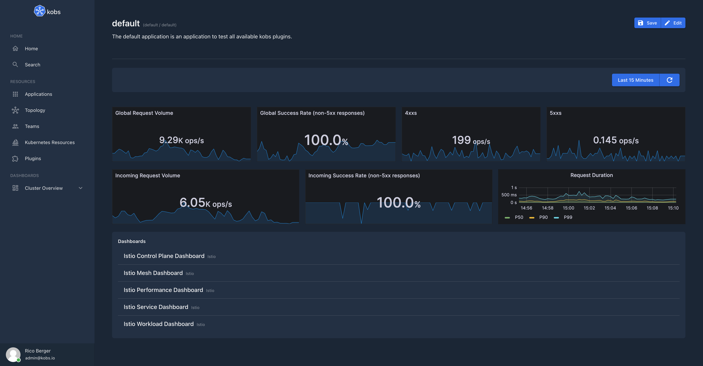

# Grafana

The Grafana plugin can be used to search through all your Grafana dashboards and to show a list of dashboards or embed a Grafana panel within a kobs dashboard.



## Configuration

The following config can be used to grant kobs access to a Grafana instance running on `grafana.kobs.io`.

```yaml
plugins:
  grafana:
    - name: Grafana
      description: Query, visualize, alert on, and understand your data no matter where it’s stored. With Grafana you can create, explore and share all of your data through beautiful, flexible dashboards.
      internalAddress: http://grafana.monitoring.svc.cluster.local:3000
      publicAddress: https://grafana.kobs.io
```

| Field | Type | Description | Required |
| ----- | ---- | ----------- | -------- |
| name | string | Name of the Grafana instance. | Yes |
| displayName | string | Name of the Grafana as it is shown in the UI. | Yes |
| descriptions | string | Description of the Grafana instance. | No |
| internalAddress | string | The cluster internal address of the Grafana instance. | Yes |
| publicAddress | string | The public address of the Grafana instance. | Yes |
| username | string | Username to access an Grafana instance via basic authentication. | No |
| password | string | Password to access an Grafana instance via basic authentication. | No |
| token | string | Token to access an Grafana instance via token based authentication. | No |

## Options

The following options can be used for a panel with the Grafana plugin:

| Field | Type | Description | Required |
| ----- | ---- | ----------- | -------- |
| type | string | The panel type. This could be `dashboards` or `panel`. | No |
| dashboards | []string | A list of dashboard ids to show, when the type is `dashboards`. | Yes |
| panel | [Panel](#panel) | The panel which should be displayed, when the type is `panel`. | Yes |

### Panel

| Field | Type | Description | Required |
| ----- | ---- | ----------- | -------- |
| dashboardID | string | The id of the dashboard. | Yes |
| panelID | string | The id of the panel. | Yes |
| variables | map<string, string> | A map of variables, with the name of the variable as key and the value of the variable as value. | No |

## Example

The following dashboards shows some panels from a Grafana plugin and a list of dashboards from this instance. The dashboard also uses some variables, which are then passed to the panels from Grafana.

```yaml
---
apiVersion: kobs.io/v1beta1
kind: Dashboard
metadata:
  name: istio-overview
  namespace: kobs
spec:
  title: Istio Overview
  variables:
    - name: var_namespace
      label: Namespace
      plugin:
        name: core
        options:
          type: static
          items:
            - bookinfo
    - name: var_workload
      label: Workload
      plugin:
        name: core
        options:
          type: static
          items:
            - productpage
            - details
            - ratings
            - reviews
  rows:
    - size: 1
      panels:
        - title: Global Request Volume
          colSpan: 3
          plugin:
            name: grafana
            options:
              type: panel
              panel:
                dashboardID: G8wLrJIZk
                panelID: "20"
        - title: Global Success Rate
          colSpan: 3
          plugin:
            name: grafana
            options:
              type: panel
              panel:
                dashboardID: G8wLrJIZk
                panelID: "21"
        - title: 4xx
          colSpan: 3
          plugin:
            name: grafana
            options:
              type: panel
              panel:
                dashboardID: G8wLrJIZk
                panelID: "22"
        - title: 5xx
          colSpan: 3
          plugin:
            name: grafana
            options:
              type: panel
              panel:
                dashboardID: G8wLrJIZk
                panelID: "23"

    - size: 1
      panels:
        - title: Incoming Request Volume
          colSpan: 4
          plugin:
            name: grafana
            options:
              type: panel
              panel:
                dashboardID: UbsSZTDik
                panelID: "12"
                variables:
                  var-datasource: default
                  var-namespace: ""
                  var-workload: ""
                  var-qrep: destination
                  var-srcns: All
                  var-srcwl: All
                  var-dstsvc: All
        - title: Incoming Success Rate
          colSpan: 4
          plugin:
            name: grafana
            options:
              type: panel
              panel:
                dashboardID: UbsSZTDik
                panelID: "14"
                variables:
                  var-datasource: default
                  var-namespace: ""
                  var-workload: ""
                  var-qrep: destination
                  var-srcns: All
                  var-srcwl: All
                  var-dstsvc: All
        - title: Request Duration
          colSpan: 4
          plugin:
            name: grafana
            options:
              type: panel
              panel:
                dashboardID: UbsSZTDik
                panelID: "87"
                variables:
                  var-datasource: default
                  var-namespace: ""
                  var-workload: ""
                  var-qrep: destination
                  var-srcns: All
                  var-srcwl: All
                  var-dstsvc: All

    - size: 3
      panels:
        - title: Dashboards
          plugin:
            name: grafana
            options:
              type: dashboards
              dashboards:
                - 3--MLVZZk
                - G8wLrJIZk
                - vu8e0VWZk
                - LJ_uJAvmk
                - UbsSZTDik
```
