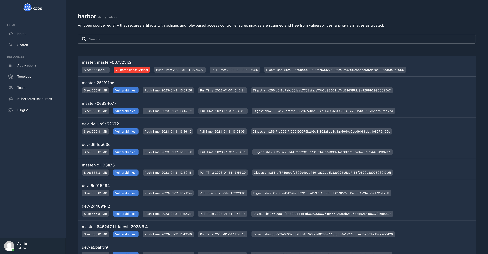
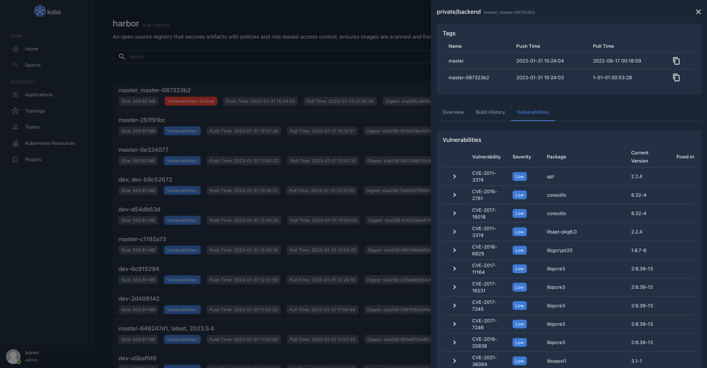

# Harbor

The Harbor plugin can be used to access all your projects, repositories and artifacts from a Harbor instance. You can also show your projects, repositories and artifacts on kobs dashboards.





## Configuration

The following config can be used to grant kobs access to a Harbor instance running on `harbor.kobs.io` and is protected with basic authentication. The credentials will be provided by the environment variables `HARBOR_USERANME` and `HARBOR_PASSWORD`.

```yaml
plugins:
  harbor:
    - name: Harbor
      description: Harbor is an open source registry that secures artifacts with policies and role-based access control, ensures images are scanned and free from vulnerabilities, and signs images as trusted.
      address: https://harbor.kobs.io
      username: ${ES_USERNAME}
      password: ${ES_PASSWORD}
```

| Field | Type | Description | Required |
| ----- | ---- | ----------- | -------- |
| name | string | Name of the Harbor instance. | Yes |
| displayName | string | Name of the Harbor as it is shown in the UI. | Yes |
| description | string | Description of the Harbor instance. | No |
| home | boolean | When this is `true` the plugin will be added to the home page. | No |
| address | string | Address of the Harbor instance. | Yes |
| username | string | Username to access an Harbor instance via basic authentication. | No |
| password | string | Password to access an Harbor instance via basic authentication. | No |
| token | string | Token to access an Harbor instance via token based authentication. | No |

## Options

The following options can be used for a panel with the Harbor plugin:

| Field | Type | Description | Required |
| ----- | ---- | ----------- | -------- |
| type | string | The panel type. This could be `projects`, `repositories` or `artifacts`. | Yes |
| repositories | [Repositories](#repositories) | Details for the panel, when the type is `repositories`. | No |
| artifacts | [Artifacts](#artifacts) | Details for the panel, when the type is `artifacts`. | No |

### Repositories

| Field | Type | Description | Required |
| ----- | ---- | ----------- | -------- |
| projectName | string | The name of the project, for which the repositories should be displayed. | Yes |
| query | string | An optional query to filter the repositories by their name. | No |

### Artifacts

| Field | Type | Description | Required |
| ----- | ---- | ----------- | -------- |
| projectName | string | The name of the project, for which the repositories should be displayed. | Yes |
| repositoryName | string | The name of the repository in the project, for which the artifacts should be displayed. | Yes |
| query | string | An optional query to filter the artifacts by their tags. | No |

## Example

The following dashboards shows all projects, all repositories from the `public` project and all artifacts from the `kobs` repository in the `public` project, where the tag contains `dev`.

```yaml
---
apiVersion: kobs.io/v1
kind: Dashboard
metadata:
  name: harbor
  namespace: kobs
spec:
  title: Harbor
  rows:
    - panels:
        - title: Projects
          plugin:
            name: harbor
            options:
              type: projects
        - title: Repositories
          plugin:
            name: harbor
            options:
              type: repositories
              panel:
                projectName: public
        - title: Artifacts
          plugin:
            name: harbor
            options:
              type: artifacts
              panel:
                projectName: public
                repositoryName: kobs
                query: dev
```
