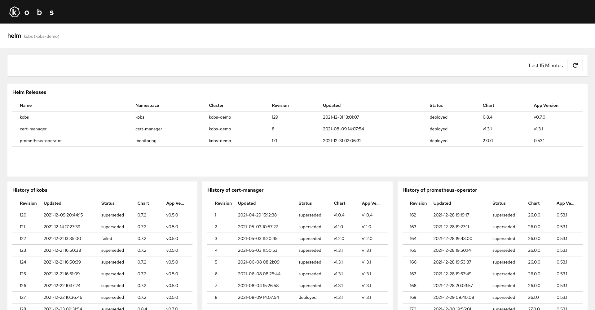
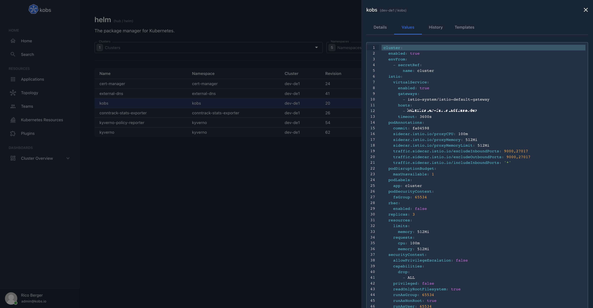

# Helm

The Helm plugin can be used to manage Helm releases within kobs.





## Configuration

The following configuration can be used for the Helm plugin.

```yaml
plugins:
  helm:
    permissionsEnabled: true
```

| Field | Type | Description | Required |
| ----- | ---- | ----------- | -------- |
| permissionsEnabled | boolean | Enable the permission handling. An example of the permission format can be found in the [usage](#usage) section of this page. | No |

## Options

The following options can be used for a panel with the Helm plugin:

| Field | Type | Description | Required |
| ----- | ---- | ----------- | -------- |
| type | string | The panel type. This could be `releases` or `releasehistory`. | Yes |
| clusters | []string | A list of cluster for which the Helm releases should be shown. | Yes |
| namespaces |[]string | A list of namespaces for which the Helm releases should be shown. | Yes |
| name | string | The name of the Helm release for whih the history should be shown, when the type is `releasehistory`. | No |

## Usage

### Permissions

You can define fine grained permissions to access your Helm releases via kobs. The permissions are defined via the `permissions.plugins[].permissions` field of a [User](../resources/users.md) or [Team](../resources/teams.md). The team membership of an user is defined via the values of the `X-Auth-Request-Groups` header.

In the following example each member of `team1@kobs.io` will get access to all Helm releases, while members of `team2@kobs.io` can only view the `kobs` Helm release in the `kobs` namespace and the `prometheus` release in the `monitoring` namespace:

??? note "team1"

    ```yaml
    ---
    apiVersion: kobs.io/v1
    kind: Team
    metadata:
      name: team1
    spec:
      id: team1@kobs.io
      permissions:
        plugins:
          - name: "*"
          - name: helm
            permissions:
              - clusters:
                  - "*"
                namespaces:
                  - "*"
                names:
                  - "*"
    ```

??? note "team2"

    ```yaml
    ---
    apiVersion: kobs.io/v1
    kind: Team
    metadata:
      name: team2
    spec:
      id: team2@kobs.io
      permissions:
        plugins:
          - name: "*"
          - name: helm
            permissions:
              - clusters:
                  - "kobs-demo"
                namespaces:
                  - "kobs"
                names:
                  - "kobs"
              - clusters:
                  - "kobs-demo"
                namespaces:
                  - "monitoring"
                names:
                  - "prometheus"
    ```

## Example

The following dashboards shows all Helm releases from the `kobs` and `monitoring` namespace and the history of the `kobs` and `prometheus-operator` releases.

```yaml
---
apiVersion: kobs.io/v1
kind: Dashboard
spec:
  rows:
    - panels:
        - title: Helm Releases
          plugin:
            name: helm
            options:
              type: releases
              clusters:
                - ""
              namespaces:
                - kobs
                - cert-manager
                - monitoring
    - size: 3
      panels:
        - title: History of kobs
          colSpan: 4
          plugin:
            name: helm
            options:
              type: releasehistory
              clusters:
                - ""
              namespaces:
                - kobs
              name: kobs
        - title: History of cert-manager
          colSpan: 4
          plugin:
            name: helm
            options:
              type: releasehistory
              clusters:
                - ""
              namespaces:
                - cert-manager
              name: cert-manager
        - title: History of prometheus-operator
          colSpan: 4
          plugin:
            name: helm
            options:
              type: releasehistory
              clusters:
                - ""
              namespaces:
                - monitoring
              name: prometheus-operator
```
