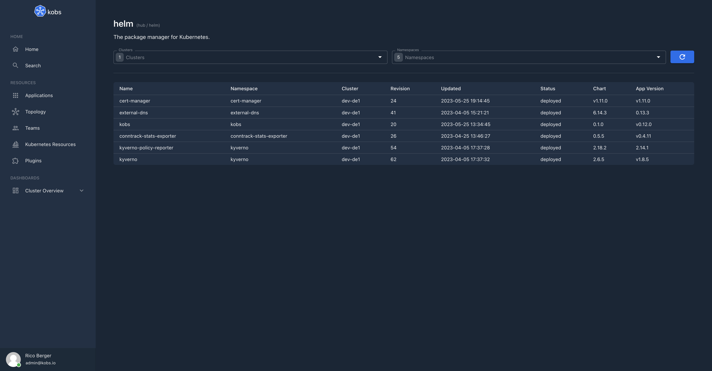
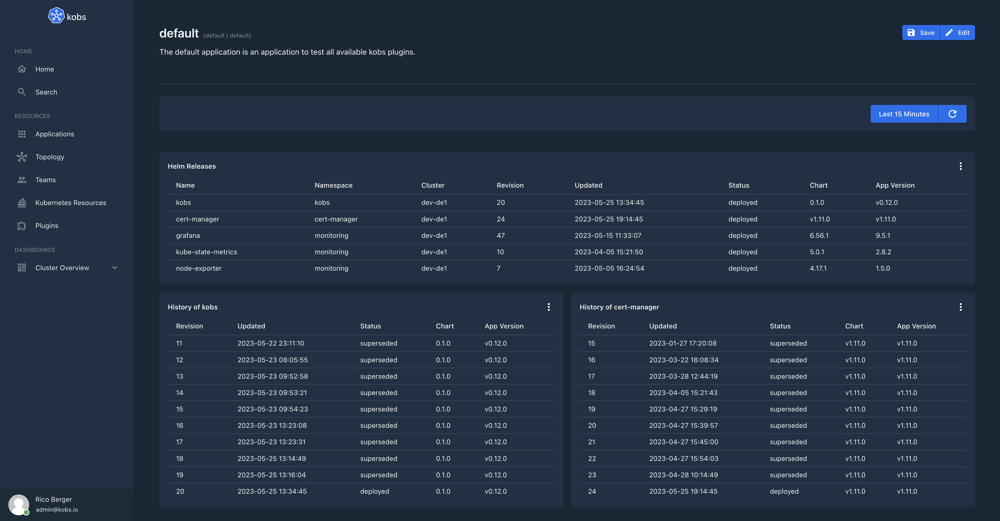

# Helm

The Helm plugin can be used to manage Helm releases within kobs.




## Configuration

The Helm plugin can only be used within the `hub`. To use the Helm plugin the following configuration is needed:

| Field | Type | Description | Required |
| ----- | ---- | ----------- | -------- |
| name | string | The name of the Helm plugin instance. | Yes |
| type | `helm` | The type for the Helm plugin. | Yes |

```yaml
plugins:
  - name: helm
    type: helm
```

## Insight Options

!!! note
    The Helm plugin can not be used within the insights section of an application.

## Variable Options

!!! note
    The Helm plugin can not be used to get a list of variable values.

## Panel Options

The following options can be used for a panel with the Helm plugin:

| Field | Type | Description | Required |
| ----- | ---- | ----------- | -------- |
| type | string | The panel type. This could be `releases` or `releasehistory`. | Yes |
| clusters | []string | A list of cluster for which the Helm releases should be shown. | Yes |
| namespaces |[]string | A list of namespaces for which the Helm releases should be shown. | Yes |
| name | string | The name of the Helm release for whih the history should be shown, when the type is `releasehistory`. | No |

## Usage

### Permissions

A user can only use the Helm plugin when he has the permissions to view all secrets in a cluster / namespace, e.g.

```yaml
---
apiVersion: kobs.io/v1
kind: User
metadata:
  name: ricoberger
  namespace: kobs
spec:
  # The following permissions are required for the user to use the Helm plugin.
  permissions:
    plugins:
      - cluster: "*"
        name: "*"
        type: "*"
    resources:
      - clusters:
          - "*"
        namespaces:
          - "*"
        resources:
          - "secrets"
        verbs:
          - "get"
```

### Example Dashboard

The following dashboards shows all Helm releases from the `kobs` and `monitoring` namespace and the history of the `kobs` and `prometheus-operator` releases.

```yaml
---
apiVersion: kobs.io/v1
kind: Application
metadata:
  name: default
  namespace: default
spec:
  description: The default application is an application to test all available kobs plugins.
  dashboards:
    - title: Helm
      inline:
        rows:
          - autoHeight: true
            panels:
              - title: Helm Releases
                plugin:
                  name: helm
                  type: helm
                  cluster: hub
                  options:
                    type: releases
                    clusters:
                      - "<% $.cluster %>"
                    namespaces:
                      - kobs
                      - cert-manager
                      - monitoring
                h: 6
                w: 12
                x: 0
                'y': 0
              - title: History of kobs
                plugin:
                  name: helm
                  type: helm
                  cluster: hub
                  options:
                    type: releasehistory
                    clusters:
                      - "<% $.cluster %>"
                    namespaces:
                      - kobs
                    name: kobs
                h: 6
                w: 6
                x: 6
                'y': 6
              - title: History of cert-manager
                plugin:
                  name: helm
                  type: helm
                  cluster: hub
                  options:
                    type: releasehistory
                    clusters:
                      - "<% $.cluster %>"
                    namespaces:
                      - cert-manager
                    name: cert-manager
                h: 6
                w: 6
                x: 0
                'y': 6
```


