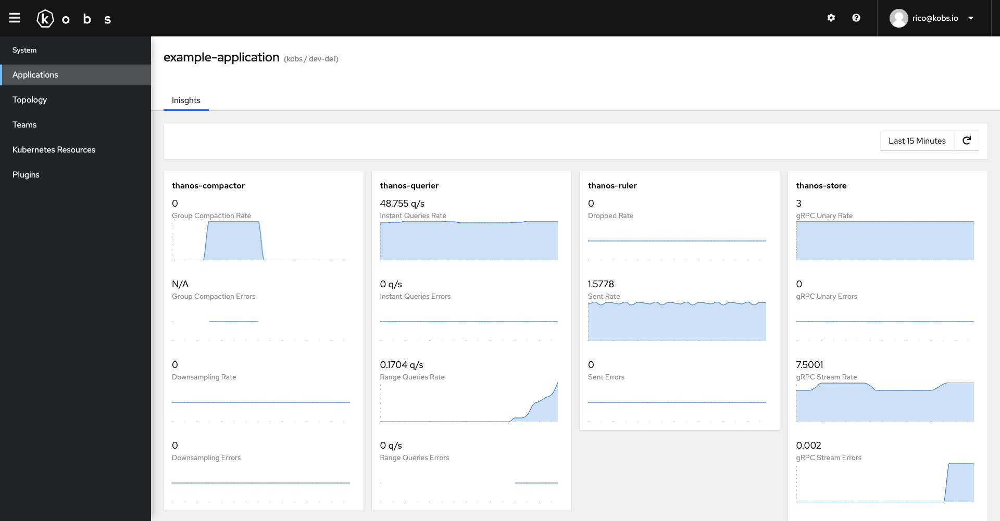
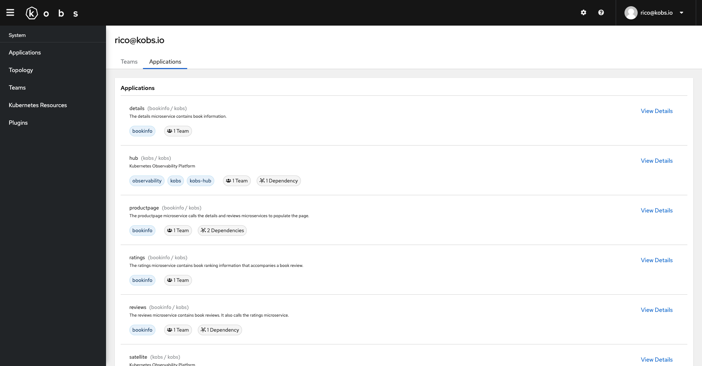
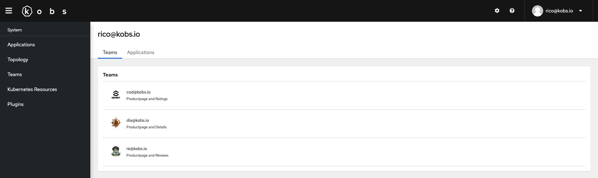
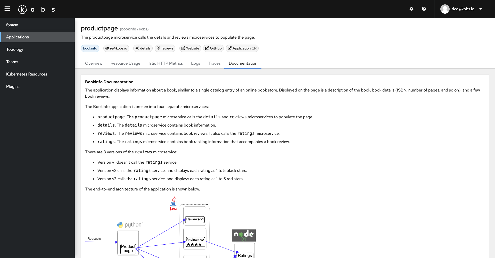

# Getting Started

Plugins can be used to extend the functionality of kobs. For example you can use Prometheus to display metrics, Elasticsearch to display logs or Jaeger to display traces for your application within kobs.

All the configured plugins can be found on the home page of kobs. From this page you can use the configured plugins directly.


## Specification

Plugins can also be used as preview for an application or within a dashboard panel:

| Field | Type | Description | Required |
| ----- | ---- | ----------- | -------- |
| satellite | string | The name of the satellite on which the plugin is configured. This field can be omitted, when the same satellite should be used as for the applicatiom, user, team or dashboard where the plugin is used. | No |
| name | string | The name of the plugin as it is defined in the [configuration file](../getting-started/configuration/satellite.md). Or one of the special values `applications`, `topology`, `userapplications`, `userteams`, `dashboards`, `markdown` or `resources` for plugins where the type is `app`. | Yes |
| type | string | The type of the plugin as it is defined in the [configuration file](../getting-started/configuration/satellite.md) or `app` for the built-in plugins. | Yes |
| options | any | Plugin specific options as they are defined at the plugins page (e.g. PromQL query). | Yes |

## Built-in Plugins

The following built-in plugins can be used when the type of the plugin is set to `app`.

### `applications`

The `applications` plugin can be used to display a list of applications for a team. The plugin requires the following options:

| Field | Type | Description | Required |
| ----- | ---- | ----------- | -------- |
| team | string | The name of the team for which the applications should be shown. This must match a value of a teams `group` property. | Yes |

```yaml
plugin:
  name: applications
  type: app
  options:
    team: dia@kobs.io
```

### `topology`

The `topology` plugin can be used to display the topology graph of an application within a dashboard. The plugin requires the following options:

| Field | Type | Description | Required |
| ----- | ---- | ----------- | -------- |
| satellite | string | The satellite of the application. | Yes |
| cluster | string | The cluster of the application. | Yes |
| namespace | string | The namespace of the application. | Yes |
| name | string | The name of the application | Yes |

```yaml
plugin:
  name: topology
  type: app
  options:
    satellite: "<% $.satellite %>"
    cluster: "<% $.cluster %>"
    namespace: "<% $.namespace %>"
    name: "<% $.name %>"
```

### `insights`

The `insights` plugin can be used to display the insights of an application within a dashboard. The plugin requires the following options:

| Field | Type | Description | Required |
| ----- | ---- | ----------- | -------- |
| satellite | string | The satellite of the application. | Yes |
| cluster | string | The cluster of the application. | Yes |
| namespace | string | The namespace of the application. | Yes |
| name | string | The name of the application | Yes |

```yaml
plugin:
  name: insights
  type: app
  options:
    satellite: "<% $.satellite %>"
    cluster: "<% $.cluster %>"
    namespace: "<% $.namespace %>"
    name: "<% $.name %>"
```

??? note "Example"

    ```yaml
    apiVersion: kobs.io/v1
    kind: Application
    metadata:
      name: example-application
      namespace: kobs
    spec:
      dashboards:
        - title: Inisghts
          inline:
            rows:
              - size: -1
                panels:
                  - title: thanos-compactor
                    colSpan: 3
                    plugin:
                      name: insights
                      type: app
                      options:
                        satellite: "<% $.satellite %>"
                        cluster: "<% $.cluster %>"
                        namespace: "monitoring"
                        name: "thanos-compactor"
                  - title: thanos-querier
                    colSpan: 3
                    plugin:
                      name: insights
                      type: app
                      options:
                        satellite: "<% $.satellite %>"
                        cluster: "<% $.cluster %>"
                        namespace: "monitoring"
                        name: "thanos-querier"
                  - title: thanos-ruler
                    colSpan: 3
                    plugin:
                      name: insights
                      type: app
                      options:
                        satellite: "<% $.satellite %>"
                        cluster: "<% $.cluster %>"
                        namespace: "monitoring"
                        name: "thanos-ruler"
                  - title: thanos-store
                    colSpan: 3
                    plugin:
                      name: insights
                      type: app
                      options:
                        satellite: "<% $.satellite %>"
                        cluster: "<% $.cluster %>"
                        namespace: "monitoring"
                        name: "thanos-store"
    ```



### `userapplications`

The `userapplications` plugin can be used to display the applications which are owned by the teams a user is a member of. This plugin doesn't require any options and is inteded to be used within a User CR to customize a users profile page.



### `userteams`

The `userteams` plugin can be used to display the team a user is a member of. This plugin doesn't require any options and is inteded to be used within a User CR to customize a users profile page.



### `dashboards`

The `dashboards` plugin can be used to display a list of dashboards within a dashboard. The plugin requires the following options:

| Field | Type | Description | Required |
| ----- | ---- | ----------- | -------- |
| satellite | string | The satellite of the dashboard. | Yes |
| cluster | string | The cluster of the dashboard. | Yes |
| namespace | string | The namespace of the dashboard. | Yes |
| name | string | The name of the dashboard | Yes |
| title | string | The title of the dashboard. | Yes |
| description | string | An optional description for the dashboard. | No |
| placeholders | map<string, string> | A map of placeholders for the dashboard, with the placeholder name as key and the placeholder value as value. | No |

```yaml
plugin:
  name: dashboards
  type: app
  options:
    - satellite: "<% $.satellite %>"
      cluster: "<% $.cluster %>"
      namespace: kobs
      name: elasticsearch-details
      title: Details
      placeholders:
        namespace: ""
        cluster: ""
```

### `markdown`

The `markdown` plugin can be used to display a Markdown formatted text within a dashboard. The plugin requires the following options:

| Field | Type | Description | Required |
| ----- | ---- | ----------- | -------- |
| text | string | The markdown formatted text. | Yes |

```yaml
plugin:
  name: markdown
  type: app
  options:
    text: |
      The application displays information about a
      book, similar to a single catalog entry of an online book store. Displayed
      on the page is a description of the book, book details (ISBN, number of
      pages, and so on), and a few book reviews.

      The Bookinfo application is broken into four separate microservices:

      * `productpage`. The `productpage` microservice calls the `details` and `reviews` microservices to populate the page.
      * `details`. The `details` microservice contains book information.
      * `reviews`. The `reviews` microservice contains book reviews. It also calls the `ratings` microservice.
      * `ratings`. The `ratings` microservice contains book ranking information that accompanies a book review.

      There are 3 versions of the `reviews` microservice:

      * Version v1 doesn't call the `ratings` service.
      * Version v2 calls the `ratings` service, and displays each rating as 1 to 5 black stars.
      * Version v3 calls the `ratings` service, and displays each rating as 1 to 5 red stars.

      The end-to-end architecture of the application is shown below.

      

      This application is polyglot, i.e., the microservices are written in different languages.
      It's worth noting that these services have no dependencies on Istio, but make an interesting
      service mesh example, particularly because of the multitude of services, languages and versions
      for the `reviews` service.
```



### `resources`

The `resources` plugin can be used to display Kubernetes resources within a dashboard. The plugin requires the following options:

| Field | Type | Description | Required |
| ----- | ---- | ----------- | -------- |
| satellites | []string | A list of satellites for which the resources should be shown. | Yes |
| clusters | []string | A list of clusters for which the resources should be shown. | Yes |
| namespaces | []string | A list of namespaces for which the resources should be shown. | Yes |
| resources | []string | A list of resources for which the resources should be shown. The following strings can be used as resource: `cronjobs`, `daemonsets`, `deployments`, `jobs`, `pods`, `replicasets`, `statefulsets`, `endpoints`, `horizontalpodautoscalers`, `ingresses`, `networkpolicies`, `services`, `configmaps`, `persistentvolumeclaims`, `persistentvolumes`, `poddisruptionbudgets`, `secrets`, `serviceaccounts`, `storageclasses`, `clusterrolebindings`, `clusterroles`, `rolebindings`, `roles`, `events`, `nodes`, `podsecuritypolicies`. A Custom Resource can be used as follows `<name>.<group>/<version>` (e.g. `vaultsecrets.ricoberger.de/v1alpha1`). | Yes |
| selector | string | A label selector for the resources. | No |
| columns | [[]Column](#column) | An optional list of columns to customize the shown fields for a resource. | No |
| filter | string | An optional filter using [JSONPath](https://goessner.net/articles/JsonPath/) to filter the list of resources. | No |

#### Column

| Field | Type | Description | Required |
| ----- | ---- | ----------- | -------- |
| title | string | A title for the column. | Yes |
| resource | string | The name of the resource for which the column should be used. | Yes |
| jsonPath | string | The [JSONPath](https://goessner.net/articles/JsonPath/) which should be used to select the value from the resource manifest file. | Yes |
| type | string | An optional type for formatting the column values. Currently only `date` is supported as special formatter. | No |

```yaml
plugin:
  name: resources
  type: app
  options:
    satellites:
      - kobs
    clusters:
      - kobs
    namespaces:
      - bookinfo
    resources:
      - pods
      - deployments
      - services
    selector: app=productpage
```

!!! note
    If you want to display Kubernetes resources from the same satellite / cluster / namespace as it is used in an application / user / team / dashboard you can use the following JSONPath to set the values: `<% $.satellite %>`, `<% $.cluster %>`, `<% $.namespace %>` and `<% $.name %>`. For example the following configuration would display all pods and deployments with from the same satellite, cluster and namespace where the application lives.

    ```yaml
    plugin:
      name: resources
      type: app
      options:
        satellites:
          - "<% $.satellite %>"
        clusters:
          - "<% $.cluster %>"
        namespaces:
          - "<% $.namespace %>"
        resources:
          - pods
          - deployments
        selector: app.kubernetes.io/name="<% $.name %>"
    ```

??? note "Example 1 with Custom Columns"

    ```yaml
    plugin:
      name: resources
      type: app
      options:
        satellites:
          - "<% $.satellite %>"
        clusters:
          - "<% $.cluster %>"
        namespaces:
          - bookinfo
        resources:
          - pods
          - deployments
        selector: app=reviews
        columns:
          - title: Image
            resource: pods
            jsonPath: "$.spec.containers[?(@.name==='bookinfo')].image"
          - title: Creation Time
            resource: pods
            jsonPath: "$.metadata.creationTimestamp"
            type: date
          - title: Image
            resource: deployments
            jsonPath: "$.spec.template.spec.containers[*].image"
    ```

??? note "Example 2 with Custom Columns"

    ```yaml
    plugin:
      name: resources
      type: app
      options:
        satellites:
          - "<% $.satellite %>"
        clusters:
          - "<% $.cluster %>"
        namespaces:
          - bookinfo
        resources:
          - vaultsecrets.ricoberger.de/v1alpha1
        columns:
          - title: Status
            resource: vaultsecrets.ricoberger.de/v1alpha1
            jsonPath: "$.status.conditions[*].status"
          - title: Reason
            resource: vaultsecrets.ricoberger.de/v1alpha1
            jsonPath: "$.status.conditions[*].reason"
          - title: Type
            resource: vaultsecrets.ricoberger.de/v1alpha1
            jsonPath: "$.status.conditions[*].type"
          - title: Message
            resource: vaultsecrets.ricoberger.de/v1alpha1
            jsonPath: "$.status.conditions[*].message"
          - title: Last Transition Time
            resource: vaultsecrets.ricoberger.de/v1alpha1
            jsonPath: "$.status.conditions[*].lastTransitionTime"
            type: date
    ```

### `static`

The `static` plugin can be used within the variables section of a dashboard, to define a static list of variable values. The options for this plugin is a list of strings with the possible values for the variable:

```yaml
variables:
  - name: var_reporter
    label: Reporter
    plugin:
      name: static
      type: app
      options:
        - destination
        - source
```
