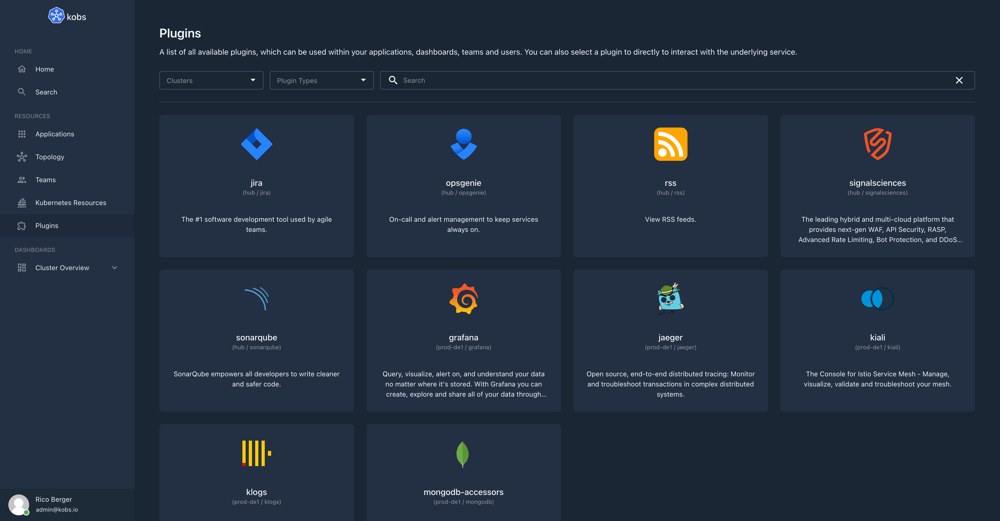

# Getting Started

Plugins can be used to extend the functionality of kobs. For example you can use Prometheus to display metrics, Elasticsearch to display logs or Jaeger to display traces for your application within kobs.

All the configured plugins can be found on the home page of kobs. From this page you can use the configured plugins directly.



## Specification

Plugins can also be used as preview for an application or within a dashboard panel:

| Field | Type | Description | Required |
| ----- | ---- | ----------- | -------- |
| cluster | string | The name of the cluster on which the plugin is configured. This field can be omitted, when the same cluster should be used as for the applicatiom, user, team or dashboard where the plugin is used. | No |
| name | string | The name of the plugin as it is defined in the configuration file for the [hub](../getting-started/configuration/hub.md) or [cluster](../getting-started/configuration/cluster.md). Or one of the special values `applications`, `applicationgroups`, `applicationinsights` `topology`, `teams`, `dashboards` or `resources` for plugins where the type is `core`. | Yes |
| type | string | The type of the plugin as it is defined in the configuration file for the [hub](../getting-started/configuration/hub.md) or [cluster](../getting-started/configuration/cluster.md) or `core` for the built-in plugins. | Yes |
| options | any | Plugin specific options as they are defined at the plugins page (e.g. PromQL query). | Yes |

## Built-in Plugins

The following built-in plugins can be used when the type of the plugin is set to `core`.

### `applications`

The `applications` plugin can be used to display a list of applications for a team. The plugin requires the following options:

| Field | Type | Description | Required |
| ----- | ---- | ----------- | -------- |
| team | string | The name of the team for which the applications should be shown. This must match a value of a teams `id` property. If the value is not provided the teams of the current user are used. | No |

```yaml
plugin:
  name: applications
  type: core
  options:
    team: dia@kobs.io
```

### `applicationgroups`

The `applicationgroups` plugin can be used to display a list of applications for a team grouped by their cluster, namespace and name values. The plugin requires the following options:

| Field | Type | Description | Required |
| ----- | ---- | ----------- | -------- |
| groups | []string | A list of groups by which the applications should be grouped. The following values can be used `cluster`, `namespace` or `name`. | Yes |
| team | string | The name of the team for which the applications should be shown. This must match a value of a teams `id` property. If the value is not provided the teams of the current user are used. | No |

```yaml
plugin:
  name: applicationgroups
  type: core
  options:
    groups:
      - namespace
      - name
```

### `applicationinsights`

The `applicationinsights` plugin can be used to display the insights of an application within a dashboard. The plugin requires the following options:

| Field | Type | Description | Required |
| ----- | ---- | ----------- | -------- |
| cluster | string | The cluster of the application. | Yes |
| namespace | string | The namespace of the application. | Yes |
| name | string | The name of the application. | Yes |
| direction | string | The direction in which the insight panels should be displayed. Must be `column` or `row`. The default value is `column`. | No |

```yaml
plugin:
  name: applicationinsights
  type: core
  options:
    cluster: "<% $.cluster %>"
    namespace: "<% $.namespace %>"
    name: "<% $.name %>"
    direction: row
```

### `topology`

The `topology` plugin can be used to display the topology graph of an application within a dashboard. The plugin requires the following options:

| Field | Type | Description | Required |
| ----- | ---- | ----------- | -------- |
| cluster | string | The cluster of the application. | Yes |
| namespace | string | The namespace of the application. | Yes |
| name | string | The name of the application | Yes |

```yaml
plugin:
  name: topology
  type: core
  options:
    cluster: "<% $.cluster %>"
    namespace: "<% $.namespace %>"
    name: "<% $.name %>"
```

### `teams`

The `teams` plugin can be used to display a list of teams for the currently authenticated user.

```yaml
plugin:
  name: teams
  type: core
```

### `dashboards`

The `dashboards` plugin can be used to display a list of links to dashboards within a dashboard. Each link can contain multiple dashboards.

| Field | Type | Description | Required |
| ----- | ---- | ----------- | -------- |
| title | string | The title of the page for the dashboards. | Yes |
| description | string | The description of the page for the dashboards. | Yes |
| dashboards | [[]Dashboard](../resources//applications.md#dashboard) | A list of dashboards which will be shown on the linked page. | Yes |

```yaml
plugin:
  name: dashboards
  type: core
  options:
    - title: My Dashboards Page
      description: My Dashboards Page Description
      dashboards:
        - title: Dashboard 1
          cluster: cluster1
          namespace: namespace1
          name: name1
        - title: Dashboard 2
          cluster: cluster2
          namespace: namespace2
          name: name2
```

### `resources`

The `resources` plugin can be used to display Kubernetes resources within a dashboard. The plugin can be used in the notifications or in a panel within a dashboard.

#### Panel Options

| Field | Type | Description | Required |
| ----- | ---- | ----------- | -------- |
| clusters | []string | A list of clusters for which the resources should be shown. | Yes |
| namespaces | []string | A list of namespaces for which the resources should be shown. | Yes |
| resources | []string | A list of resources for which the resources should be shown. The following strings can be used as resource: `cronjobs`, `daemonsets`, `deployments`, `jobs`, `pods`, `replicasets`, `statefulsets`, `endpoints`, `horizontalpodautoscalers`, `ingresses`, `networkpolicies`, `services`, `configmaps`, `persistentvolumeclaims`, `persistentvolumes`, `poddisruptionbudgets`, `secrets`, `serviceaccounts`, `storageclasses`, `clusterrolebindings`, `clusterroles`, `rolebindings`, `roles`, `events`, `nodes`. A Custom Resource can be used as follows `<name>.<group>` (e.g. `vaultsecrets.ricoberger.de`). | Yes |
| paramName | string | The name of the parameter which should be used for filtering the resources. Must be `labelSelector` or `fieldSelector`. | No |
| param | string | The parameter which is used to filter the resources. | No |
| columns | [[]Column](#column) | An optional list of columns to customize the shown fields for a resource. | No |
| filter | string | An optional filter using [JSONPath](https://goessner.net/articles/JsonPath/) to filter the list of resources. | No |

##### Column

| Field | Type | Description | Required |
| ----- | ---- | ----------- | -------- |
| title | string | A title for the column. | Yes |
| resource | string | The name of the resource for which the column should be used. | Yes |
| jsonPath | string | The [JSONPath](https://goessner.net/articles/JsonPath/) which should be used to select the value from the resource manifest file. | Yes |
| type | string | An optional type for formatting the column values. Currently only `date` is supported as special formatter. | No |

#### Examples

```yaml
plugin:
  name: resources
  type: core
  options:
    clusters:
      - kobs
    namespaces:
      - bookinfo
    resources:
      - pods
      - deployments
      - services
    paramName: labelSelector
    param: app=productpage
```

!!! note
    If you want to display Kubernetes resources from the same cluster / namespace as it is used in an application / user / team / dashboard you can use the following JSONPath to set the values: `<% $.cluster %>`, `<% $.namespace %>` and `<% $.name %>`. For example the following configuration would display all pods and deployments with from the same satellite, cluster and namespace where the application lives.

    ```yaml
    plugin:
      name: resources
      type: core
      options:
        clusters:
          - "<% $.cluster %>"
        namespaces:
          - "<% $.namespace %>"
        resources:
          - pods
          - deployments
        paramName: labelSelector
        param: app.kubernetes.io/name="<% $.name %>"
    ```

??? note "Example 1 with Custom Columns"

    ```yaml
    plugin:
      name: resources
      type: core
      options:
        clusters:
          - "<% $.cluster %>"
        namespaces:
          - bookinfo
        resources:
          - pods
          - deployments
        paramName: labelSelector
        param: app=reviews
        columns:
          - title: Image
            resource: pods
            jsonPath: "$.spec.containers[?(@.name==='bookinfo')].image"
          - title: Creation Time
            resource: pods
            jsonPath: "$.metadata.creationTimestamp"
            type: date
          - title: Image
            resource: deployments
            jsonPath: "$.spec.template.spec.containers[*].image"
    ```

??? note "Example 2 with Custom Columns"

    ```yaml
    plugin:
      name: resources
      type: core
      options:
        clusters:
          - "<% $.cluster %>"
        namespaces:
          - bookinfo
        resources:
          - vaultsecrets.ricoberger.de/v1alpha1
        columns:
          - title: Status
            resource: vaultsecrets.ricoberger.de/v1alpha1
            jsonPath: "$.status.conditions[*].status"
          - title: Reason
            resource: vaultsecrets.ricoberger.de/v1alpha1
            jsonPath: "$.status.conditions[*].reason"
          - title: Type
            resource: vaultsecrets.ricoberger.de/v1alpha1
            jsonPath: "$.status.conditions[*].type"
          - title: Message
            resource: vaultsecrets.ricoberger.de/v1alpha1
            jsonPath: "$.status.conditions[*].message"
          - title: Last Transition Time
            resource: vaultsecrets.ricoberger.de/v1alpha1
            jsonPath: "$.status.conditions[*].lastTransitionTime"
            type: date
    ```

### `static`

The `static` plugin can be used within the variables section of a dashboard, to define a static list of variable values. The options for this plugin is a list of strings with the possible values for the variable:

```yaml
variables:
  - name: var_reporter
    label: Reporter
    plugin:
      name: static
      type: core
      options:
        - destination
        - source
```
