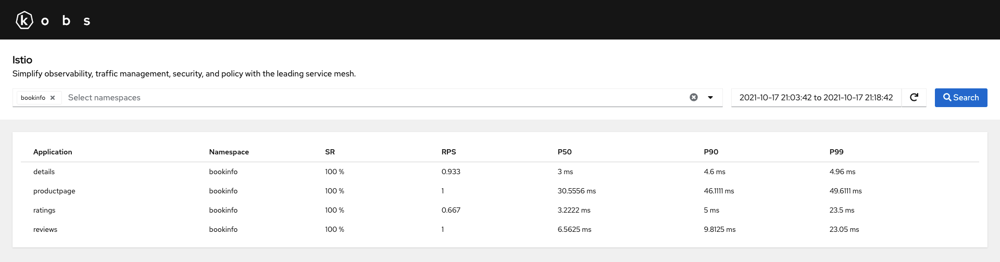
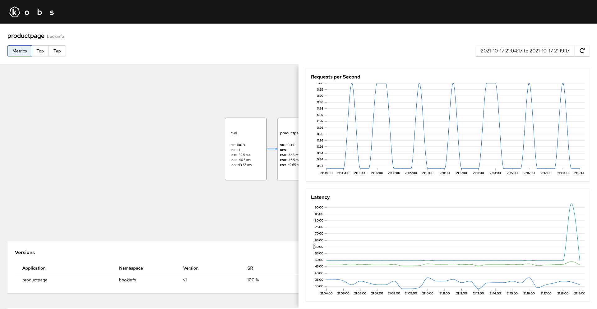
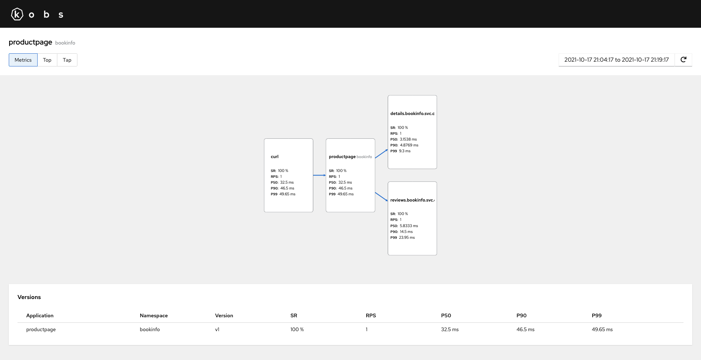
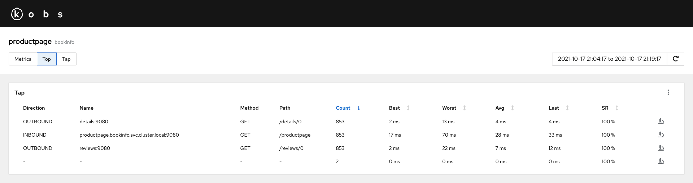
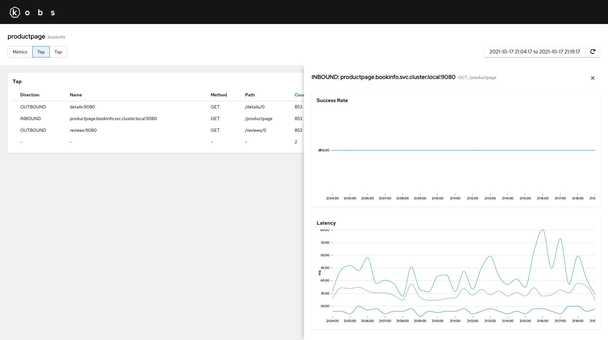
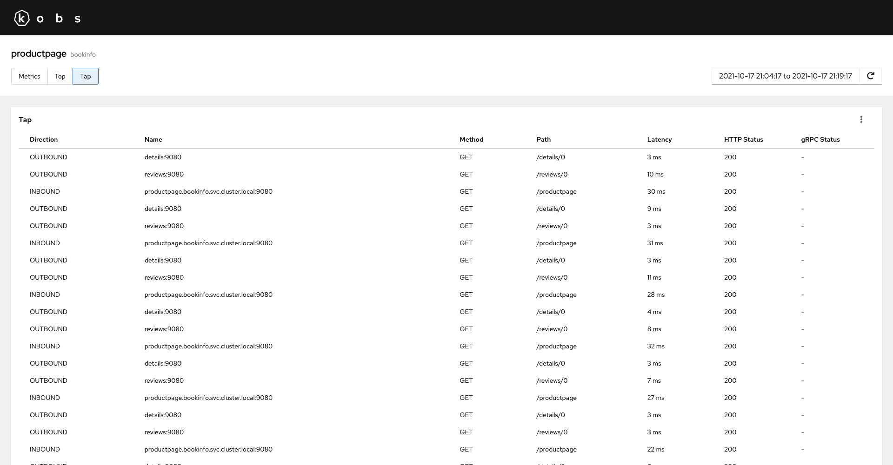
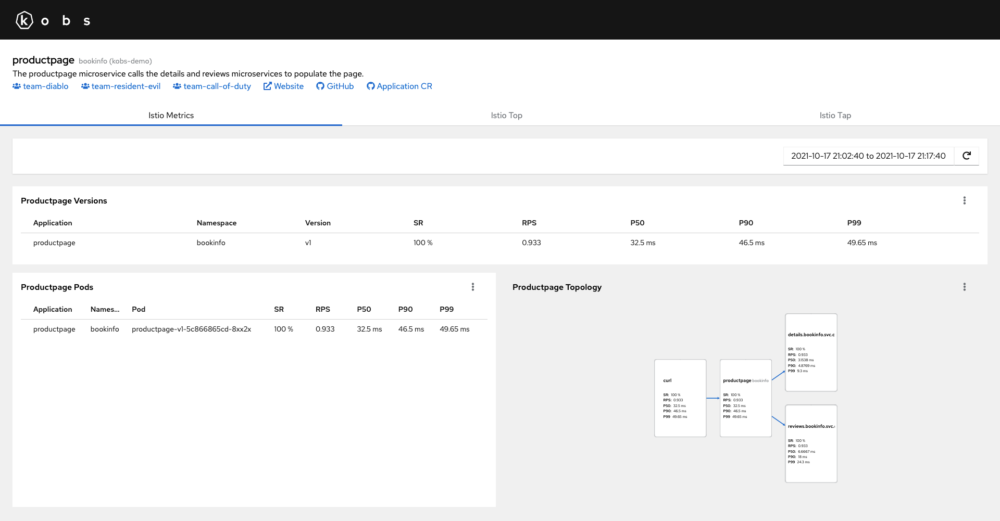
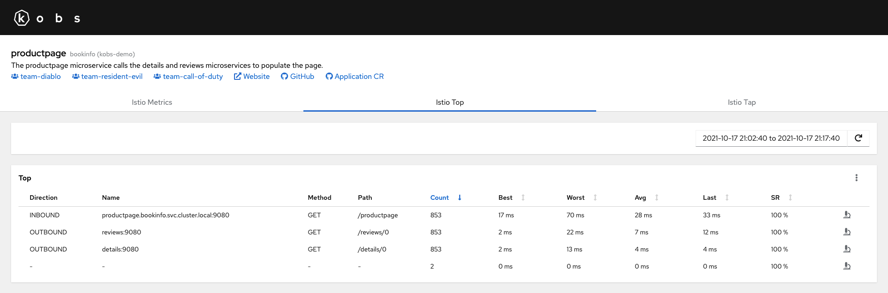
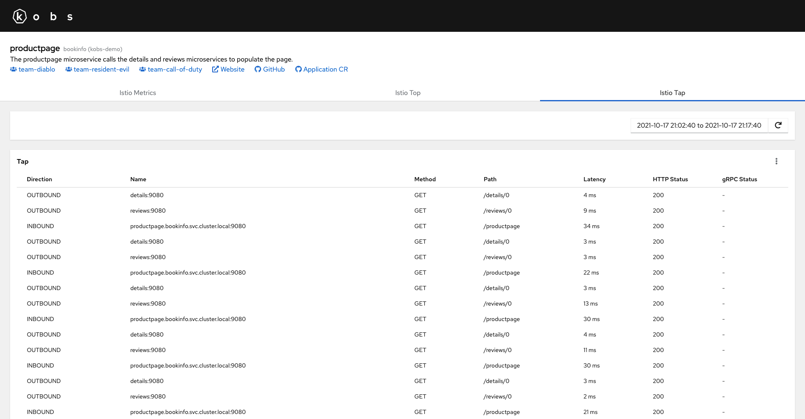

# Istio

The Istio plugin can be used to observe your service mesh within kobs. For that kobs uses an existing Prometheus and klogs instance to get the metrics for your applications which are part of the service mesh and to build a simple topology graph for them.



For each application you have a metrics, top and tap view. The metrics view shows all incoming and outgoing connections. Next to the topology graph you can also view the success rate, requests per second and latency metrics for each version and Pod of your application.





The top view can be used to get the aggregated metrics, based on the request direction, service, method and path. These metrics are generated based on the access logs via the klogs plugin. The top view shows the number of requests, the best, worst, average, and last request duration and the success rate. You can also go to the tap view, for a specific request type.





The tap view can be used to live tail all requests. You can filter the view by the name, method and path.



## Configuration

The following configuration can be used to access a Istio instances using a Prometheus plugin named `prometheus` and an klogs plugin named `klogs`.

```yaml
plugins:
  istio:
    - name: istio
      displayName: Istio
      description: Simplify observability, traffic management, security, and policy with the leading service mesh.
      prometheus:
        enabled: true
        name: prometheus
      klogs:
        enabled: true
        name: klogs
```

| Field | Type | Description | Required |
| ----- | ---- | ----------- | -------- |
| name | string | Name of the Istio instance. | Yes |
| displayName | string | Name of the Istio as it is shown in the UI. | Yes |
| descriptions | string | Description of the Istio instance. | No |
| prometheus.enabled | boolean | Enabled the Prometheus integration for Istio. | No |
| prometheus.name | string | The name of the Prometheus instance which should be used for the Istio instance. | No |
| klogs.enabled | boolean | Enabled the klogs integration for Istio. | No |
| klogs.name | string | The name of the klogs instance which should be used for the Istio instance. | No |

## Options

The following options can be used for a panel with the Istio plugin:

| Field | Type | Description | Required |
| ----- | ---- | ----------- | -------- |
| type | string | The panel type, must be `list`, `metricsVersions`, `metricsPods`, `metricsTopology`, `top` or `tap`. | Yes |
| namespaces | []string | A list of namespaces. If the type **is not** `list` the list must contain extactly one entry. | Yes |
| application | string | The name of the application. This options is not available for the `list` option. | No |
| filters | [[]Filter](#filter) | Filters which should be used for the `top` or `tap` view. | No |

### Filter

| Field | Type | Description | Required |
| ----- | ---- | ----------- | -------- |
| name | string | Filter the top / tap results by the specified name. | No |
| method | string | Filter the top / tap results by the specified method. | No |
| path | string | Filter the top / tap results by the specified path. | No |

## Example

The following Application contains three dashboards to get the metrics, top and tab view for the `productpage` Application in the `bookinfo` namespace.

```yaml
---
apiVersion: kobs.io/v1
kind: Application
metadata:
  name: productpage
  namespace: bookinfo
spec:
  description: The productpage microservice calls the details and reviews microservices to populate the page.
  links:
    - title: Website
      link: https://istio.io/latest/docs/examples/bookinfo/
    - title: GitHub
      link: https://github.com/istio/istio/tree/master/samples/bookinfo
    - title: Application CR
      link: https://github.com/kobsio/kobs/blob/main/deploy/demo/bookinfo/productpage-application.yaml
  teams:
    - name: team-diablo
      namespace: kobs
    - name: team-resident-evil
      namespace: kobs
    - name: team-call-of-duty
      namespace: kobs
  dashboards:
    - title: Istio Metrics
      inline:
        rows:
          - size: 1
            panels:
              - title: Productpage Versions
                plugin:
                  name: istio
                  options:
                    type: metricsVersions
                    namespaces:
                      - bookinfo
                    application: productpage
          - size: 3
            panels:
              - title: Productpage Pods
                colSpan: 6
                plugin:
                  name: istio
                  options:
                    type: metricsPods
                    namespaces:
                      - bookinfo
                    application: productpage
              - title: Productpage Topology
                colSpan: 6
                plugin:
                  name: istio
                  options:
                    type: metricsTopology
                    namespaces:
                      - bookinfo
                    application: productpage
    - title: Istio Top
      inline:
        rows:
          - size: -1
            panels:
              - title: Top
                plugin:
                  name: istio
                  options:
                    type: top
                    namespaces:
                      - bookinfo
                    application: productpage
    - title: Istio Tap
      inline:
        rows:
          - size: -1
            panels:
              - title: Tap
                plugin:
                  name: istio
                  options:
                    type: tap
                    namespaces:
                      - bookinfo
                    application: productpage
```

In the following you found the screenshots for the Application, which was created with the manifest from above.






