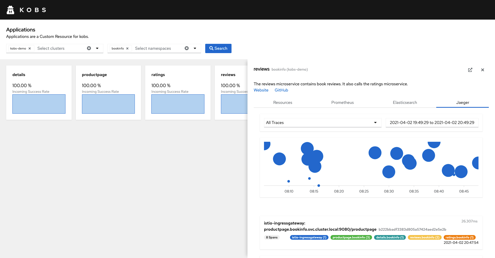

# Jaeger

The Jaeger plugin can be used to retrieve traces from a configured Jaeger instance. You can specify the service, operation and tags for which you want to retrieve traces. You can also view the details of a trace and compare it with another trace.


## Specification

The following specification can be used, within an application.

| Field | Type | Description | Required |
| ----- | ---- | ----------- | -------- |
| queries | [[]Query](#query) | A list of queries, to retrieve traces for. | Yes |

### Query

| Field | Type | Description | Required |
| ----- | ---- | ----------- | -------- |
| name | string | A name for the query. | Yes |
| service | string | The service to retrieve traces for. | Yes |
| operation | string | An optional operation to retrieve traces for. | No |
| tags | string | Tags, which the traces must be contain. | No |

For example the following query specification will display all traces for the `reviews.bookinfo` service.

```yaml
spec:
  plugins:
    - name: Jaeger
      jaeger:
        queries:
          - name: All Traces
            service: reviews.bookinfo
```


