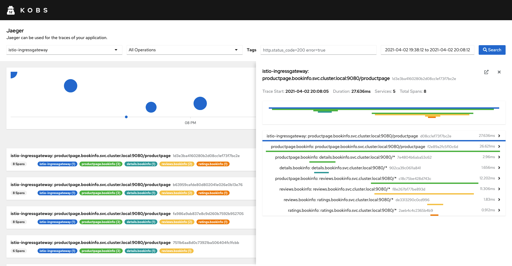
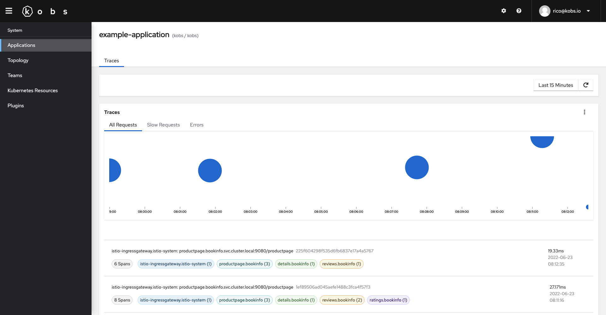

# Jaeger

The Jaeger plugin can be used to retrieve traces from a configured Jaeger instance. You can specify the service, operation and tags for which you want to retrieve traces. You can also view the details of a trace and compare it with another trace.





## Configuration

To use the Jaeger plugin the following configuration is needed in the satellites configuration file:

| Field | Type | Description | Required |
| ----- | ---- | ----------- | -------- |
| name | string | The name of the Jaeger plugin instance. | Yes |
| type | `jaeger` | The type for the Jaeger plugin. | Yes |
| options.address | string | Address of the Jaeger instance. | Yes |
| options.username | string | Username to access a Jaeger instance via basic authentication. | No |
| options.password | string | Password to access a Jaeger instance via basic authentication. | No |
| options.token | string | Token to access a Jaeger instance via token based authentication. | No |
| frontendOptions.address | string | The address of the Jaeger instance, which can be accessed by the user. | No |

```yaml
plugins:
  - name: jaeger
    type: jaeger
    options:
      address:
      username:
      password:
      token:
    frontendOptions:
      address:
```

## Insight Options

!!! note
    The Jaeger plugin can not be used within the insights section of an application.

## Variable Options

!!! note
    The Jaeger plugin can not be used to get a list of variable values.

## Panel Options

The following options can be used for a panel with the Jaeger plugin:

| Field | Type | Description | Required |
| ----- | ---- | ----------- | -------- |
| showChart | boolean | If this is `true` the chart with the traces will be shown. | No |
| queries | [[]Query](#query) | A list of Jaeger queries, which can be selected by the user. | Yes |

### Query

| Field | Type | Description | Required |
| ----- | ---- | ----------- | -------- |
| name | string | A name for the Jaeger query, which is displayed in the select box. | Yes |
| limit | string | The maximum number of traces which should be shown. The default value is `20`. | No |
| maxDuration | string | The maximum duration for the retrieved traces (e.g. `1s`). | No |
| minDuration | string | The minimum duration for the retrieved traces (e.g. `100ms`). | No |
| service | string | The service to retrieve traces for. | Yes |
| operation | string | An optional operation to retrieve traces for. | No |
| tags | string | Tags, which the traces must be contain. | No |

## Usage

```yaml
---
apiVersion: kobs.io/v1
kind: Application
metadata:
  name: example-application
  namespace: kobs
spec:
  dashboards:
    - title: Traces
      inline:
        rows:
          - size: -1
            panels:
              - title: Traces
                colSpan: 12
                plugin:
                  name: jaeger
                  type: jaeger
                  options:
                    showChart: true
                    queries:
                      - name: All Requests
                        service: productpage.bookinfo
                      - name: Slow Requests
                        service: productpage.bookinfo
                        minDuration: 100ms
                      - name: Errors
                        service: productpage.bookinfo
                        tags: error=true

```


