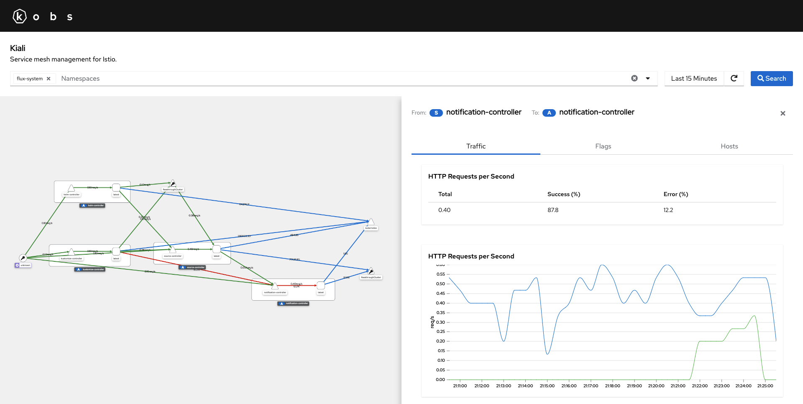

# Kiali

The Kiali plugin can be used to visualize your Istio service mesh within kobs. You can select a list of namespaces for which the topology graph from [Kiali](https://kiali.io) should be retrieved. When you select a node or edge in the topology graph you can view the detailed metrics for the selected edge or node.



## Configuration

The following configuration can be used to access a Kiali instances running on `kiali.kobs.io`. We also enable the visualization of the traffic and set the threshold to mark edges with degraded performance or failures.

```yaml
plugins:
  kiali:
    - name: Kiali
      description: Service mesh management for Istio.
      address: https://kiali.kobs.io
      traffic:
        degraded: 1
        failure: 5
```

| Field | Type | Description | Required |
| ----- | ---- | ----------- | -------- |
| name | string | Name of the Kiali instance. | Yes |
| displayName | string | Name of the Kiali instance as it is shown in the UI. | Yes |
| descriptions | string | Description of the Kiali instance. | No |
| address | string | Address of the Kiali instance. | Yes |
| username | string | Username to access a Kiali instance via basic authentication. | No |
| password | string | Password to access a Kiali instance via basic authentication. | No |
| token | string | Token to access a Kiali instance via token based authentication. | No |
| traffic.failure | number | Threshold to mark edges with failures. This must be a number between `0` and `100`. The default value is `5`. | No |
| traffic.degraded | number | Threshold to mark edges with degraded performance. This must be a number between `0` and `100`. The default value is `1`. | No |

## Options

The following options can be used for a panel with the Kiali plugin:

| Field | Type | Description | Required |
| ----- | ---- | ----------- | -------- |
| namespaces | []string | A list of namespaces for which the topology graph should be shown. | Yes |
