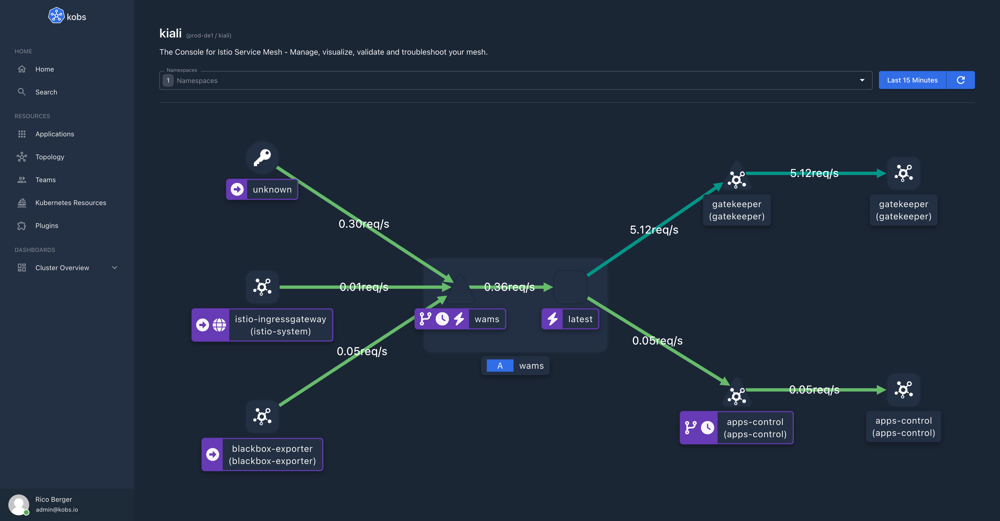
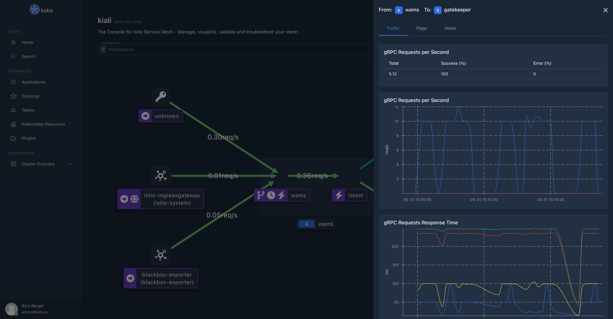
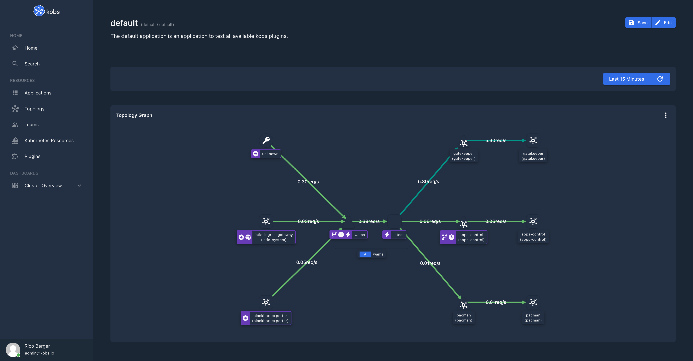

# Kiali

The Kiali plugin can be used to visualize your Istio service mesh within kobs. You can select a list of namespaces for which the topology graph from [Kiali](https://kiali.io) should be retrieved. When you select a node or edge in the topology graph you can view the detailed metrics for the selected edge or node.





## Configuration

The Kiali plugin can be used within the `hub` or `cluster`. To use the Kiali plugin the following configuration is needed:

| Field | Type | Description | Required |
| ----- | ---- | ----------- | -------- |
| name | string | The name of the Kiali plugin instance. | Yes |
| type | `kiali` | The type for the Kiali plugin. | Yes |
| options.address | string | Address of the Kiali instance. | Yes |
| options.username | string | Username to access a Kiali instance via basic authentication. | No |
| options.password | string | Password to access a Kiali instance via basic authentication. | No |
| options.token | string | Token to access a Kiali instance via token based authentication. | No |
| options.traffic.failure | number | Threshold to mark edges with failures. This must be a number between `0` and `100`. The default value is `5`. | No |
| options.traffic.degraded | number | Threshold to mark edges with degraded performance. This must be a number between `0` and `100`. The default value is `1`. | No |

```yaml
plugins:
  - name: kiali
    type: kiali
    options:
      address:
      username:
      password:
      token:
      traffic:
        degraded: 1
        failure: 5
```

## Insight Options

!!! note
    The Kiali plugin can not be used within the insights section of an application.

## Variable Options

!!! note
    The Kiali plugin can not be used to get a list of variable values.

## Panel Options

The following options can be used for a panel with the Kiali plugin:

| Field | Type | Description | Required |
| ----- | ---- | ----------- | -------- |
| namespaces | []string | A list of namespaces for which the topology graph should be shown. | Yes |
| application | string | The name of an application to show the topology graph only for this application. When an application is provided the `namespaces` property must contain exactly one namespace. | No |

## Usage

```yaml
---
apiVersion: kobs.io/v1
kind: Application
metadata:
  name: default
  namespace: default
spec:
  description: The default application is an application to test all available kobs plugins.
  dashboards:
    - title: Flux
      inline:
        rows:
          - panels:
              - title: Topology Graph
                plugin:
                  name: kiali
                  type: kiali
                  options:
                    namespaces:
                      - wams
                    application: wams
                h: 14
                w: 12
                x: 0
                'y': 0
```


