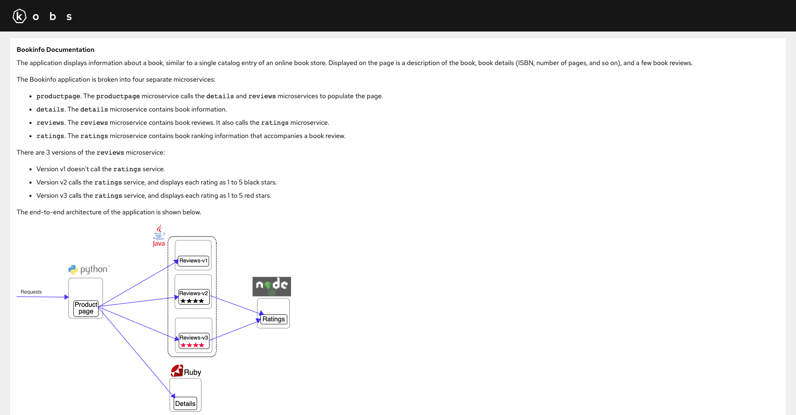

# Markdown

The markdown plugin can be used to show a markdown formatted text on a dashboard.



## Options

The following options can be used for a panel with the markdown plugin:

| Field | Type | Description | Required |
| ----- | ---- | ----------- | -------- |
| text | string | The markdown formatted text, which is shown within a panel. | Yes |

```yaml
---
apiVersion: kobs.io/v1beta1
kind: Dashboard
spec:
  rows:
    - size: -1
      panels:
        - title: Bookinfo Documentation
          plugin:
            name: markdown
            options:
              text: |
                The application displays information about a
                book, similar to a single catalog entry of an online book store. Displayed
                on the page is a description of the book, book details (ISBN, number of
                pages, and so on), and a few book reviews.

                The Bookinfo application is broken into four separate microservices:

                * `productpage`. The `productpage` microservice calls the `details` and `reviews` microservices to populate the page.
                * `details`. The `details` microservice contains book information.
                * `reviews`. The `reviews` microservice contains book reviews. It also calls the `ratings` microservice.
                * `ratings`. The `ratings` microservice contains book ranking information that accompanies a book review.

                There are 3 versions of the `reviews` microservice:

                * Version v1 doesn't call the `ratings` service.
                * Version v2 calls the `ratings` service, and displays each rating as 1 to 5 black stars.
                * Version v3 calls the `ratings` service, and displays each rating as 1 to 5 red stars.

                The end-to-end architecture of the application is shown below.

                

                This application is polyglot, i.e., the microservices are written in different languages.
                It’s worth noting that these services have no dependencies on Istio, but make an interesting
                service mesh example, particularly because of the multitude of services, languages and versions
                for the `reviews` service.
```
