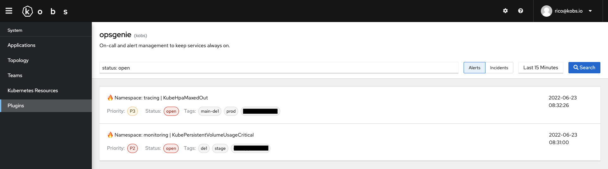
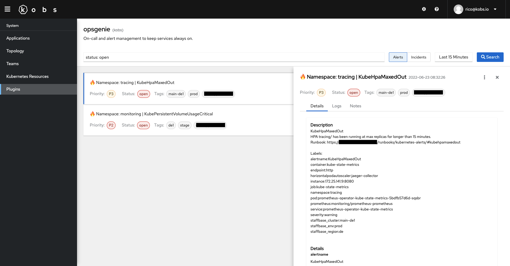

# Opsgenie

The Opsgenie plugin can be used to retrieve alerts and incidents from Opsgenie.





## Options

The following options can be used for a panel with the Opsgenie plugin:

| Field | Type | Description | Required |
| ----- | ---- | ----------- | -------- |
| type | string | Specify if you want to show `alerts` or `incidents`. The default value is `alerts`. | No |
| query | string | The Opsgenie query. The documentation for the query language can be found in the [Opsgenie Documentation](https://support.atlassian.com/opsgenie/docs/search-queries-for-alerts/). | No |

For example the following dashboard shows all open alerts and incidents.

```yaml
---
apiVersion: kobs.io/v1beta1
kind: Dashboard
spec:
  rows:
    - size: -1
      panels:
        - title: Alerts
          colSpan: 6
          plugin:
            name: opsgenie
            options:
              type: alerts
              query: "status: open"
        - title: Incidents
          colSpan: 6
          plugin:
            name: opsgenie
            options:
              type: incidents
              query: "status: open"
```

!!! note
    kobs automatically adds the `createdAt >= <selected-start-time> AND createdAt <= <selected-end-time>` to all Opsgenie queries, so that only results for the selected time range are shown.
