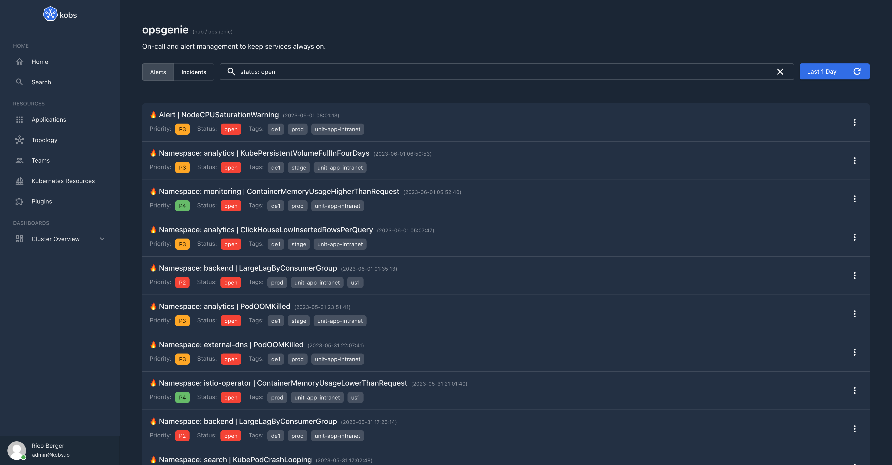
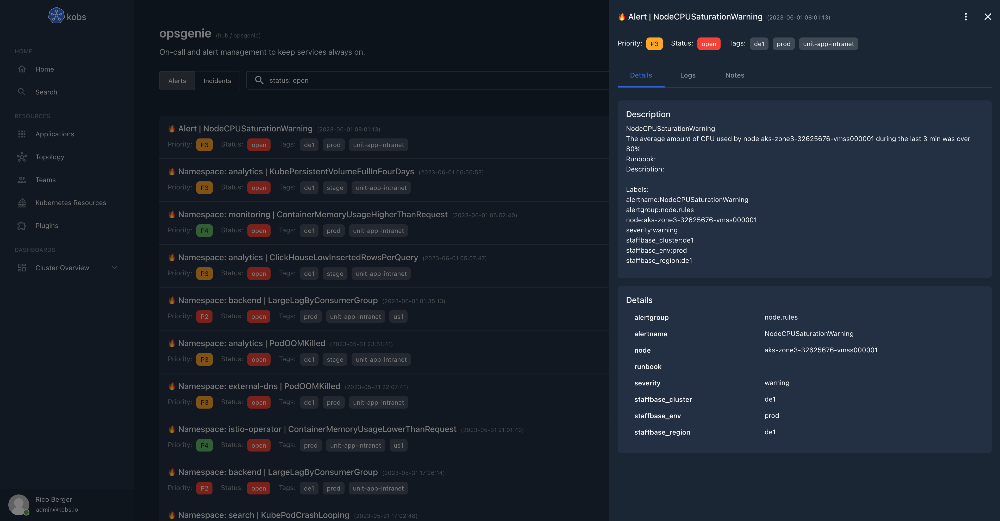

# Opsgenie

The Opsgenie plugin can be used to retrieve alerts and incidents from Opsgenie.





## Configuration

The Opsgenie plugin can only be used within the `hub`. To use the Opsgenie plugin the following configuration is needed:

| Field | Type | Description | Required |
| ----- | ---- | ----------- | -------- |
| name | string | The name of the Opsgenie plugin instance. | Yes |
| type | `opsgenie` | The type for the Opsgenie plugin. | Yes |
| options.apiKey | string | API Key for the Opsgenie API. More information can be found at [API key management](https://support.atlassian.com/opsgenie/docs/api-key-management/). | Yes |
| options.apiUrl | string | API URL for the Opsgenie API. Must be `api.opsgenie.com` or `api.eu.opsgenie.com`. | Yes |
| frontendOptions.url | string | The address for the Opsgenie account of your organisation. | No |
| frontendOptions.integrations.runbook.plugin.cluster | string | The cluster for the runbooks plugin. | No |
| frontendOptions.integrations.runbook.plugin.name | string | The name of the runbooks plugin. | No |
| frontendOptions.integrations.runbook.plugin.type | `runbooks` | The type of the runbooks plugin. Must be `runbooks`. | No |
| frontendOptions.integrations.runbook.options.alertname | string | The details field from an alert, which should be used to select a runbook. | No |
| frontendOptions.integrations.runbook.options.alertgroup | string | The details field from an alert, which should be used to select a runbook. | No |

```yaml
plugins:
  - name: opsgenie
    type: opsgenie
    options:
      apiKey:
      apiUrl:
    frontendOptions:
      url:
      # The integrations can be used to add a runbook to the Opsgenie alerts in
      # the UI.
      #
      # To use this integration you must also configure a runbooks plugin and
      # set the plugin which should be used in the "plugin" section.
      #
      # To select a runbook from the configured runbooks plugin, you must
      # configure the details field from an Opsgenie alert which should be used
      # for the "alertname" and "alertgroup" values of the runbook.
      integrations:
        runbook:
          plugin:
            cluster: hub
            name: runbooks
            type: runbooks
          options:
            alertname: "alertname"
            alertgroup: "alertgroup"
```

## Insight Options

!!! note
    The Opsgenie plugin can not be used within the insights section of an application.

## Variable Options

!!! note
    The Opsgenie plugin can not be used to get a list of variable values.

## Panel Options

The following options can be used for a panel with the Opsgenie plugin:

| Field | Type | Description | Required |
| ----- | ---- | ----------- | -------- |
| type | string | Specify if you want to show `alerts` or `incidents`. | Yes |
| queries | []string | The Opsgenie queries. The documentation for the query language can be found in the [Opsgenie Documentation](https://support.atlassian.com/opsgenie/docs/search-queries-for-alerts/). | Yes |
| interval | number | An optional interval in seconds, which should be used instead of the selected time range in the Dashboard to get the alerts / incidents for. | No |

!!! note
    kobs automatically adds the `createdAt >= <selected-start-time> AND createdAt <= <selected-end-time>` to all Opsgenie queries, so that only results for the selected time range are shown.

    This behaviour can be overwritten with the `interval` property. If the `interval` property is provided, we add `createdAt >= <now - interval> AND createdAt <= <now>`.
