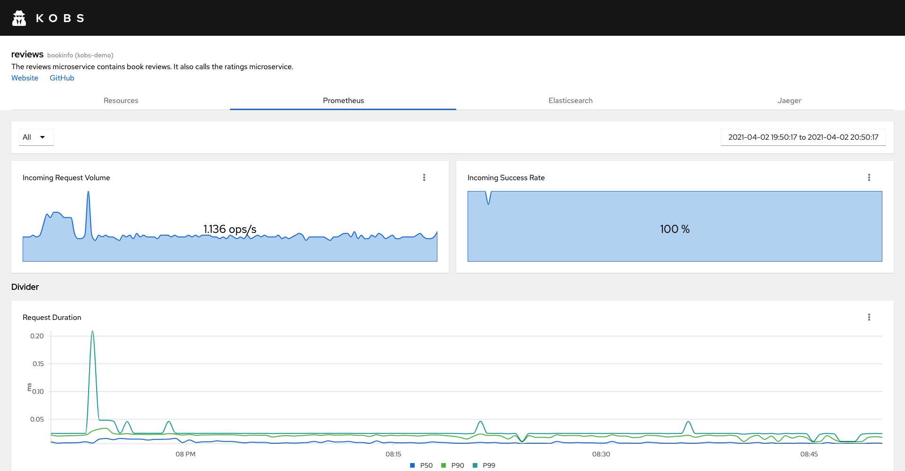

# Prometheus

The Prometheus plugin can be used to retrieve metrics from a configured Prometheus instance.


## Specification

The following specification can be used, within an application.

| Field | Type | Description | Required |
| ----- | ---- | ----------- | -------- |
| variables | [[]Variable](#variable) | A list of variables, which can be used to filter the results in the charts. | No |
| charts | [[]Chart](#chart) | A list of charts for the Prometheus plugin page. | Yes |

### Variable

| Field | Type | Description | Required |
| ----- | ---- | ----------- | -------- |
| name | string | The name of the variable. The name can the be used in other queries, via the Go templating syntax: `{{ .VARIABLENAME }}`. | Yes |
| label | string | The Prometheus label, which should be used for the possible variable values. | Yes |
| query | string | The query which should be used to get the variable values. | Yes |
| allowAll | boolean | When this is `true` an additional value `All` is added, which contains a regular expression with all values of the variable. | No |

### Chart

| Field | Type | Description | Required |
| ----- | ---- | ----------- | -------- |
| title | string | The title of the chart. | Yes |
| type | string | The type of the chart. Must be `sparkline`, `line`, `area` or `bar`. The special type `divider` can be used to add a horizontal divider between the charts. | Yes |
| unit | string | An optional unit for the y axis of the chart. | No |
| stacked | boolean | When this is `true` all time series in the chart will be stacked. | No |
| size | number | An optional size for the chart. Must be a number between `1` and `12`. This is used to customize the grid of charts in the Prometheus tab. | No |
| legend | string | The type which should be used for the legend. Must be `bottom`, `table` or `disabled`. The default is `bottom` | No |
| mappings | map<string, string> | Specify value mappings for your data. **Note:** The value must be provided as string (e.g. `"1": "Green"`). | No |
| queries | [[]Query](#query) | A list of queries, which are used to get the data for the chart. | Yes |

### Query

| Field | Type | Description | Required |
| ----- | ---- | ----------- | -------- |
| query | string | The PromQL query. The query can use the value of a variable via the Go templating syntax: `{{ .VARIABLENAME }}`. | Yes |
| label | string | The label the results. The label can use the value of a variable or a label of the returned time series, e.g. `{{ .response_code }}`. | Yes |

## Example

The following example will display five charts.

```yaml
  plugins:
    - name: Prometheus
      prometheus:
        variables:
          - name: Workload
            label: destination_workload
            query: istio_requests_total{destination_workload_namespace=~"bookinfo",destination_workload=~"reviews-.*"}
            allowAll: true
        charts:
          - title: Incoming Request Volume
            type: sparkline
            unit: ops/s
            size: 6
            queries:
              - label: Incoming Request Volume
                query: round(sum(irate(istio_requests_total{reporter="destination",destination_workload_namespace=~"bookinfo",destination_workload=~"{{ .Workload }}"}[5m])), 0.001)
          - title: Incoming Success Rate
            type: sparkline
            unit: "%"
            size: 6
            queries:
              - label: Incoming Success Rate
                query: sum(irate(istio_requests_total{reporter="destination",destination_workload_namespace=~"bookinfo",destination_workload=~"{{ .Workload }}",response_code!~"5.*"}[5m])) / sum(irate(istio_requests_total{reporter="destination",destination_workload_namespace=~"bookinfo",destination_workload=~"{{ .Workload }}"}[5m])) * 100
          - title: Details
            type: divider
          - title: Request Duration
            type: line
            unit: ms
            size: 12
            queries:
              - label: P50
                query: (histogram_quantile(0.50, sum(irate(istio_request_duration_milliseconds_bucket{reporter="destination",destination_workload_namespace=~"bookinfo",destination_workload=~"{{ .Workload }}"}[1m])) by (le)) / 1000)
              - label: P90
                query: (histogram_quantile(0.90, sum(irate(istio_request_duration_milliseconds_bucket{reporter="destination",destination_workload_namespace=~"bookinfo",destination_workload=~"{{ .Workload }}"}[1m])) by (le)) / 1000)
              - label: P99
                query: (histogram_quantile(0.99, sum(irate(istio_request_duration_milliseconds_bucket{reporter="destination",destination_workload_namespace=~"bookinfo",destination_workload=~"{{ .Workload }}"}[1m])) by (le)) / 1000)
          - title: Incoming Requests By Source And Response Code
            type: line
            unit: ops/s
            size: 6
            queries:
              - label: "{{ .source_workload }}.{{ .source_workload_namespace }} : {{ .response_code }} (🔐 mTLS)"
                query: round(sum(irate(istio_requests_total{connection_security_policy="mutual_tls",destination_workload_namespace=~"bookinfo",destination_workload=~"{{ .Workload }}",reporter="destination"}[5m])) by (source_workload, source_workload_namespace, response_code), 0.001)
              - label: "{{ .source_workload }}.{{ .source_workload_namespace }} : {{ .response_code }}"
                query: round(sum(irate(istio_requests_total{connection_security_policy!="mutual_tls",destination_workload_namespace=~"bookinfo",destination_workload=~"{{ .Workload }}",reporter="destination"}[5m])) by (source_workload, source_workload_namespace, response_code), 0.001)
          - title: Incoming Success Rate (non-5xx responses) By Source
            type: line
            unit: "%"
            size: 6
            queries:
              - label: "{{ .source_workload }}.{{ .source_workload_namespace }} (🔐 mTLS)"
                query: sum(irate(istio_requests_total{reporter="destination",connection_security_policy="mutual_tls",destination_workload_namespace=~"bookinfo",destination_workload=~"{{ .Workload }}",response_code!~"5.*"}[5m])) by (source_workload, source_workload_namespace) / sum(irate(istio_requests_total{reporter="destination",connection_security_policy="mutual_tls",destination_workload_namespace=~"bookinfo",destination_workload=~"{{ .Workload }}"}[5m])) by (source_workload, source_workload_namespace) * 100
              - label: "{{ .source_workload }}.{{ .source_workload_namespace }}"
                query: sum(irate(istio_requests_total{reporter="destination",connection_security_policy!="mutual_tls",destination_workload_namespace=~"bookinfo",destination_workload=~"{{ .Workload }}",response_code!~"5.*"}[5m])) by (source_workload, source_workload_namespace) / sum(irate(istio_requests_total{reporter="destination",connection_security_policy!="mutual_tls",destination_workload_namespace=~"bookinfo",destination_workload=~"{{ .Workload }}"}[5m])) by (source_workload, source_workload_namespace) * 100
```


