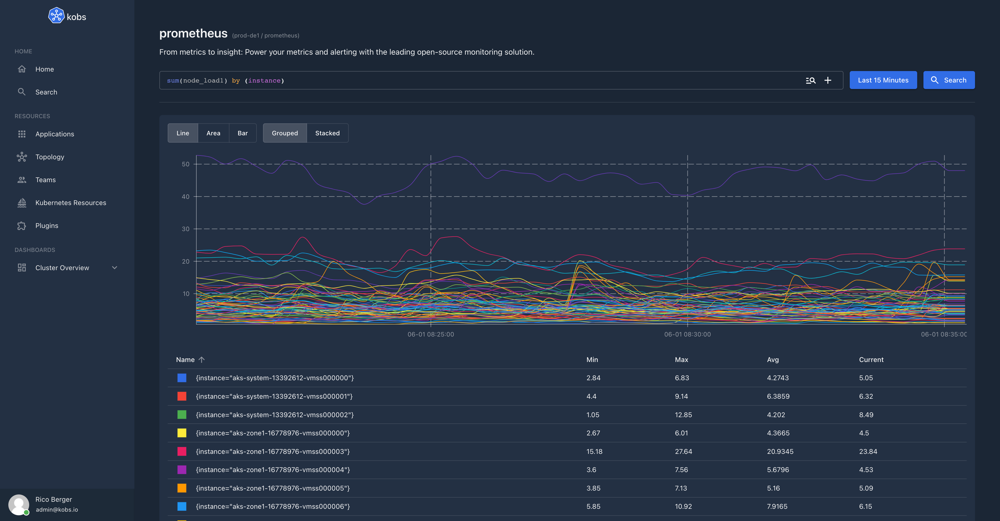

# Prometheus

The Prometheus plugin can be used to retrieve metrics from a configured Prometheus instance.




## Options

The following options can be used for a panel with the Prometheus plugin:

| Field | Type | Description | Required |
| ----- | ---- | ----------- | -------- |
| type | string | The type of the chart. Must be `sparkline`, `line`, `area` or `table`. | Yes |
| unit | string | An optional unit for the y axis of the chart. | No |
| stacked | boolean | When this is `true` all time series in the chart will be stacked. | No |
| legend | string | The type which should be used for the legend. Currently only `table` is supported as legend. If the value is not set, no legend will be shown. | No |
| mappings | map<string, string> | Specify value mappings for your data. **Note:** The value must be provided as string (e.g. `"1": "Green"`). | No |
| queries | [[]Query](#query) | A list of queries, which are used to get the data for the chart. | Yes |
| columns | [[]Column](#column) | A list of columns, which **must** be provided, when the type of the chart is `table` | No |

### Query

| Field | Type | Description | Required |
| ----- | ---- | ----------- | -------- |
| query | string | The PromQL query. | Yes |
| label | string | The label the results. The label can use the value of a variable or a label of the returned time series, e.g. ``. If you want to use a Prometheus label make sure that the label name doesn't conflict with a variable name. | Yes |

!!! note
    In `sparkline` charts the label must not be provided. If the label is provided in a `sparkline` chart the label will be displayed instead of the current value.

### Column

| Field | Type | Description | Required |
| ----- | ---- | ----------- | -------- |
| name | string | The name of a column must be a returned label from the specified queries. To get the result of a query the special column `value-N`, where `N` is the index of the query. | Yes |
| header | string | An optional value for the header of the column. When this is not specified the name will be used as header for the column. | No |
| unit | string | An optional unit for the column values. | No |

## Example

The following dashboard, shows the CPU and Memory usage of a selected Pod. When this dashboard is used in via a team or application, it is possible to set the namespace and a regular expression to pre select all the Pods. These values are then used to get the names of all Pods and a user can then select the name of a Pod via the `var_pod` variable.

The dashboard only uses the Prometheus plugin to show the CPU Usage, Memory Usage, the Network Usage and some other information via different charts and tables.

```yaml
---
apiVersion: kobs.io/v1beta1
kind: Dashboard
spec:
  description: Resources Usage of Pods
  placeholders:
    - name: namespace
      description: Namespace for the Pods
    - name: pod
      description: Pod selector
  variables:
    - name: var_pod
      label: Pod
      plugin:
        name: prometheus
        options:
          type: labelValues
          label: pod
          query: container_cpu_usage_seconds_total{namespace="{{ .namespace }}", image!="", pod=~"{{ .pod }}", container!="POD", container!=""}
          allowAll: false
  rows:
    - size: 1
      panels:
        - title: CPU Usage
          colSpan: 4
          plugin:
            name: prometheus
            options:
              type: sparkline
              unit: Cores
              queries:
                - query: sum(rate(container_cpu_usage_seconds_total{namespace="{{ .namespace }}", image!="", pod=~"", container!="POD", container!=""}[2m]))
        - title: Memory Usage
          colSpan: 4
          plugin:
            name: prometheus
            options:
              type: sparkline
              unit: MiB
              queries:
                - query: sum(container_memory_working_set_bytes{namespace="{{ .namespace }}", pod=~"", container!="POD", container!=""}) / 1024 / 1024
        - title: Restarts
          colSpan: 4
          plugin:
            name: prometheus
            options:
              type: sparkline
              queries:
                - query: kube_pod_container_status_restarts_total{namespace="{{ .namespace }}", pod=~""}
    - size: 3
      panels:
        - title: CPU Usage
          colSpan: 6
          plugin:
            name: prometheus
            options:
              type: line
              unit: Cores
              legend: table
              queries:
                - label: "Usage: "
                  query: sum(rate(container_cpu_usage_seconds_total{namespace="{{ .namespace }}", image!="", pod=~"", container!="POD", container!=""}[2m])) by (container)
                - label: "Request: "
                  query: sum(kube_pod_container_resource_requests{namespace="{{ .namespace }}", resource="cpu", pod=~"", container!="POD", container!=""}) by (container)
                - label: "Limits: "
                  query: sum(kube_pod_container_resource_limits{namespace="{{ .namespace }}", resource="cpu", pod=~"", container!="POD", container!=""}) by (container)
        - title: Memory Usage
          colSpan: 6
          plugin:
            name: prometheus
            options:
              type: line
              unit: MiB
              legend: table
              queries:
                - label: "Usage: "
                  query: sum(container_memory_working_set_bytes{namespace="{{ .namespace }}", pod=~"", container!="POD", container!=""}) by (container) / 1024 / 1024
                - label: "Request: "
                  query: sum(kube_pod_container_resource_requests{namespace="{{ .namespace }}", resource="memory", pod=~"", container!="POD", container!=""}) by (container) / 1024 / 1024
                - label: "Limits: "
                  query: sum(kube_pod_container_resource_limits{namespace="{{ .namespace }}", resource="memory", pod=~"", container!="POD", container!=""}) by (container) / 1024 / 1024
    - title: Network
      size: 3
      panels:
        - title: Bandwidth
          colSpan: 12
          plugin:
            name: prometheus
            options:
              type: area
              unit: bytes/s
              queries:
                - label: Received
                  query: sum(irate(container_network_receive_bytes_total{namespace="{{ .namespace }}", pod=""}[2m])) by (pod)
                - label: Transmitted
                  query: -sum(irate(container_network_transmit_bytes_total{namespace="{{ .namespace }}", pod=""}[2m])) by (pod)
        - title: Rate of Packets
          colSpan: 6
          plugin:
            name: prometheus
            options:
              type: area
              unit: bytes/s
              queries:
                - label: Received
                  query: sum(irate(container_network_receive_packets_total{namespace=~"{{ .namespace }}", pod=~""}[2m])) by (pod)
                - label: Transmitted
                  query: -sum(irate(container_network_transmit_packets_total{namespace=~"{{ .namespace }}", pod=~""}[2m])) by (pod)
        - title: Rate of Packets Dropped
          colSpan: 6
          plugin:
            name: prometheus
            options:
              type: area
              unit: bytes/s
              queries:
                - label: Received
                  query: sum(irate(container_network_receive_packets_dropped_total{namespace=~"{{ .namespace }}", pod=~""}[2m])) by (pod)
                - label: Transmitted
                  query: -sum(irate(container_network_transmit_packets_dropped_total{namespace=~"{{ .namespace }}", pod=~""}[2m])) by (pod)
    - title: "Resource Usage for all Pods"
      panels:
        - title: Table
          plugin:
            name: prometheus
            options:
              type: table
              queries:
                - label: ""
                  query: sum(rate(container_cpu_usage_seconds_total{namespace="{{ .namespace }}", image!="", pod=~"{{ .pod }}", container!="POD", container!=""}[2m])) by (pod)
                - label: ""
                  query: sum(kube_pod_container_resource_requests{namespace="{{ .namespace }}", resource="cpu", pod=~"{{ .pod }}", container!="POD", container!=""}) by (pod)
                - label: ""
                  query: sum(kube_pod_container_resource_limits{namespace="{{ .namespace }}", resource="cpu", pod=~"{{ .pod }}", container!="POD", container!=""}) by (pod)
                - label: ""
                  query: sum(container_memory_working_set_bytes{namespace="{{ .namespace }}", pod=~"{{ .pod }}", container!="POD", container!=""}) by (pod) / 1024 / 1024
                - label: ""
                  query: sum(kube_pod_container_resource_requests{namespace="{{ .namespace }}", resource="memory", pod=~"{{ .pod }}", container!="POD", container!=""}) by (pod) / 1024 / 1024
                - label: ""
                  query: sum(kube_pod_container_resource_limits{namespace="{{ .namespace }}", resource="memory", pod=~"{{ .pod }}", container!="POD", container!=""}) by (pod) / 1024 / 1024
              columns:
                - name: pod
                  title: Pod
                - name: value-1
                  title: CPU Usage
                  unit: Cores
                - name: value-2
                  title: CPU Requests
                  unit: Cores
                - name: value-3
                  title: CPU Limits
                  unit: Cores
                - name: value-4
                  title: Memory Usage
                  unit: MiB
                - name: value-5
                  title: Memory Requests
                  unit: MiB
                - name: value-6
                  title: Memory Limits
                  unit: MiB
```
