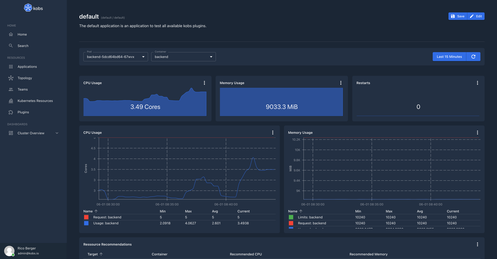

# Prometheus

The Prometheus plugin can be used to retrieve metrics from a configured Prometheus instance.


## Configuration

The Prometheus plugin can be used within the `hub` or `cluster`. To use the Prometheus plugin the following configuration is needed:

| Field | Type | Description | Required |
| ----- | ---- | ----------- | -------- |
| name | string | The name of the Prometheus plugin instance. | Yes |
| type | `prometheus` | The type for the Prometheus plugin. | Yes |
| options.address | string | Address of the Prometheus instance. | Yes |
| options.username | string | Username to access a Prometheus instance via basic authentication. | No |
| options.password | string | Password to access a Prometheus instance via basic authentication. | No |
| options.token | string | Token to access a Prometheus instance via token based authentication. | No |

```yaml
plugins:
  - name: prometheus
    type: prometheus
    options:
      address:
      username:
      password:
      token:
```

## Insight Options

| Field | Type | Description | Required |
| ----- | ---- | ----------- | -------- |
| query | string | The PromQL query. | Yes |

## Variable Options

| Field | Type | Description | Required |
| ----- | ---- | ----------- | -------- |
| type | string | The query type to get the values for the variable. At the moment this must be `labelValues` | Yes |
| label | string | The Prometheus label which should be used to get the values for the variable. | Yes |
| query | string | The PromQL query. | Yes |

??? note "Example"

    ```yaml
    variables:
      - name: var_pod
        label: Pod
        includeAllOption: false
        plugin:
          name: prometheus
          type: prometheus
          options:
            type: labelValues
            label: pod
            query: container_cpu_usage_seconds_total{namespace="", image!="", pod=~"", container!="POD", container!=""}
    ```

## Panel Options

The following options can be used for a panel with the Prometheus plugin:

| Field | Type | Description | Required |
| ----- | ---- | ----------- | -------- |
| type | string | The type of the chart. Must be `sparkline`, `line`, `area`, `bar` or `table`. | Yes |
| unit | string | An optional unit for the y axis of the chart. | No |
| stacked | boolean | When this is `true` all time series in the chart will be stacked. | No |
| legend | string | The type which should be used for the legend. Currently only `table` and `table-large` is supported as legend. If the value is not set, no legend will be shown. | No |
| yAxis | [yAxis](#yaxis) | Set the scale of the y axis. | No |
| mappings | map<string, string> | Specify value mappings for your data. **Note:** The value must be provided as string (e.g. `"1": "Green"`). | No |
| queries | [[]Query](#query) | A list of queries, which are used to get the data for the chart. | Yes |
| columns | [[]Column](#column) | A list of columns, which **must** be provided, when the type of the chart is `table` | No |

### yAxis

| Field | Type | Description | Required |
| ----- | ---- | ----------- | -------- |
| min | `auto`, `min`, number | The minimum value for the y axis. This could be `auto`, `min` (minimum value accross all displayed metrics) or a custom number. The default is `auto`. | No |
| max | `auto`, `max`, number | The minimum value for the y axis. This could be `auto`, `max` (maximum value accross all displayed metrics) or a custom number. The default is `auto`. | No |

### Query

| Field | Type | Description | Required |
| ----- | ---- | ----------- | -------- |
| query | string | The PromQL query. | Yes |
| label | string | The label the results. The label can use the value of a variable or a label of the returned time series, e.g. ``. If you want to use a Prometheus label make sure that the label name doesn't conflict with a variable name. | Yes |

!!! note
    In `sparkline` charts the label must not be provided. If the label is provided in a `sparkline` chart the label will be displayed instead of the current value.

### Column

| Field | Type | Description | Required |
| ----- | ---- | ----------- | -------- |
| name | string | The name of a column must be a returned label from the specified queries. To get the result of a query the special column `value-N`, where `N` is the index of the query. | Yes |
| header | string | An optional value for the header of the column. When this is not specified the name will be used as header for the column. | No |
| unit | string | An optional unit for the column values. | No |
| mappings | map<string, string> | Specify value mappings for the column. **Note:** The value must be provided as string (e.g. `"1": "Green"`). | No |

## Usage

The following dashboard, shows the CPU and Memory usage of a selected Pod. When this dashboard is used in via a team or application, it is possible to set the namespace and a regular expression to pre select all the Pods. These values are then used to get the names of all Pods and a user can then select the name of a Pod via the `var_pod` variable.

```yaml
---
apiVersion: kobs.io/v1
kind: Dashboard
metadata:
  name: resource-usage
  namespace: kobs
spec:
  description: Resources Usage of Pods
  placeholders:
    - name: namespace
      description: |
        The namespace of the application, e.g.
            namespace: "<% $.namespace %>"
    - name: pod
      description: |
        A selector for the Pods of the application,
        must be a valid PromQL selector, e.g.
            pod: "<% $.name %>-.*"
    - name: verticalpodautoscaler
      description: |
        The identifier for the VerticalPodAutoscaler,
        must be a valid PromQL selector, e.g.
            verticalpodautoscaler: "<% $.name %>"
  variables:
    - name: var_pod
      label: Pod
      includeAllOption: false
      plugin:
        name: prometheus
        type: prometheus
        options:
          type: labelValues
          label: pod
          query: container_cpu_usage_seconds_total{namespace="", image!="", pod=~"", container!="POD", container!=""}
    - name: var_container
      label: Container
      includeAllOption: true
      plugin:
        name: prometheus
        type: prometheus
        options:
          type: labelValues
          label: container
          query: container_cpu_usage_seconds_total{namespace="", image!="", pod=~"", container!="POD", container!=""}
  rows:
    - panels:
        - title: CPU Usage
          plugin:
            type: prometheus
            name: prometheus
            options:
              queries:
                - query: >-
                    sum(rate(container_cpu_usage_seconds_total{namespace="", image!="", pod=~"",
                    container!="POD", container!="", container=~""}[2m]))
              type: sparkline
              unit: Cores
          h: 4
          w: 4
          x: 0
          'y': 0
        - title: Memory Usage
          plugin:
            type: prometheus
            name: prometheus
            options:
              queries:
                - query: >-
                    sum(container_memory_working_set_bytes{namespace="", pod=~"", container!="POD",
                    container!="", container=~""}) /
                    1024 / 1024
              type: sparkline
              unit: MiB
          h: 4
          w: 4
          x: 4
          'y': 0
        - title: Restarts
          plugin:
            type: prometheus
            name: prometheus
            options:
              queries:
                - query: >-
                    kube_pod_container_status_restarts_total{namespace="", pod=~"", container=~""}
              type: sparkline
          h: 4
          w: 4
          x: 8
          'y': 0
    - panels:
        - title: CPU Usage
          plugin:
            type: prometheus
            name: prometheus
            options:
              legend: table
              queries:
                - label: 'Usage: '
                  query: >-
                    sum(rate(container_cpu_usage_seconds_total{namespace="", image!="", pod=~"",
                    container!="POD", container!="", container=~""}[2m])) by (container)
                - label: 'Request: '
                  query: >-
                    sum(kube_pod_container_resource_requests{namespace="", resource="cpu", pod=~"",
                    container!="POD", container!="", container=~""}) by (container)
              type: line
              unit: Cores
          h: 9
          w: 6
          x: 0
          'y': 0
        - title: Memory Usage
          plugin:
            type: prometheus
            name: prometheus
            options:
              legend: table
              queries:
                - label: 'Usage: '
                  query: >-
                    sum(container_memory_working_set_bytes{namespace="", pod=~"", container!="POD",
                    container!="", container=~""}) by
                    (container) / 1024 / 1024
                - label: 'Request: '
                  query: >-
                    sum(kube_pod_container_resource_requests{namespace="", resource="memory", pod=~"", container!="POD", container!="", container=~""}) by (container) / 1024 / 1024
                - label: 'Limits: '
                  query: >-
                    sum(kube_pod_container_resource_limits{namespace="", resource="memory", pod=~"", container!="POD", container!="", container=~""}) by (container) / 1024 / 1024
              type: line
              unit: MiB
          h: 9
          w: 6
          x: 6
          'y': 0
    - panels:
        - title: Ressource Recommendations
          plugin:
            type: prometheus
            name: prometheus
            options:
              columns:
                - name: target_name
                  title: Target
                - name: container
                  title: Container
                - name: value-1
                  title: Recommended CPU
                  unit: m
                - name: value-2
                  title: Recommended Memory
                  unit: Mi
              queries:
                - label: ' - '
                  query: >-
                    max(max_over_time(kube_verticalpodautoscaler_status_recommendation_containerrecommendations_target{namespace="", container!="POD", container!="", container=~"",
                    resource="cpu", verticalpodautoscaler=~""}[7d]) * 1000) by
                    (target_name, container)
                - label: ' - '
                  query: >-
                    max(round(max_over_time(kube_verticalpodautoscaler_status_recommendation_containerrecommendations_target{namespace="", container!="POD", container!="", container=~"",
                    resource="memory", verticalpodautoscaler=~""}[7d]) / 1000 / 1000)) by
                    (target_name, container)
              type: table
          h: 9
          w: 12
          x: 0
          'y': 0
      autoHeight: true
      description: ''
      if: '"" !== ""'
    - title: Network
      panels:
        - title: Bandwidth
          plugin:
            type: prometheus
            name: prometheus
            options:
              queries:
                - label: Received
                  query: >-
                    sum(irate(container_network_receive_bytes_total{namespace="", pod=""}[2m])) by (pod)
                - label: Transmitted
                  query: >-
                    -sum(irate(container_network_transmit_bytes_total{namespace="", pod=""}[2m])) by (pod)
              type: area
              unit: bytes/s
          h: 9
          w: 12
          x: 0
          'y': 0
        - title: Rate of Packets
          plugin:
            type: prometheus
            name: prometheus
            options:
              queries:
                - label: Received
                  query: >-
                    sum(irate(container_network_receive_packets_total{namespace=~"", pod=~""}[2m])) by (pod)
                - label: Transmitted
                  query: >-
                    -sum(irate(container_network_transmit_packets_total{namespace=~"", pod=~""}[2m])) by (pod)
              type: area
              unit: p/s
          h: 9
          w: 6
          x: 0
          'y': 9
        - title: Rate of Packets Dropped
          plugin:
            type: prometheus
            name: prometheus
            options:
              queries:
                - label: Received
                  query: >-
                    sum(irate(container_network_receive_packets_dropped_total{namespace=~"", pod=~""}[2m])) by (pod)
                - label: Transmitted
                  query: >-
                    -sum(irate(container_network_transmit_packets_dropped_total{namespace=~"", pod=~""}[2m])) by (pod)
              type: area
              unit: p/s
          h: 9
          w: 6
          x: 6
          'y': 9
```


