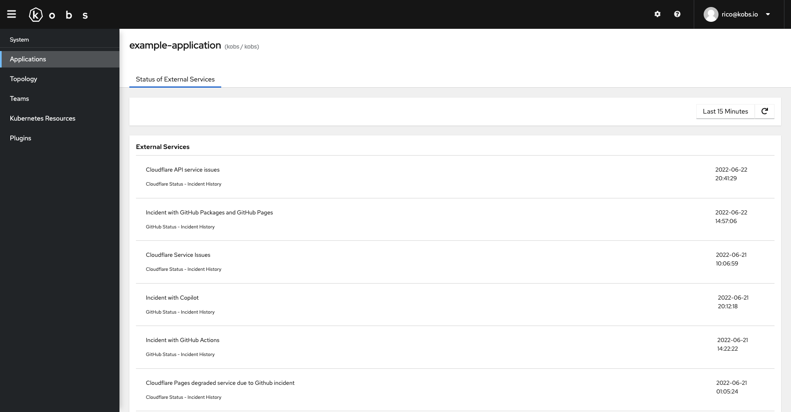

# RSS

The RSS plugin can be used to show the latest status updates of third party services, from a list of sepcified RSS feeds.

## Configuration

To use the RSS plugin the following configuration is needed in the satellites configuration file:

| Field | Type | Description | Required |
| ----- | ---- | ----------- | -------- |
| name | string | The name of the RSS plugin instance. | Yes |
| type | `rss` | The type for the RSS plugin. | Yes |

```yaml
plugins:
  - name: rss
    type: rss
```

## Insight Options

!!! note
    The RSS plugin can not be used within the insights section of an application.

## Variable Options

!!! note
    The RSS plugin can not be used to get a list of variable values.

## Panel Options

The following options can be used for a panel with the RSS plugin:

| Field | Type | Description | Required |
| ----- | ---- | ----------- | -------- |
| urls | []string | A list of RSS feed URLs. | Yes |
| sortBy | string | Set the field by which the retrieved feed items should be sorted. This can be `feed`, `title`, `updated` or `published`. The default value is `published`. | No |

## Usage

```yaml
---
apiVersion: kobs.io/v1
kind: Application
metadata:
  name: example-application
  namespace: kobs
spec:
  dashboards:
    - title: Status of External Services
      inline:
        rows:
          - size: -1
            panels:
              - title: External Services
                plugin:
                  name: rss
                  type: rss
                  options:
                    urls:
                      - https://www.githubstatus.com/history.rss
                      - https://status.aws.amazon.com/rss/route53.rss
                      - https://azurestatuscdn.azureedge.net/de-de/status/feed/
                      - https://www.cloudflarestatus.com/history.atom
                    sortBy: updated
```


