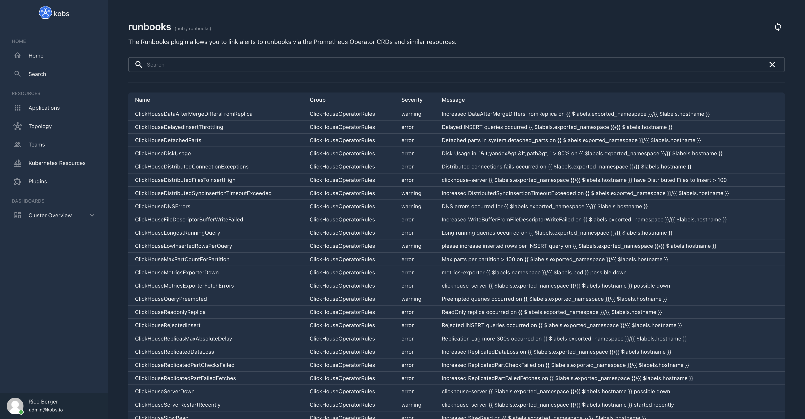
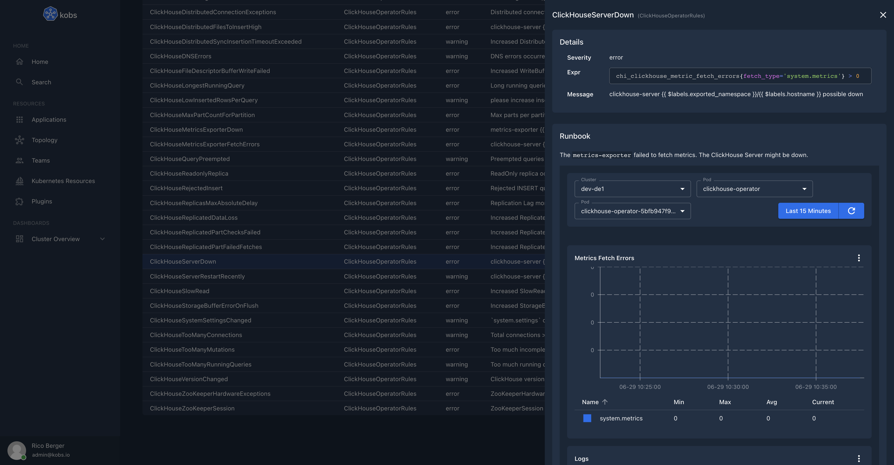

# Runbooks

The Runbooks plugin can be used to manage runbooks within the Prometheus Operator CRDs or similar CRDs. To add a runbook to an PrometheusRule an `runbook` annotation must be added. The runbooks are markdown formatted and can use the same features as the [TechDocs](./techdocs.md) plugin.





## Configuration

The Runbooks plugin can only be used within the `hub`. To use the Runbooks plugin the following configuration is needed:

| Field | Type | Description | Required |
| ----- | ---- | ----------- | -------- |
| name | string | The name of the Runbooks plugin instance. | Yes |
| type | `runbooks` | The type for the Runbooks plugin. | Yes |
| options.path | string | The Kubernetes API path for the resource, which should be used for the runbooks. | Yes |
| options.resource | string | The Kubernetes API resource, which should be used for the runbooks. | Yes |

```yaml
plugins:
  - name: runbooks
    type: runbooks
    options:
      ## The path and resource fields could also point to another PrometheusRule compatible resource, e.g. the VictoriaMetrics rules:
      #   path: /apis/operator.victoriametrics.com/v1beta1
      #   resource: vmrules
      path: /apis/monitoring.coreos.com/v1
      resource: prometheusrule
```

## Insight Options

!!! note
    The Runbooks plugin can not be used within the insights section of an application.

## Variable Options

!!! note
    The Runbooks plugin can not be used to get a list of variable values.

## Panel Options

The following options can be used for a panel with the Runbooks plugin:

| Field | Type | Description | Required |
| ----- | ---- | ----------- | -------- |
| type | string | The type for the Runbooks panel. This must be `list` to render a list of runbooks or `details` to render a single runbook. | No |
| query | string | A search query to render the list of runbooks. | No |
| alert | string | The name of the alert. | No |
| group | string | The groups of the alert. | No |

## Usage

The following example shows a `VMRule` with a runbook:

```yaml
---
apiVersion: operator.victoriametrics.com/v1beta1
kind: VMRule
metadata:
  name: clickhouse-alert-rules
  namespace: monitoring
spec:
  groups:
    - name: ClickHouseOperatorRules
      rules:
        - alert: ClickHouseServerDown
          expr: chi_clickhouse_metric_fetch_errors{fetch_type='system.metrics'} > 0
          for: 5m
          labels:
            namespace: "{{ $labels.exported_namespace }}"
            severity: error
          annotations:
            message: "clickhouse-server {{ $labels.exported_namespace }}/{{ $labels.hostname }} possible down"
            runbook: |
              The `metrics-exporter` failed to fetch metrics. The ClickHouse Server might be down.

              ```kobs:dashboard
              - title: 'ClickHouseServerDown'
                inline:
                  variables:
                    - name: var_cluster
                      label: Cluster
                      includeAllOption: false
                      plugin:
                        name: static
                        type: core
                        options:
                          - dev-de1
                          - stage-de1
                          - prod-de1
                          - prod-us1
                    - name: var_namespace
                      label: Pod
                      includeAllOption: false
                      plugin:
                        type: prometheus
                        name: prometheus
                        cluster: ""
                        options:
                          type: labelValues
                          label: namespace
                          query: chi_clickhouse_metric_fetch_errors
                    - name: var_pod
                      label: Pod
                      includeAllOption: false
                      plugin:
                        type: prometheus
                        name: prometheus
                        cluster: ""
                        options:
                          type: labelValues
                          label: pod
                          query: chi_clickhouse_metric_fetch_errors
                  rows:
                    - panels:
                        - title: Metrics Fetch Errors
                          plugin:
                            type: prometheus
                            name: prometheus
                            cluster: ""
                            options:
                              legend: table
                              queries:
                                - label: "system.metrics"
                                  query: sum(chi_clickhouse_metric_fetch_errors{fetch_type="system.metrics", namespace="", pod=""})
                              type: line
                          h: 9
                          w: 12
                          x: 0
                          'y': 0
                    - autoHeight: true
                      panels:
                        - title: Logs
                          plugin:
                            type: klogs
                            name: klogs
                            cluster: ""
                            options:
                              type: logs
                              queries:
                                - name: Instance Logs
                                  query: "namespace='' _and_ pod_name='' _and_ container_name='clickhouse'"
                          h: 9
                          w: 12
                          x: 0
                          'y': 0
              ```
```

To add some common instructions to all alerts in an alert group you can add a `kobs.io/<ALERTGROUP>` annotation, e.g.:

```yaml
---
apiVersion: operator.victoriametrics.com/v1beta1
kind: VMRule
metadata:
  name: clickhouse-alert-rules
  namespace: monitoring
  aanotation:
    kobs.io/ClickHouseOperatorRules: |
      Here you can add some common actions which are visible within all alerts in the ClickHouseOperatorRules alert group.
spec:
  groups:
    - name: ClickHouseOperatorRules
      rules:
        - alert: ClickHouseServerDown
```
