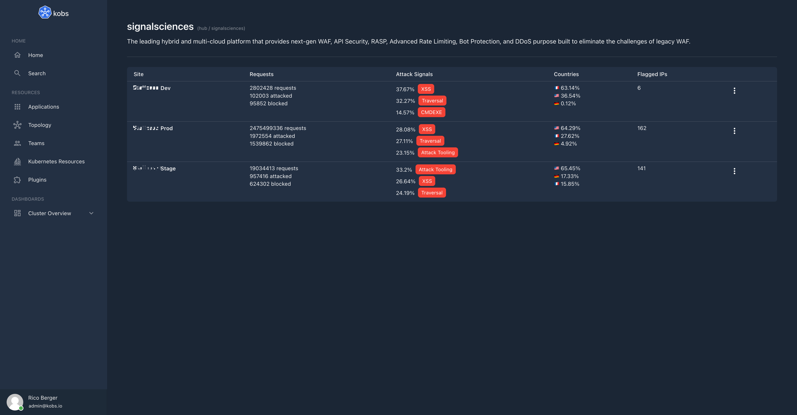

# Signal Sciences

The Signal Sciences plugin can be used to view sites, agents and requests from Signal Sciences within kobs.



## Configuration

The Signal Sciences plugin can only be used within the `hub`. To use the Signal Sciences plugin the following configuration is needed:

| Field | Type | Description | Required |
| ----- | ---- | ----------- | -------- |
| name | string | The name of the Signal Sciences plugin instance. | Yes |
| type | `signalsciences` | The type for the Signal Sciences plugin. | Yes |
| options.corpName | string | The name of your organization. | Yes |
| options.email | string | The email address of a user to access the API. | Yes |
| options.password | string | The token of a user to access the API. | Yes |

```yaml
plugins:
  - name: signalsciences
    type: signalsciences
    options:
      corpName:
      email:
      token:
```

## Insight Options

!!! note
    The Signal Sciences plugin can not be used within the insights section of an application.

## Variable Options

!!! note
    The Signal Sciences plugin can not be used to get a list of variable values.

## Panel Options

The following options can be used for a panel with the Signal Sciences plugin:

| Field | Type | Description | Required |
| ----- | ---- | ----------- | -------- |
| type | string | The type which should be used for the panel. Must be `overview`, `requests` or `agents`. | Yes |
| site | string | If the type is `requests` or `agents` this is the site name for which the requests or agents should be shown. | No |
| query | string | If the type is `requests` this is the query to filter the requests ([Search Syntax](https://docs.fastly.com/faq/search-syntax/)). | No |

## Usage


