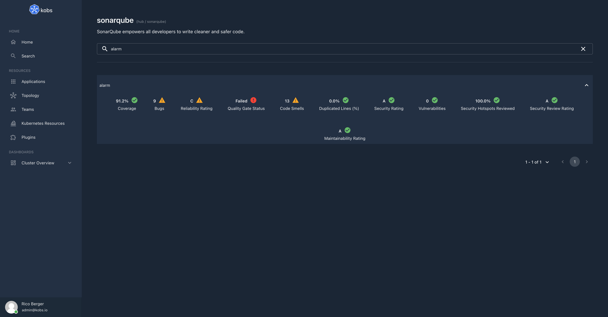

# SonarQube

The SonarQube plugin can be used to view all projects with the measures from a SonarQube instance.



## Configuration

The following configuration can be used to access a SonarQube instance, which is running at `https://sonarqube.kobs.io` and a token from the `SONARQUBE_TOKEN` environment variable.

```yaml
plugins:
  sonarqube:
    - name: SonarQube
      description: SonarQube empowers all developers to write cleaner and safer code.
      address: https://sonarqube.kobs.io
      username: ${SONARQUBE_TOKEN}
      password:
```

| Field | Type | Description | Required |
| ----- | ---- | ----------- | -------- |
| name | string | Name of the SonarQube instance. | Yes |
| displayName | string | Name of the SonarQube as it is shown in the UI. | Yes |
| descriptions | string | Description of the SonarQube instance. | No |
| address | string | Address of the SonarQube instance. | Yes |
| username | string | Username to access a SonarQube instance via basic authentication. | No |
| password | string | Password to access a SonarQube instance via basic authentication. | No |
| metricKeys | []string | An optional list of metric keys which should be displayed for all projects. If this value is not provided the following list will be used: `alert_status`, `bugs`, `reliability_rating`, `vulnerabilities`, `security_rating`, `security_hotspots_reviewed`, `security_review_rating`, `code_smells`, `sqale_rating`, `coverage`, `duplicated_lines_density`. | No |

## Options

The following options can be used for a panel with the SonarQube plugin:

| Field | Type | Description | Required |
| ----- | ---- | ----------- | -------- |
| project | string | The key of the SonarQube project. | Yes |
| metricKeys | []string | An optional list of metric keys, which should be displayed for the project. If this value is not provided the globally configured default value will be used. A list of all available metrics can be retrieved from the `/api/metrics/search` API endpoint of a SonarQube instance. | No |

## Example

The following dashboard shows a single panel with the measures for the SonarQube project with the key `details`.

```yaml
---
apiVersion: kobs.io/v1
kind: Dashboard
metadata:
  name: sonarqube
  namespace: kobs
spec:
  title: SonarQube
  rows:
    - size: 3
      panels:
        - title: Details
          plugin:
            name: sonarqube
            options:
              project: details
```
