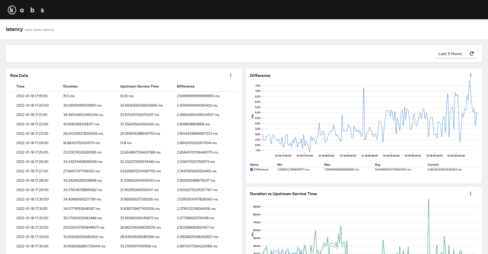
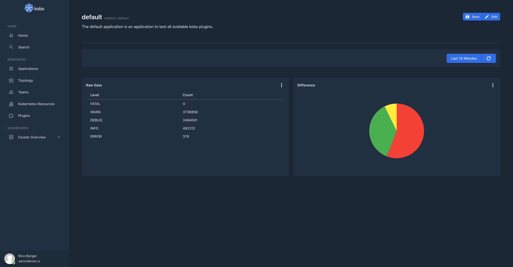
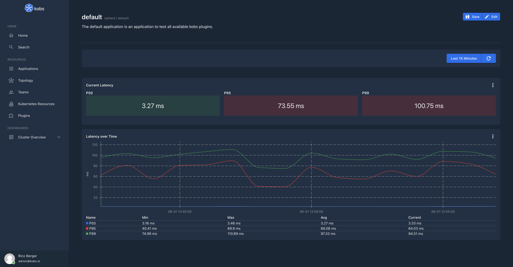

# SQL

The SQL plugin can be used to get run queries against a SQL database. Currently we are supporting ClickHouse, Postgres and MySQL databases.

## Configuration

To use the SQL plugin the following configuration is needed in the satellites configuration file:

| Field | Type | Description | Required |
| ----- | ---- | ----------- | -------- |
| name | string | The name of the SQL plugin instance. | Yes |
| type | `sql` | The type for the SQL plugin. | Yes |
| options.connection | string | The connection string, to connect to a SQL database. | Yes |
| options.driver | string | The driver which should be used for the database instance. This must be `clickhouse`, `postgres` or `mysql`. | Yes |

```yaml
plugins:
  - name: sql
    type: sql
    options:
      connection:
      driver:
```

## Insight Options

!!! note
    The SQL plugin can not be used within the insights section of an application.

## Variable Options

!!! note
    The SQL plugin can not be used to get a list of variable values.

## Panel Options

The following options can be used for a panel with the SQL plugin:

| Field | Type | Description | Required |
| ----- | ---- | ----------- | -------- |
| type | string | The type which should be used to visualize the data. This can be `table` or `chart`. | Yes |
| queries | [[]Query](#query) | A list of queries, which can be selected by the user. This is required when the `type` is set to `table`. | No |
| chart | [Chart](#chart) | Settings to render the results of a query in a chart. This is required when the `type` is set to `chart`. | No |

### Query

| Field | Type | Description | Required |
| ----- | ---- | ----------- | -------- |
| name | string | A name for the SQL query, which is displayed in the select box. | Yes |
| query | string | The query which should be run against the configured SQL database. | Yes |
| columns | map<string, [Column](#column)> | A map of columns to format the returned data for a query. The key must match the returned column name. | No |

#### Column

| Field | Type | Description | Required |
| ----- | ---- | ----------- | -------- |
| title | string | Set a title for the column. | No |
| unit | string | A unit which should be displayed behind the column value. If this is `time` we automatically try to auto format the column to the users local time. | No |

### Chart

| Field | Type | Description | Required |
| ----- | ---- | ----------- | -------- |
| type | string | The chart type. This could be `pie`, `line`, `area`, `bar` or `singlestats`. | Yes |
| query | string | The query which which results should be used in the chart. | Yes |
| pieLabelColumn | string | The name of the column which should be used for the labels in the pie chart. This is required when the type is `pie`. | No |
| pieValueColumn | string | The name of the column which should be used for the values in the pie chart. This is required when the type is `pie`. | No |
| xAxisColumn | string | The column which should be used for the x axis. This is required when the type is `line` or `area`. | No |
| xAxisType | string | The type for the x axis. This could be empty or `time`. | No |
| xAxisUnit | string | The unit which should be used for the x axis. | No |
| yAxisColumns | []string | A list of columns which should be shown for the y axis. This is required when the type is `line` or `area`. | No |
| yAxisUnit | string | The unit for the y axis. | No |
| yAxisGroup | string | The name of the column, which values should be used to group the data. | No |
| yAxisStacked | boolean | When this is `true` the values of the y axis are stacked. | No |
| legend | map<string, string> | A map of string pairs, to set the displayed title for a column in the legend. The key is the column name as returned by the query and the value is the shown title. | No |
| thresholds | map<string, string> | A map of string pairs, to set the background color in a `singlestats` chart. | No |

## Notification Options

!!! note
    The SQL plugin can not be used to get a list of notifications.

## Usage

??? note "Application 1"

    ```yaml
    ---
    apiVersion: kobs.io/v1
    kind: Application
    metadata:
      name: example-application
      namespace: kobs
    spec:
        dashboards:
          - title: Latency
            inline:
              rows:
                - size: 3
                  panels:
                    - title: Raw Data
                      colSpan: 6
                      rowSpan: 2
                      plugin:
                        name: sql
                        type: sql
                        options:
                          type: table
                          queries:
                            - name: Duration and Upstream Service Time
                              query: |
                                SELECT
                                  toStartOfInterval(timestamp, INTERVAL 60 second) AS time,
                                  avg(fields_number['content_duration']) as avg_duration,
                                  avg(fields_number['content_upstream_service_time']) as avg_ust,
                                  avg_duration - avg_ust as avg_diff
                                FROM
                                  logs.logs
                                WHERE
                                  timestamp >= FROM_UNIXTIME()
                                  AND timestamp <= FROM_UNIXTIME()
                                  AND namespace='myservice'
                                  AND app='myservice'
                                  AND container_name='istio-proxy'
                                  AND match(fields_string['content_upstream_cluster'], '^inbound.*')
                                GROUP BY
                                  time
                                ORDER BY
                                  time
                              columns:
                                time:
                                  title: Time
                                  unit: time
                                avg_duration:
                                  title: Duration
                                  unit: ms
                                avg_ust:
                                  title: Upstream Service Time
                                  unit: ms
                                avg_diff:
                                  title: Difference
                                  unit: ms

                    - title: Difference
                      colSpan: 6
                      plugin:
                        name: sql
                        type: sql
                        options:
                          type: chart
                          chart:
                            type: line
                            query: |
                              SELECT
                                toStartOfInterval(timestamp, INTERVAL 60 second) AS time,
                                avg(fields_number['content_duration']) - avg(fields_number['content_upstream_service_time']) as avg_diff
                              FROM
                                logs.logs
                              WHERE
                                timestamp >= FROM_UNIXTIME()
                                AND timestamp <= FROM_UNIXTIME()
                                AND namespace='myservice'
                                AND app='myservice'
                                AND container_name='istio-proxy'
                                AND match(fields_string['content_upstream_cluster'], '^inbound.*')
                              GROUP BY
                                time
                              ORDER BY
                                time
                            xAxisColumn: time
                            xAxisType: time
                            yAxisColumns:
                              - avg_diff
                            yAxisUnit: ms
                            yAxisStacked: false
                            legend:
                              avg_diff: Difference

                    - title: Duration vs Upstream Service Time
                      colSpan: 6
                      plugin:
                        name: sql
                        type: sql
                        options:
                          type: chart
                          chart:
                            type: line
                            query: |
                              SELECT
                                toStartOfInterval(timestamp, INTERVAL 60 second) AS time,
                                avg(fields_number['content_duration']) as avg_duration,
                                avg(fields_number['content_upstream_service_time']) as avg_ust
                              FROM
                                logs.logs
                              WHERE
                                timestamp >= FROM_UNIXTIME()
                                AND timestamp <= FROM_UNIXTIME()
                                AND namespace='myservice'
                                AND app='myservice'
                                AND container_name='istio-proxy'
                                AND match(fields_string['content_upstream_cluster'], '^inbound.*')
                              GROUP BY
                                time
                              ORDER BY
                                time
                            xAxisColumn: time
                            xAxisType: time
                            yAxisColumns:
                              - avg_duration
                              - avg_ust
                            yAxisUnit: ms
                            yAxisStacked: false
                            legend:
                              avg_duration: Duration
                              avg_ust: Upstream Service Time

          - title: Log Levels
            inline:
              rows:
                - size: 3
                  panels:
                    - title: Raw Data
                      colSpan: 6
                      plugin:
                        name: sql
                        type: sql
                        options:
                          type: table
                          queries:
                            - name: Log Levels
                              query: |
                                SELECT
                                  content_level,
                                  count(content_level) as count_data
                                FROM
                                  logs.logs
                                WHERE
                                  timestamp >= FROM_UNIXTIME()
                                  AND timestamp <= FROM_UNIXTIME()
                                  AND namespace='myservice'
                                  AND app='myservice'
                                  AND container_name='myservice'
                                GROUP BY
                                  content_level
                              columns:
                                content_level:
                                  title: Level
                                count_data:
                                  title: Count
                    - title: Log Level Distribution
                      colSpan: 6
                      plugin:
                        name: sql
                        type: sql
                        options:
                          type: chart
                          chart:
                            type: pie
                            query: |
                              SELECT
                                content_level,
                                count(content_level) as count_data
                              FROM
                                logs.logs
                              WHERE
                                timestamp >= FROM_UNIXTIME()
                                AND timestamp <= FROM_UNIXTIME()
                                AND namespace='myservice'
                                AND app='myservice'
                                AND container_name='myservice'
                              GROUP BY
                                content_level
                            pieLabelColumn: content_level
                            pieValueColumn: count_data
    ```





??? note "Application 2"

    ```yaml
    ---
    apiVersion: kobs.io/v1
    kind: Application
    metadata:
      name: example-application
      namespace: kobs
    spec:
        dashboards:
          - title: Latency
            inline:
              rows:
                - size: 1
                  panels:
                    - title: Latency
                      plugin:
                        satellite: global
                        name: sql-traces
                        type: sql
                        options:
                          type: chart
                          chart:
                            type: singlestats
                            query: |
                              SELECT
                                floor(quantile(0.5)(JSONExtractInt(model, 'duration')) / 1000000, 2) as p50,
                                floor(quantile(0.95)(JSONExtractInt(model, 'duration')) / 1000000, 2) as p95,
                                floor(quantile(0.99)(JSONExtractInt(model, 'duration')) / 1000000, 2) as p99
                              FROM
                                (
                                  SELECT * FROM jaeger_spans
                                  WHERE
                                    timestamp >= FROM_UNIXTIME()
                                    AND timestamp <= FROM_UNIXTIME()
                                    AND JSONExtractString(model, 'operation_name') = 'async envoy.service.auth.v3.Authorization.Check egress'
                                )
                            yAxisColumns:
                              - p50
                              - p95
                              - p99
                            yAxisUnit: ms
                            legend:
                              p50: P50
                              p95: P95
                              p99: P99
                            thresholds:
                              "-1024": "#3E8635"
                              "4": "#F0AB00"
                              "6": "#C9190B"
                - size: 3
                  panels:
                    - title: Latency
                      plugin:
                        satellite: global
                        name: sql-traces
                        type: sql
                        options:
                          type: chart
                          chart:
                            type: line
                            query: |
                              SELECT
                                toStartOfInterval(timestamp, INTERVAL 60 second) AS time,
                                floor(quantile(0.5)(JSONExtractInt(model, 'duration')) / 1000000, 2) as p50,
                                floor(quantile(0.95)(JSONExtractInt(model, 'duration')) / 1000000, 2) as p95,
                                floor(quantile(0.99)(JSONExtractInt(model, 'duration')) / 1000000, 2) as p99
                              FROM
                                (
                                  SELECT * FROM jaeger_spans
                                  WHERE
                                    timestamp >= FROM_UNIXTIME()
                                    AND timestamp <= FROM_UNIXTIME()
                                    AND JSONExtractString(model, 'operation_name') = 'async envoy.service.auth.v3.Authorization.Check egress'
                                )
                              GROUP BY time
                              ORDER BY time
                            xAxisColumn: time
                            xAxisType: time
                            yAxisColumns:
                              - p50
                              - p95
                              - p99
                            yAxisUnit: ms
                            legend:
                              p50: P50
                              p95: P95
                              p99: P99
    ```


