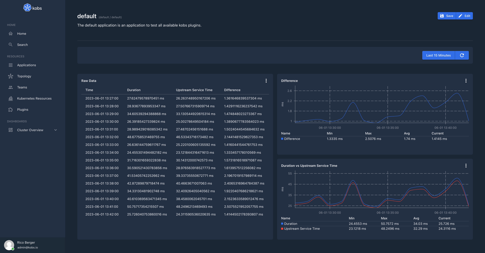

# SQL

The SQL plugin can be used to get run queries against a SQL database. Currently we are supporting ClickHouse, Postgres and MySQL databases.

## Configuration

The following config can be used to grant kobs access to a ClickHouse database running at `clickhouse-clickhouse.logging.svc.cluster.local:9000`. To access ClickHouse the user `admin` with the password provided via the `CLICKHOUSE_PASSWORD` environment variable is used.

```yaml
plugins:
  sql:
    - name: sql
      displayName: SQL
      connection: tcp://clickhouse-clickhouse.logging.svc.cluster.local:9000?username=admin&password=${CLICKHOUSE_PASSWORD}&database=logs
      driver: clickhouse
```

| Field | Type | Description | Required |
| ----- | ---- | ----------- | -------- |
| name | string | Name of the ClickHouse instance. | Yes |
| displayName | string | Name of the ClickHouse as it is shown in the UI. | Yes |
| descriptions | string | Description of the ClickHouse instance. | No |
| connection | string | The connection string, to connect to a SQL database. | Yes |
| driver | string | The driver which should be used for the database instance. This must be `clickhouse`, `postgres` or `mysql`. | Yes |

## Options

The following options can be used for a panel with the SQL plugin:

| Field | Type | Description | Required |
| ----- | ---- | ----------- | -------- |
| type | string | The type which should be used to visualize the data. This can be `table` or `chart`. | Yes |
| queries | [[]Query](#query) | A list of queries, which can be selected by the user. This is required when the `type` is set to `table`. | No |
| chart | [Chart](#chart) | Settings to render the results of a query in a chart. This is required when the `type` is set to `chart`. | No |

### Query

| Field | Type | Description | Required |
| ----- | ---- | ----------- | -------- |
| name | string | A name for the SQL query, which is displayed in the select box. | Yes |
| query | string | The query which should be run against the configured SQL database. | Yes |
| columns | map<string, [Column](#column)> | A map of columns to format the returned data for a query. The key must match the returned column name. | No |

### Column

| Field | Type | Description | Required |
| ----- | ---- | ----------- | -------- |
| title | string | Set a title for the column. | No |
| unit | string | A unit which should be displayed behind the column value. If this is `time` we automatically try to auto format the column to the users local time. | No |

### Chart

| Field | Type | Description | Required |
| ----- | ---- | ----------- | -------- |
| type | string | The chart type. This could be `pie`, `line` or `area`. | Yes |
| query | string | The query which which results should be used in the chart. | Yes |
| pieLabelColumn | string | The name of the column which should be used for the labels in the pie chart. This is required when the type is `pie`. | No |
| pieValueColumn | string | The name of the column which should be used for the values in the pie chart. This is required when the type is `pie`. | No |
| xAxisColumn | string | The column which should be used for the x axis. This is required when the type is `line` or `area`. | No |
| xAxisType | string | The type for the x axis. This could be empty or `time`. | No |
| xAxisUnit | string | The unit which should be used for the x axis. | No |
| yAxisColumns | []string | A list of columns which should be shown for the y axis. This is required when the type is `line` or `area`. | No |
| yAxisUnit | string | The unit for the y axis. | No |
| yAxisStacked | boolean | When this is `true` the values of the y axis are stacked. | No |
| legend | map<string, string> | A map of string pairs, to set the displayed title for a column in the legend. The key is the column name as returned by the query and the value is the shown title. | No |

## Examples

The following example uses a configured SQL which access the data from a [klogs](klogs.md) ClickHouse instance to show the difference between the duration and upstream service time from the Istio access logs.

??? note "Dashboard"

    ```yaml
    ---
    apiVersion: kobs.io/v1
    kind: Dashboard
    metadata:
      name: latency
      namespace: kobs
    spec:
      rows:
        - size: 3
          panels:
            - title: Raw Data
              colSpan: 6
              rowSpan: 2
              plugin:
                name: sql-klogs-clickhouse
                options:
                  type: table
                  queries:
                    - name: Duration and Upstream Service Time
                      query: |
                        SELECT
                          toStartOfInterval(timestamp, INTERVAL 60 second) AS time,
                          avg(fields_number.value[indexOf(fields_number.key, 'content.duration')]) as avg_duration,
                          avg(fields_number.value[indexOf(fields_number.key, 'content.upstream_service_time')]) as avg_ust,
                          avg_duration - avg_ust as avg_diff
                        FROM
                          logs.logs
                        WHERE
                          timestamp >= FROM_UNIXTIME()
                          AND timestamp <= FROM_UNIXTIME()
                          AND namespace='myservice'
                          AND app='myservice'
                          AND container_name='istio-proxy'
                          AND match(fields_string.value[indexOf(fields_string.key, 'content.upstream_cluster')], '^inbound.*')
                        GROUP BY
                          time
                        ORDER BY
                          time
                      columns:
                        time:
                          title: Time
                          unit: time
                        avg_duration:
                          title: Duration
                          unit: ms
                        avg_ust:
                          title: Upstream Service Time
                          unit: ms
                        avg_diff:
                          title: Difference
                          unit: ms

            - title: Difference
              colSpan: 6
              plugin:
                name: sql-klogs-clickhouse
                options:
                  type: chart
                  chart:
                    type: line
                    query: |
                      SELECT
                        toStartOfInterval(timestamp, INTERVAL 60 second) AS time,
                        avg(fields_number.value[indexOf(fields_number.key, 'content.duration')]) - avg(fields_number.value[indexOf(fields_number.key, 'content.upstream_service_time')]) as avg_diff
                      FROM
                        logs.logs
                      WHERE
                        timestamp >= FROM_UNIXTIME()
                        AND timestamp <= FROM_UNIXTIME()
                        AND namespace='myservice'
                        AND app='myservice'
                        AND container_name='istio-proxy'
                        AND match(fields_string.value[indexOf(fields_string.key, 'content.upstream_cluster')], '^inbound.*')
                      GROUP BY
                        time
                      ORDER BY
                        time
                    xAxisColumn: time
                    xAxisType: time
                    yAxisColumns:
                      - avg_diff
                    yAxisUnit: ms
                    yAxisStacked: false
                    legend:
                      avg_diff: Difference

            - title: Duration vs Upstream Service Time
              colSpan: 6
              plugin:
                name: sql-klogs-clickhouse
                options:
                  type: chart
                  chart:
                    type: line
                    query: |
                      SELECT
                        toStartOfInterval(timestamp, INTERVAL 60 second) AS time,
                        avg(fields_number.value[indexOf(fields_number.key, 'content.duration')]) as avg_duration,
                        avg(fields_number.value[indexOf(fields_number.key, 'content.upstream_service_time')]) as avg_ust
                      FROM
                        logs.logs
                      WHERE
                        timestamp >= FROM_UNIXTIME()
                        AND timestamp <= FROM_UNIXTIME()
                        AND namespace='myservice'
                        AND app='myservice'
                        AND container_name='istio-proxy'
                        AND match(fields_string.value[indexOf(fields_string.key, 'content.upstream_cluster')], '^inbound.*')
                      GROUP BY
                        time
                      ORDER BY
                        time
                    xAxisColumn: time
                    xAxisType: time
                    yAxisColumns:
                      - avg_duration
                      - avg_ust
                    yAxisUnit: ms
                    yAxisStacked: false
                    legend:
                      avg_duration: Duration
                      avg_ust: Upstream Service Time
    ```



In the next example we are visualizing the distribution of log levels from the same SQL instance via a Pie chart.

??? note "Dashboard"

    ```yaml
    ---
    apiVersion: kobs.io/v1
    kind: Dashboard
    metadata:
      name: log-levels
      namespace: kobs
    spec:
      rows:
        - size: 3
          panels:
            - title: Raw Data
              colSpan: 6
              plugin:
                name: sql-clickhouse-logging
                options:
                  type: table
                  queries:
                    - name: Log Levels
                      query: |
                        SELECT
                          content.level,
                          count(content.level) as count_data
                        FROM
                          logs.logs
                        WHERE
                          timestamp >= FROM_UNIXTIME()
                          AND timestamp <= FROM_UNIXTIME()
                          AND namespace='myservice'
                          AND app='myservice'
                          AND container_name='myservice'
                        GROUP BY
                          content.level
                      columns:
                        content.level:
                          title: Level
                        count_data:
                          title: Count
            - title: Log Level Distribution
              colSpan: 6
              plugin:
                name: sql-clickhouse-logging
                options:
                  type: chart
                  chart:
                    type: pie
                    query: |
                      SELECT
                        content.level,
                        count(content.level) as count_data
                      FROM
                        logs.logs
                      WHERE
                        timestamp >= FROM_UNIXTIME()
                        AND timestamp <= FROM_UNIXTIME()
                        AND namespace='myservice'
                        AND app='myservice'
                        AND container_name='myservice'
                      GROUP BY
                        content.level
                    pieLabelColumn: content.level
                    pieValueColumn: count_data
    ```


