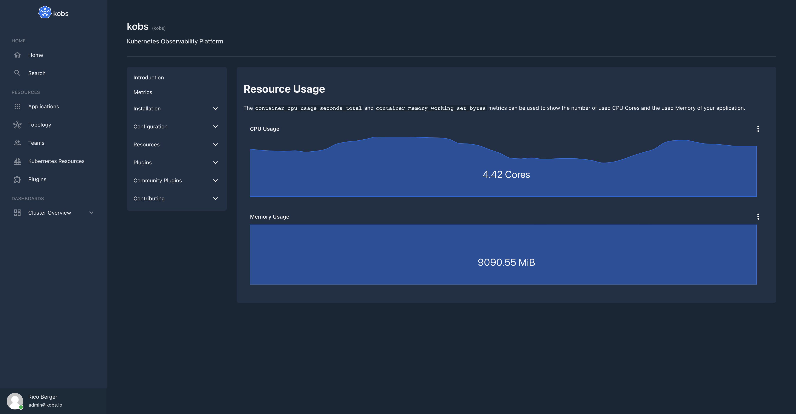
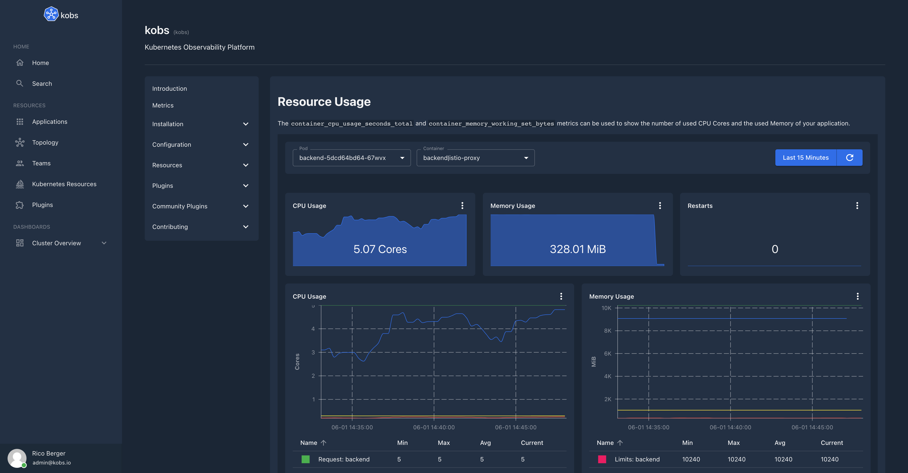

# TechDocs

The TechDocs plugin allows your engineers to write their documentation in markdown files which live together with their code and display them in kobs.


## Configuration

The TechDocs plugin can only be used within the `hub`. To use the TechDocs plugin the following configuration is needed:

| Field | Type | Description | Required |
| ----- | ---- | ----------- | -------- |
| name | string | The name of the TechDocs plugin instance. | Yes |
| type | `techdocs` | The type for the TechDocs plugin. | Yes |
| options.provider.type | string | The provider type. Must be `local`, `s3` or `azure` | Yes |
| options.provider.local.rootDirectory | string | The path to the directory, which contains all the folders with your TechDocs for your services. | Yes |
| options.provider.s3.endpoint | string | The endpoint for your S3 bucket. | Yes |
| options.provider.s3.accessKeyID | string | The access key id for your S3 bucket. | Yes |
| options.provider.s3.secretAccessKey | string | The secret access key for your S3 bucket. | Yes |
| options.provider.s3.bucket | string | The name of the S3 bucket with your TechDocs. | Yes |
| options.provider.s3.useSSL | boolean | Use SSL to access the S3 bucket. | No |
| options.provider.azure.accountName | boolean | The name of the Azure storage account. | Yes |
| options.provider.azure.accountKey | boolean | The key for the Azure storage account. | Yes |

```yaml
plugins:
  - name: techdocs
    type: techdocs
    options:
      provider:
        type: local
        local:
          rootDirectory:
        # type: s3
        # s3:
        #   endpoint:
        #   accessKeyID:
        #   secretAccessKey:
        #   bucket:
        #   useSSL
        # type: azure
        # azure:
        #   accountName:
        #   accountKey:
```

## Insight Options

!!! note
    The TechDocs plugin can not be used within the insights section of an application.

## Variable Options

!!! note
    The TechDocs plugin can not be used to get a list of variable values.

## Panel Options

The following options can be used for a panel with the TechDocs plugin:

| Field | Type | Description | Required |
| ----- | ---- | ----------- | -------- |
| type | string | The type which should be used for the TechDocs panel. Must be `services` to render the list of all available services, `service-toc` to render the table of contents for a service, `service-markdown` to render the TechDocs for a service or `markdown` to render a markdown text. | Yes |
| service | string | The name of the service. This value is required when the type is `service-toc` or `service-markdown`. | No |
| service | string | The markdown text. This value is required when the type is `markdown`. | No |

## Usage

The TechDocs plugin renders the markdown files for your service. For that you have to provide the files for kobs via S3 or via a file system which kobs can access.

### File Structure

The TechDocs for all of your service must live in their own folder. Lets say we have four services `productpage`, `details`, `ratings` and `reviews`. All of these services have their own documentation, so that the final structure for kobs should look as follows:

```plain
techdocs
├── details
│   └── index.yaml
├── productpage
│   ├── configuration
│   │   ├── addbooks.md
│   │   └── getting-started.md
│   ├── index.md
│   ├── index.yaml
│   └── installation
│       ├── helm.md
│       └── kustomize.md
├── ratings
│   └── index.yaml
└── reviews
    └── index.yaml
```

As you can see each folder must also contain a `index.yaml` file with the following content:

```yaml
# The key should be a unique identifier for all of your TechDocs.
# It must have the same name as the folder, where the TechDocs for the service are stored for kobs.
key: productpage
# The name of your service and a short description of your service.
name: Productpage
description: The productpage for the bookinfo application.
# The first markdown file which should be shown, when a user opens the TechDocs for the service.
home: index.md
# The table of contents for your service, with links to all the markdown files should can be accessed by a user.
toc:
  - Home: index.md
  - Installation:
      - Helm: installation/helm.md
      - Kustomize: installation/kustomize.md
  - Configuration:
      - Getting Started: configuration/getting-started.md
      - Add Books: configuration/addbooks.md
```

### Admonitions

The TechDocs plugin supports admonitions. The syntax to add admonitions to your markdown files is as follows:

```plain
:::info{title="My info title"}
My info text
:::
```

```plain
:::success{title="My success title"}
My success text
:::
```

```plain
:::warning{title="My warning title"}
My warning text
:::
```

```plain
:::error{title="My error title"}
My error text
:::
```

Admonitions can also be collapsed by adding the `collapse="true"` property:

```plain
:::info{title="My info title" collapse="true"}
My info text
:::
```

```plain
:::success{title="My success title" collapse="true"}
My success text
:::
```

```plain
:::warning{title="My warning title" collapse="true"}
My warning text
:::
```

```plain
:::error{title="My error title" collapse="true"}
My error text
:::
```

### Embed kobs Panels

You can add kobs panels to your TechDocs in the same way how they are used within applications, dashboards, teams and users. To add a panel to your documentation you have to use a code block with the `kobs:panel` language.

~~~yaml
# Resource Usage

The `container_cpu_usage_seconds_total` and `container_memory_working_set_bytes` metrics can be used to show the number of used CPU Cores and the used Memory of your application.

```kobs:panel
title: CPU Usage
plugin:
  type: prometheus
  name: prometheus
  cluster: prod-de1
  options:
    queries:
      - query: >-
          avg(rate(container_cpu_usage_seconds_total{namespace="backend", image!="", pod=~"backend-.*",
          container!="POD", container!="", container=~"backend"}[2m]))
    type: sparkline
    unit: Cores
```

```kobs:panel
title: Memory Usage
plugin:
  type: prometheus
  name: prometheus
  cluster: prod-de1
  options:
    queries:
      - query: >-
          avg(container_memory_working_set_bytes{namespace="backend", pod=~"backend-.*", container!="POD",
          container!="", container=~"backend"}) /
          1024 / 1024
    type: sparkline
    unit: MiB
```
~~~



### Embed kobs Dashboards

Similar to the panels you can also embed complete dashboards within your documentation. To add a dashboard you have to use a code block with the `kobs:dashboard` annotation.

~~~yaml
# Resource Usage

The `container_cpu_usage_seconds_total` and `container_memory_working_set_bytes` metrics can be used to show the number of used CPU Cores and the used Memory of your application.

```kobs:dashboard
- title: 'Resource Usage'
  inline:
    variables:
      - name: var_pod
        label: Pod
        includeAllOption: false
        plugin:
          type: prometheus
          name: prometheus
          cluster: prod-de1
          options:
            type: labelValues
            label: pod
            query: container_cpu_usage_seconds_total{namespace="backend", image!="", pod=~"backend-.*", container!="POD", container!=""}
      - name: var_container
        label: Container
        includeAllOption: true
        plugin:
          type: prometheus
          name: prometheus
          cluster: prod-de1
          options:
            type: labelValues
            label: container
            query: container_cpu_usage_seconds_total{namespace="backend", image!="", pod=~"", container!="POD", container!=""}
    rows:
      - panels:
          - title: CPU Usage
            plugin:
              type: prometheus
              name: prometheus
              cluster: prod-de1
              options:
                queries:
                  - query: >-
                      sum(rate(container_cpu_usage_seconds_total{namespace="backend", image!="", pod=~"",
                      container!="POD", container!="", container=~""}[2m]))
                type: sparkline
                unit: Cores
            h: 4
            w: 4
            x: 0
            'y': 0
          - title: Memory Usage
            plugin:
              type: prometheus
              name: prometheus
              cluster: prod-de1
              options:
                queries:
                  - query: >-
                      sum(container_memory_working_set_bytes{namespace="backend", pod=~"", container!="POD",
                      container!="", container=~""}) /
                      1024 / 1024
                type: sparkline
                unit: MiB
            h: 4
            w: 4
            x: 4
            'y': 0
          - title: Restarts
            plugin:
              type: prometheus
              name: prometheus
              cluster: prod-de1
              options:
                queries:
                  - query: >-
                      kube_pod_container_status_restarts_total{namespace="backend", pod=~"", container=~""}
                type: sparkline
            h: 4
            w: 4
            x: 8
            'y': 0
      - panels:
          - title: CPU Usage
            plugin:
              type: prometheus
              name: prometheus
              cluster: prod-de1
              options:
                legend: table
                queries:
                  - label: 'Usage: '
                    query: >-
                      sum(rate(container_cpu_usage_seconds_total{namespace="backend", image!="", pod=~"",
                      container!="POD", container!="", container=~""}[2m])) by (container)
                  - label: 'Request: '
                    query: >-
                      sum(kube_pod_container_resource_requests{namespace="backend", resource="cpu", pod=~"",
                      container!="POD", container!="", container=~""}) by (container)
                type: line
                unit: Cores
            h: 9
            w: 6
            x: 0
            'y': 0
          - title: Memory Usage
            plugin:
              type: prometheus
              name: prometheus
              cluster: prod-de1
              options:
                legend: table
                queries:
                  - label: 'Usage: '
                    query: >-
                      sum(container_memory_working_set_bytes{namespace="backend", pod=~"", container!="POD",
                      container!="", container=~""}) by
                      (container) / 1024 / 1024
                  - label: 'Request: '
                    query: >-
                      sum(kube_pod_container_resource_requests{namespace="backend", resource="memory", pod=~"", container!="POD", container!="", container=~""}) by (container) / 1024 / 1024
                  - label: 'Limits: '
                    query: >-
                      sum(kube_pod_container_resource_limits{namespace="backend", resource="memory", pod=~"", container!="POD", container!="", container=~""}) by (container) / 1024 / 1024
                type: line
                unit: MiB
            h: 9
            w: 6
            x: 6
            'y': 0
```
~~~


