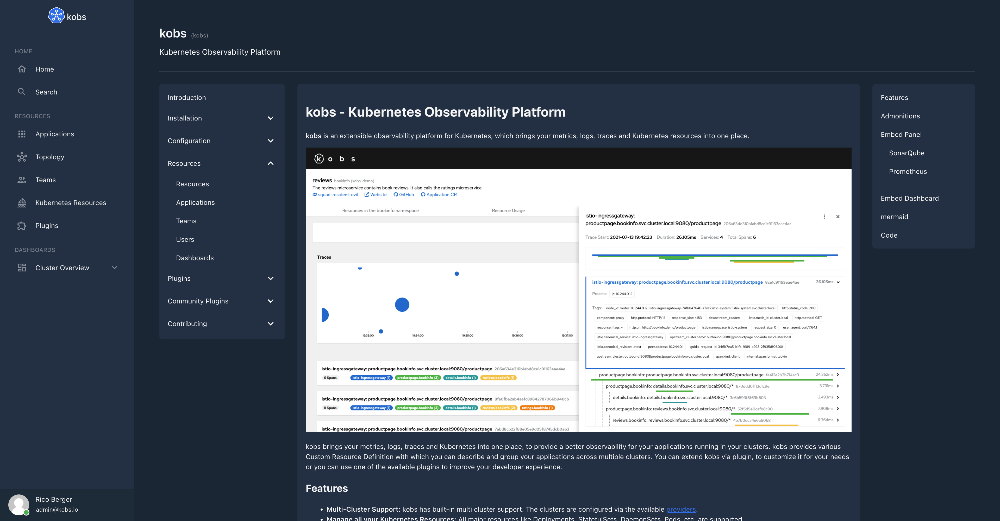

# TechDocs

The TechDocs plugin allows your engineers to write their documentation in markdown files which live together with their code and display them in kobs.



## Configuration

To use the TechDocs plugin the following configuration is needed in the satellites configuration file:

| Field | Type | Description | Required |
| ----- | ---- | ----------- | -------- |
| name | string | The name of the TechDocs plugin instance. | Yes |
| type | `techdocs` | The type for the TechDocs plugin. | Yes |
| options.provider.type | string | The provider type. Must be `local` or `s3` | Yes |
| options.provider.local.rootDirectory | string | The path to the directory, which contains all the folders with your TechDocs for your services. | Yes |
| options.provider.s3.endpoint | string | The endpoint for your S3 bucket. | Yes |
| options.provider.s3.accessKeyID | string | The access key id for your S3 bucket. | Yes |
| options.provider.s3.secretAccessKey | string | The secret access key for your S3 bucket. | Yes |
| options.provider.s3.bucket | string | The name of the S3 bucket with your TechDocs. | Yes |
| options.provider.s3.useSSL | boolean | Use SSL to access the S3 bucket. | Yes |

```yaml
plugins:
  - name: techdocs
    type: techdocs
    options:
      provider:
        type: local
        local:
          rootDirectory:
        # type: s3
        # s3:
        #   endpoint:
        #   accessKeyID:
        #   secretAccessKey:
        #   bucket:
        #   useSSL: true
```

## Insight Options

!!! note
    The TechDocs plugin can not be used within the insights section of an application.

## Variable Options

!!! note
    The TechDocs plugin can not be used to get a list of variable values.

## Panel Options

The following options can be used for a panel with the TechDocs plugin:

| Field | Type | Description | Required |
| ----- | ---- | ----------- | -------- |
| type | string | Specify if you want to show a `list` of TechDocs or the table of contents (`toc`) for a specific service. | Yes |
| service | string | The name of the service for which the table of contents should be shown when the type is `toc`. | No |

## Notification Options

!!! note
    The TechDocs plugin can not be used to get a list of notifications.

## Usage

The TechDocs plugin renders the markdown files for your service. For that you have to provide the files for kobs via S3 or via a file system which kobs can access.

### File Structure

The TechDocs for all of your service must live in their own folder. Lets say we have four services `productpage`, `details`, `ratings` and `reviews`. All of these services have their own documentation, so that the final structure for kobs should look as follows:

```plain
techdocs
├── details
│   └── index.yaml
├── productpage
│   ├── configuration
│   │   ├── addbooks.md
│   │   └── getting-started.md
│   ├── index.md
│   ├── index.yaml
│   └── installation
│       ├── helm.md
│       └── kustomize.md
├── ratings
│   └── index.yaml
└── reviews
    └── index.yaml
```

As you can see each folder must also contain a `index.yaml` file with the following content:

```yaml
# The key should be a unique identifier for all of your TechDocs.
# It must have the same name as the folder, where the TechDocs for the service are stored for kobs.
key: productpage
# The name of your service and a short description of your service.
name: Productpage
description: The productpage for the bookinfo application.
# The first markdown file which should be shown, when a user opens the TechDocs for the service.
home: index.md
# The table of contents for your service, with links to all the markdown files should can be accessed by a user.
toc:
  - Home: index.md
  - Installation:
      - Helm: installation/helm.md
      - Kustomize: installation/kustomize.md
  - Configuration:
      - Getting Started: configuration/getting-started.md
      - Add Books: configuration/addbooks.md
```
