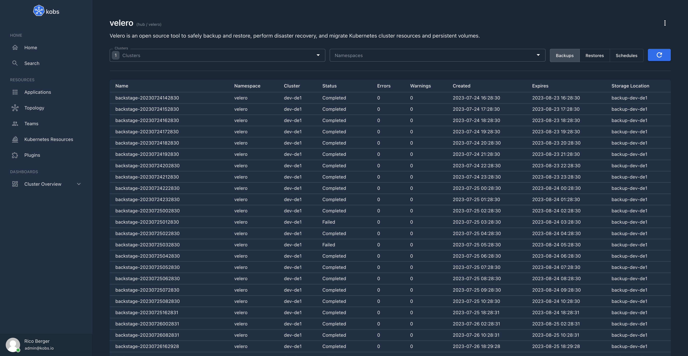

# Velero

The Velero plugin can be used to view backups, restores and schedules for [Velero](https://velero.io). The plugin can also be used to create new backups.



## Configuration

The Velero plugin can only be used within the `hub`. To use the Velero plugin the following configuration is needed:

| Field | Type | Description | Required |
| ----- | ---- | ----------- | -------- |
| name | string | The name of the Velero plugin instance. | Yes |
| type | `velero` | The type for the Velero plugin. | Yes |
| frontendOptions.backupTemplate | string | The template which is used, when a new backup is created. | No |

```yaml
plugins:
  - name: velero
    type: velero
    frontendOptions:
    backupTemplate: |
      apiVersion: velero.io/v1
      kind: Backup
      metadata:
        name: <BACKUP-NAME>
        namespace: velero
      spec:
        includedNamespaces:
          - <BACKUP-NAMESPACE>
        includedResources:
          - persistentvolumeclaims
```

## Insight Options

!!! note
    The Velero plugin can not be used within the insights section of an application.

## Variable Options

!!! note
    The Velero plugin can not be used to get a list of variable values.

## Panel Options

The following options can be used for a panel with the Velero plugin:

| Field | Type | Description | Required |
| ----- | ---- | ----------- | -------- |
| type | string | The Velero resource which should be displayed. This must be `backups`, `restores` or `schedules`. | Yes |
| clusters | []string | The cluster for which the resources should be displayed. | Yes |
| namespace | []string | The namespace for which the resources should be displayed. | Yes |
| paramName | string | The name of the parameter which should be used for filtering the resources. Must be `labelSelector` or `fieldSelector`. | No |
| param | string | The parameter which is used to filter the resources. | No |
