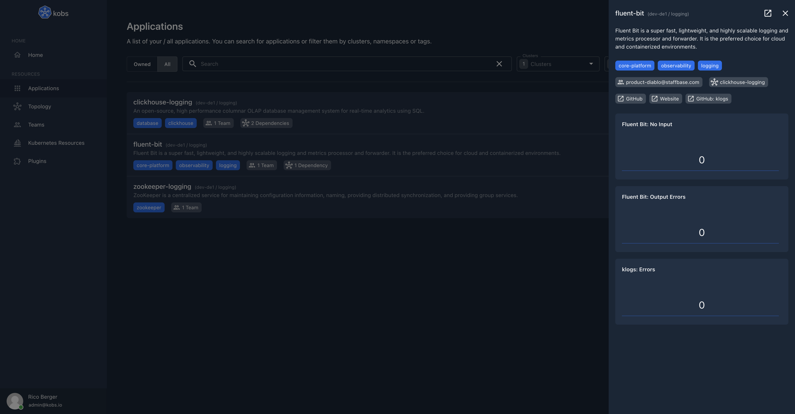
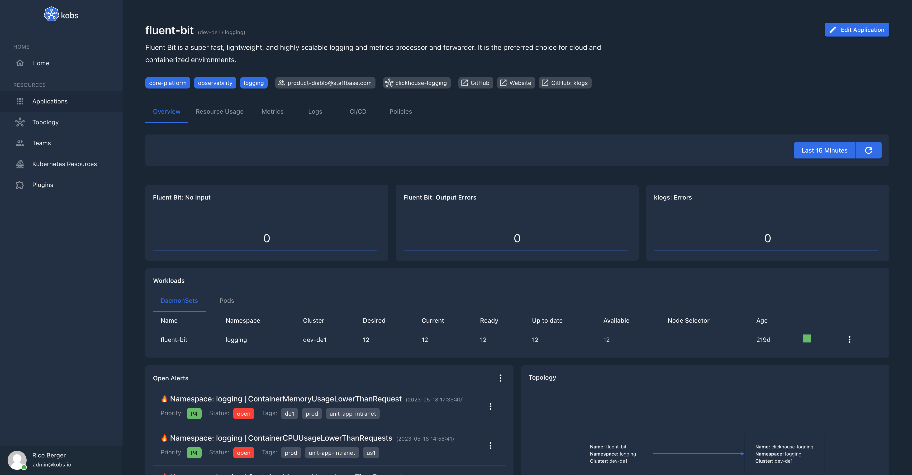
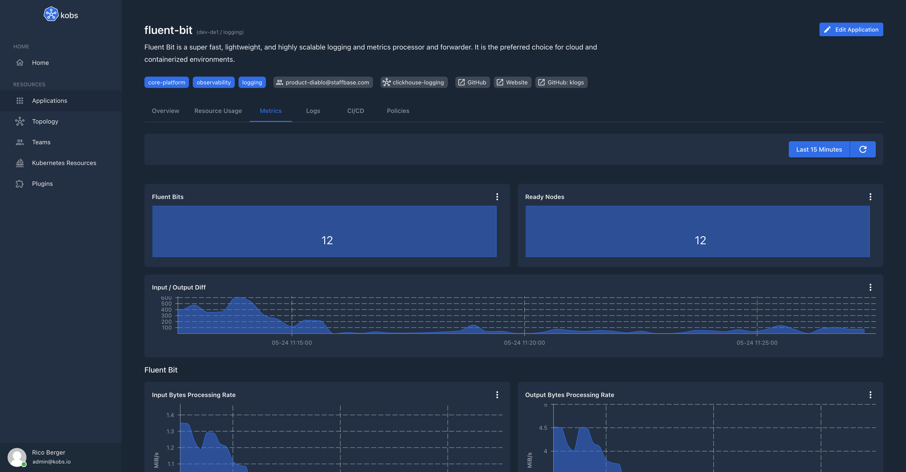
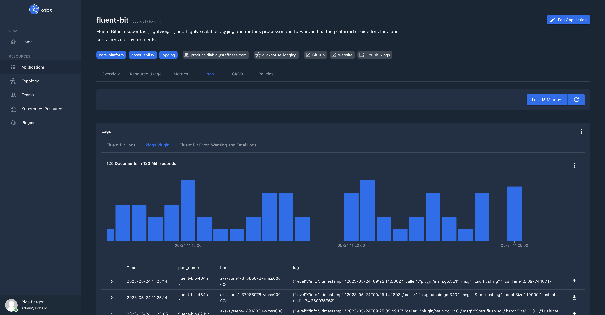

# Applications

Applications are defined via the [Application Custom Resource Definition](https://github.com/kobsio/kobs/blob/main/deploy/kustomize/crds/kobs.io_applications.yaml). Applications can be used to improve the observability of your Kubernetes workloads. For that you can add metrics, logs, traces and other information via the different plugins to your Kubernetes resources.

Applications can be accessed via the Applications page. By default it shows all the Applications, which are owned by a Team a User is part of. It is also possible to filter the list of Applications by clusters, namespaces, tags or search for them by their name.


You can also use the topology page to view the topology graph of your applications. For that you can use the `topology.dependencies` field in the Application CR to define the dependencies for an Application.


## Specification

| Field | Type | Description | Required |
| ----- | ---- | ----------- | -------- |
| description | string | Provide a descriptions for the application with additional details. | No |
| tags | []string | A list of tags to describe the application. | No |
| links | [[]Link](#link) | A list of links (e.g. a link to the GitHub repository for this application). | No |
| teams | []string | A list of teams to define the ownership for the application. The provided names must match a `group` field in a defined Team CR. | No |
| topology | [Topology](#topology) | Set the topology settings for your application. This can be used to define dependencies or to add Application which are running outside of Kubernetes. | No |
| insights | [[]Insight](#insight) | A list of insights for an Application, e.g. the most important metrics. | No |
| dashboards | [[]Dashboard](#dashboard) | A list of dashboards, which should be shown for this application. | No |

### Link

| Field | Type | Description | Required |
| ----- | ---- | ----------- | -------- |
| title | string | Title for the link | Yes |
| link | string | The actuall link | Yes |

### Topology

| Field | Type | Description | Required |
| ----- | ---- | ----------- | -------- |
| external | boolean | When this `true` the application will be marked as external. This means that we do not show the cluster and namespace of the Application CR in the UI, to allow users to also add Applications which are not running in a Kubernetes cluster. | No |
| dependencies | [[]Dependency](#dependency) | Add other applications as dependencies for this application. This can be used to render a topology graph for your applications. | No |

### Dependency

| Field | Type | Description | Required |
| ----- | ---- | ----------- | -------- |
| cluster | string | Cluster of the application, which should be added as dependency. If this field is omitted kobs will look in the same cluster as the application was created in. | No |
| namespace | string | Namespace of the application, which should be added as dependency. If this field is omitted kobs will look in the same namespace as the application was created in. | No |
| name | string | Name of the application, which should be added as dependency. | Yes |
| description | string | The description can be used to explain, why this application is a dependency of the current application. | No |

### Insight

| Field | Type | Description | Required |
| ----- | ---- | ----------- | -------- |
| title | string | The title for the defined insight metric. | Yes |
| type | string | The type which should be used to display the insight metric. Currently the only valid value is `sparkline`. | Yes |
| unit | string | An optional unit for the metric. | No |
| mappings | map<string, string> | A map of mappings, which should be displayed instead of the current metric value. | No |
| plugin | [Plugin](../plugins/index.md#specification) | The plugin, which should be used for the preview. | Yes |



### Dashboard

Define the dashboards, which should be used for the application.

| Field | Type | Description | Required |
| ----- | ---- | ----------- | -------- |
| cluster | string | Cluster of the dashboard. If this field is omitted kobs will look in the same cluster as the application was created in. | No |
| namespace | string | Namespace of the dashboard. If this field is omitted kobs will look in the same namespace as the application was created in. | No |
| name | string | Name of the dashboard. **Note:** You have not to provide a name, if you use the **inline** property.  | Yes |
| title | string | Title for the dashboard | Yes |
| description | string | The description can be used to explain the content of the dashboard. | No |
| placeholders | map<string, string> | A map of placeholders, whith the name as key and the value for the placeholder as value. More information for placeholders can be found in the documentation for [Dashboards](./dashboards.md). | No |
| inline | [Inline](#inline) | Specify a complete dashboard within the reference. This can be used if you just use the dashboard within one application. | No |

#### Inline

| Field | Type | Description | Required |
| ----- | ---- | ----------- | -------- |
| hideToolbar | boolean | If this is `true` the toolbar will be hidden in the dashboard. | No |
| defaultTime | boolean | Set the default time interval used for a dashboard. Must be `last12Hours`, `last15Minutes`, `last1Day`, `last1Hour`, `last1Year`, `last2Days`, `last30Days`, `last30Minutes`, `last3Hours`, `last5Minutes`, `last6Hours`, `last6Months`, `last7Days` or `last90Days`. The default value is `last15Minutes`. | No |
| variables | [[]Variable](./dashboards.md#variable) | A list of variables, where the values are loaded by the specified plugin. | No |
| rows | [[]Row](./dashboards.md#row) | A list of rows for the dashboard. | Yes |

## Example

The following Application CR defines an kobs Application for Fluent Bit, to display, the resources, metrics and logs for Fluent Bit.

??? note "Application"

    ```yaml
    ---
    apiVersion: kobs.io/v1
    kind: Application
    metadata:
      name: fluent-bit
      namespace: logging
    spec:
      description: Fluent Bit is a super fast, lightweight, and highly scalable logging and metrics processor and forwarder. It is the preferred choice for cloud and containerized environments.
      tags:
        - core-platform
        - observability
        - logging
      links:
        - title: GitHub
          link: https://github.com/fluent/fluent-bit
        - title: Website
          link: https://fluentbit.io
        - title: "GitHub: klogs"
          link: https://github.com/kobsio/klogs
      teams:
        - product-diablo@staffbase.com
      topology:
        dependencies:
          - name: clickhouse-logging

      insights:
        - title: "Fluent Bit: No Input"
          type: sparkline
          plugin:
            name: prometheus
            type: prometheus
            options:
              query: count(sum(rate(fluentbit_input_bytes_total{namespace="logging", pod=~"fluent-bit-.*", name="tail.0"}[5m])) by (pod, name) == 0) or vector(0)
        - title: "Fluent Bit: Output Errors"
          type: sparkline
          plugin:
            name: prometheus
            type: prometheus
            options:
              query: sum(rate(fluentbit_output_errors_total[1m]))
        - title: "klogs: Errors"
          type: sparkline
          plugin:
            name: prometheus
            type: prometheus
            options:
              query: sum(rate(klogs_errors_total{namespace="logging", pod=~"fluent-bit-.*"}[5m]))

      dashboards:
        - namespace: kobs
          name: overview
          title: Overview
          placeholders:
            cluster: "<% $.cluster %>"
            namespace: "<% $.namespace %>"
            name: "<% $.name %>"
            resources: |
              - pods
              - daemonsets
            param: app=<% $.name %>
        - namespace: kobs
          name: resource-usage
          title: Resource Usage
          placeholders:
            namespace: "<% $.namespace %>"
            pod: "<% $.name %>-.*"
            verticalpodautoscaler: "<% $.name %>"
        - title: Metrics
          inline:
            rows:
              - panels:
                  - title: Fluent Bits
                    plugin:
                      type: prometheus
                      name: prometheus
                      options:
                        queries:
                          - query: >-
                              sum(kube_pod_info{namespace="logging",
                              pod=~"fluent-bit-.*"})
                        type: sparkline
                    h: 4
                    w: 6
                    x: 0
                    'y': 0
                  - title: Ready Nodes
                    plugin:
                      type: prometheus
                      name: prometheus
                      options:
                        queries:
                          - query: >-
                              sum(kube_node_status_condition{condition="Ready",status="true"})
                        type: sparkline
                    h: 4
                    w: 6
                    x: 6
                    'y': 0
                  - title: Input / Output Diff
                    plugin:
                      type: prometheus
                      name: prometheus
                      options:
                        queries:
                          - label: Input / Output Diff
                            query: >-
                              abs(sum(rate(fluentbit_input_records_total{namespace="logging",
                              pod=~"fluent-bit-.*"}[5m])) -
                              sum(rate(klogs_batch_size_sum{namespace="logging",
                              pod=~"fluent-bit-.*"}[5m])))
                        stacked: true
                        type: area
                    h: 4
                    w: 12
                    x: 0
                    'y': 4
              - title: Fluent Bit
                panels:
                  - title: Input Bytes Processing Rate
                    plugin:
                      type: prometheus
                      name: prometheus
                      options:
                        legend: table
                        queries:
                          - label: ''
                            query: >-
                              sum(rate(fluentbit_input_bytes_total{namespace="logging",
                              pod=~"fluent-bit-.*"}[5m])) by (name) / 1024 / 1024
                        stacked: true
                        type: area
                        unit: MiB/s
                    h: 9
                    w: 6
                    x: 0
                    'y': 0
                  - title: Output Bytes Processing Rate
                    plugin:
                      type: prometheus
                      name: prometheus
                      options:
                        legend: table
                        queries:
                          - label: ''
                            query: >-
                              sum(rate(fluentbit_output_proc_bytes_total{namespace="logging",
                              pod=~"fluent-bit-.*"}[5m])) by (name) / 1024 / 1024
                        stacked: true
                        type: area
                        unit: MiB/s
                    h: 9
                    w: 6
                    x: 6
                    'y': 0
                  - title: Input Records Processing Rate
                    plugin:
                      type: prometheus
                      name: prometheus
                      options:
                        legend: table
                        queries:
                          - label: ''
                            query: >-
                              sum(rate(fluentbit_input_records_total{namespace="logging",
                              pod=~"fluent-bit-.*"}[5m])) by (name)
                        stacked: true
                        type: area
                        unit: rps
                    h: 9
                    w: 6
                    x: 0
                    'y': 9
                  - title: Output Record Processing Rate
                    plugin:
                      type: prometheus
                      name: prometheus
                      options:
                        legend: table
                        queries:
                          - label: ''
                            query: >-
                              sum(rate(fluentbit_output_proc_records_total{namespace="logging",
                              pod=~"fluent-bit-.*"}[5m])) by (name)
                        stacked: true
                        type: area
                        unit: rps
                    h: 9
                    w: 6
                    x: 6
                    'y': 9
                  - title: Output Retry/Failed-Rytry Rate
                    plugin:
                      type: prometheus
                      name: prometheus
                      options:
                        legend: table
                        queries:
                          - label: Retries to 
                            query: >-
                              sum(rate(fluentbit_output_retries_total{namespace="logging",
                              pod=~"fluent-bit-.*"}[5m])) by (name)
                          - label: Failed Retries to 
                            query: >-
                              sum(rate(fluentbit_output_retries_failed_total{namespace="logging",
                              pod=~"fluent-bit-.*"}[5m])) by (name)
                        stacked: true
                        type: area
                    h: 9
                    w: 6
                    x: 0
                    'y': 18
                  - title: Output Error Rate
                    plugin:
                      type: prometheus
                      name: prometheus
                      options:
                        legend: table
                        queries:
                          - label: ''
                            query: >-
                              sum(rate(fluentbit_output_errors_total{namespace="logging",
                              pod=~"fluent-bit-.*"}[5m])) by (name)
                        stacked: true
                        type: area
                    h: 9
                    w: 6
                    x: 6
                    'y': 18
              - title: klogs
                panels:
                  - title: Input Records Processing Rate
                    plugin:
                      type: prometheus
                      name: prometheus
                      options:
                        legend: table
                        queries:
                          - label: Input Rate
                            query: >-
                              sum(rate(klogs_input_records_total{namespace="logging",
                              pod=~"fluent-bit-.*"}[5m]))
                        stacked: true
                        type: area
                        unit: rps
                    h: 9
                    w: 6
                    x: 0
                    'y': 0
                  - title: Output Record Processing Rate
                    plugin:
                      type: prometheus
                      name: prometheus
                      options:
                        legend: table
                        queries:
                          - label: Output Rate
                            query: >-
                              sum(rate(klogs_batch_size_sum{namespace="logging",
                              pod=~"fluent-bit-.*"}[5m]))
                        stacked: true
                        type: area
                        unit: rps
                    h: 9
                    w: 6
                    x: 6
                    'y': 0
                  - title: Errors
                    plugin:
                      type: prometheus
                      name: prometheus
                      options:
                        legend: table
                        queries:
                          - label: Errors
                            query: >-
                              sum(rate(klogs_errors_total{namespace="logging",
                              pod=~"fluent-bit-.*"}[5m]))
                        stacked: true
                        type: area
                        unit: rps
                    h: 9
                    w: 6
                    x: 0
                    'y': 9
                  - title: Avg. Flush Time
                    plugin:
                      type: prometheus
                      name: prometheus
                      options:
                        legend: table
                        queries:
                          - label: Flush Time
                            query: >-
                              sum(rate(klogs_flush_time_seconds_sum{namespace="logging",
                              pod=~"fluent-bit-.*"}[5m])) /
                              sum(rate(klogs_flush_time_seconds_count{namespace="logging",
                              pod=~"fluent-bit-.*"}[5m]))
                        stacked: true
                        type: area
                        unit: s
                    h: 9
                    w: 6
                    x: 6
                    'y': 9
              - title: Hosts
                autoHeight: true
                panels:
                  - title: Stats
                    plugin:
                      type: prometheus
                      name: prometheus
                      options:
                        columns:
                          - name: instance
                            title: Host
                          - name: value-2
                            title: Fluent Bit Input Records Processing Rate
                            unit: rps
                          - name: value-3
                            title: Fluent Bit Output Records Processing Rate
                            unit: rps
                          - name: value-4
                            title: Fluent Bit Output Error Rate
                          - name: value-5
                            title: klogs Input Records Processing Rate
                            unit: rps
                          - name: value-6
                            title: klogs Output Records Processing Rate
                            unit: rps
                          - name: value-7
                            title: klogs Output Error Rate
                        queries:
                          - label: ''
                            query: sum(node_exporter_build_info) by (instance)
                          - label: ''
                            query: >-
                              sum(rate(fluentbit_input_records_total{namespace="logging",
                              pod=~"fluent-bit-.*"}[5m])) by (instance)
                          - label: ''
                            query: >-
                              sum(rate(fluentbit_output_proc_records_total{namespace="logging",
                              pod=~"fluent-bit-.*"}[5m])) by (instance)
                          - label: ''
                            query: >-
                              sum(rate(fluentbit_output_errors_total{namespace="logging",
                              pod=~"fluent-bit-.*"}[5m])) by (instance)
                          - label: ''
                            query: >-
                              sum(rate(klogs_input_records_total{namespace="logging",
                              pod=~"fluent-bit-.*"}[5m])) by (instance)
                          - label: ''
                            query: >-
                              sum(rate(klogs_batch_size_sum{namespace="logging",
                              pod=~"fluent-bit-.*"}[5m])) by (instance)
                          - label: ''
                            query: >-
                              sum(rate(klogs_errors_total{namespace="logging",
                              pod=~"fluent-bit-.*"}[5m])) by (instance)
                        type: table
                    h: 9
                    w: 12
                    x: 0
                    'y': 0
              - panels:
                  - title: Number of Logs
                    plugin:
                      type: klogs
                      name: klogs
                      options:
                        aggregation:
                          chart: bar
                          horizontalAxisField: host
                          horizontalAxisLimit: 100
                          horizontalAxisOperation: top
                          horizontalAxisOrder: descending
                          verticalAxisOperation: count
                          query: namespace!=''
                        type: aggregation
                    h: 9
                    w: 12
                    x: 0
                    'y': 0
        - namespace: kobs
          name: overview-logs
          title: Logs
          placeholders:
            cluster: "<% $.cluster %>"
            namespace: "<% $.namespace %>"
            name: "<% $.name %>"
            queries: |
              - name: Fluent Bit Logs
                query: "namespace='logging' _and_ app='fluent-bit' _and_ container_name='fluent-bit'"
                fields:
                  - pod_name
                  - host
                  - log
              - name: klogs Plugin
                query: "namespace='logging' _and_ app='fluent-bit' _and_ container_name='fluent-bit' _and_ _exists_ content_caller"
                fields:
                  - pod_name
                  - host
                  - log
              - name: Fluent Bit Error, Warning and Fatal Logs
                query: "namespace='logging' _and_ app='fluent-bit' _and_ container_name='fluent-bit' _and_ (log=~'%warn%' _or_ log=~'%error%' _or_ log=~'%fatal%')"
                fields:
                  - pod_name
                  - host
                  - log
        - namespace: kobs
          name: overview-cicd
          title: CI/CD
          placeholders:
            cluster: "<% $.cluster %>"
            namespace: "<% $.namespace %>"
            name: "<% $.name %>"
            container: "<% $.name %>"
            type: daemonset
        - namespace: kobs
          name: kyverno-policies
          title: Policies
          placeholders:
            namespace: <% $.namespace %>
    ```

In the fowlling you can find some screenshots how the above application will look in kobs. The application contains the DaemonSet and Pods, which are related to Fluent Bit. It also uses the Prometheus plugin to display metrics and the klogs plugin to display the logs.

### Overview



### Metrics



### Logs


