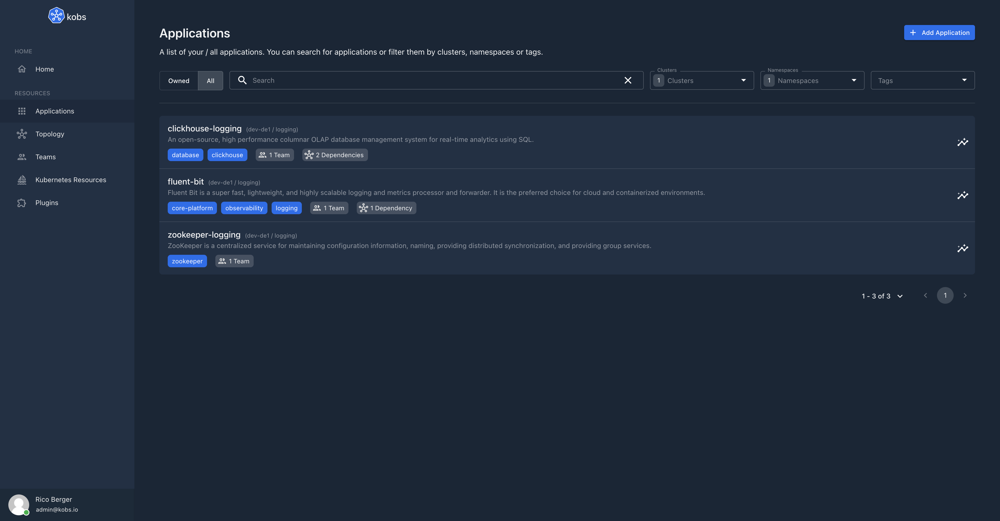
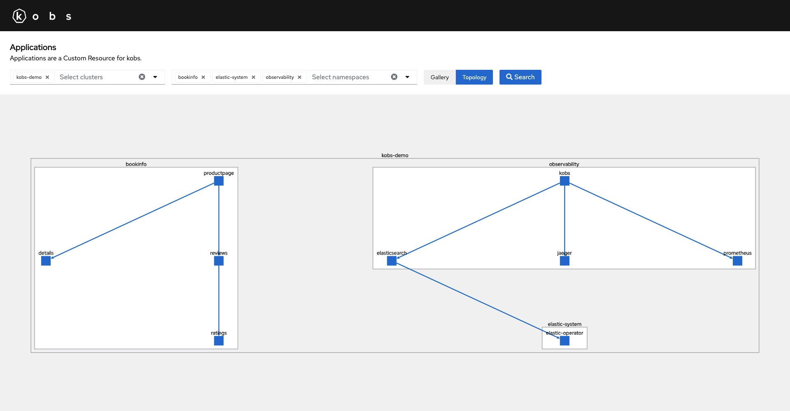
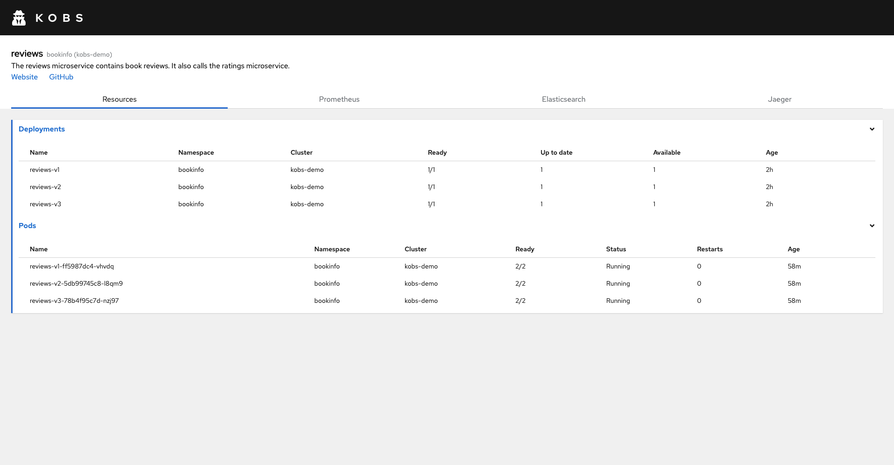
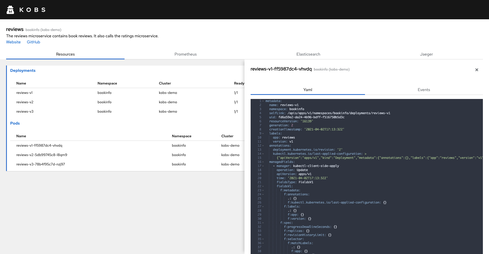
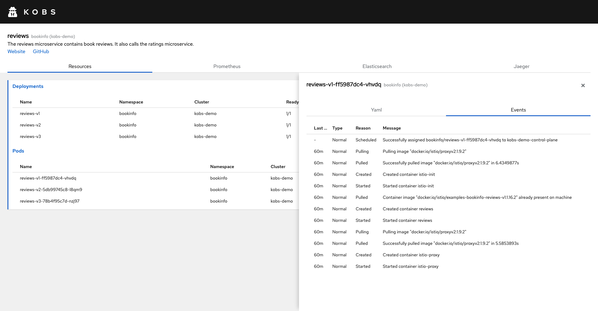
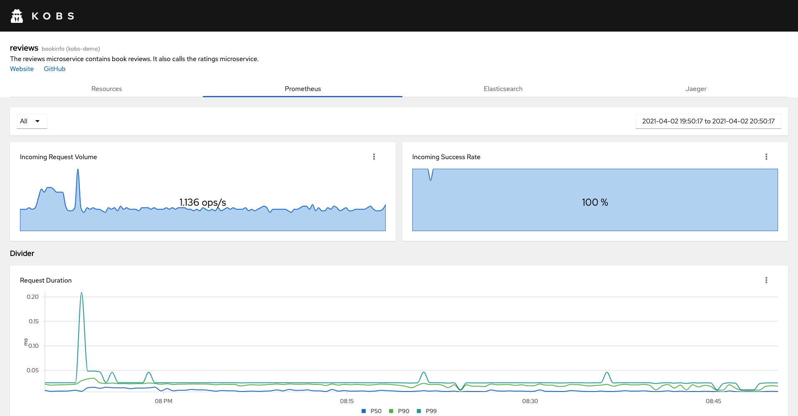
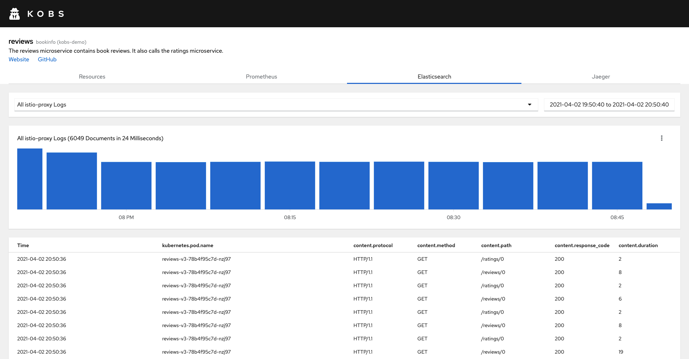
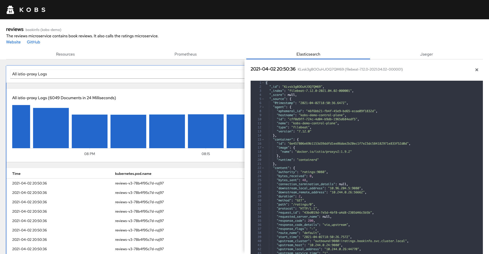
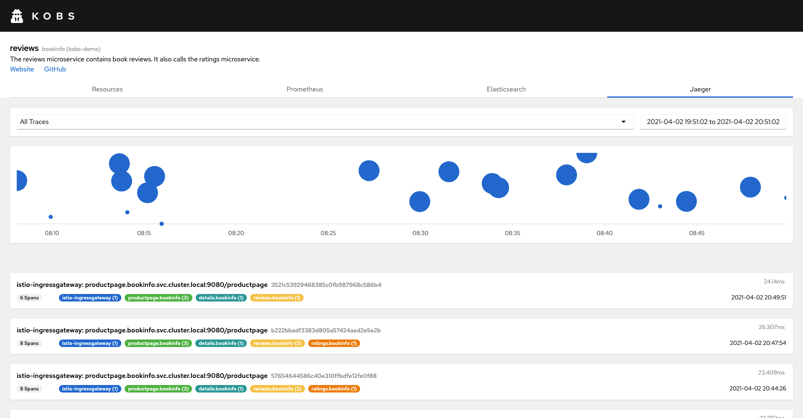
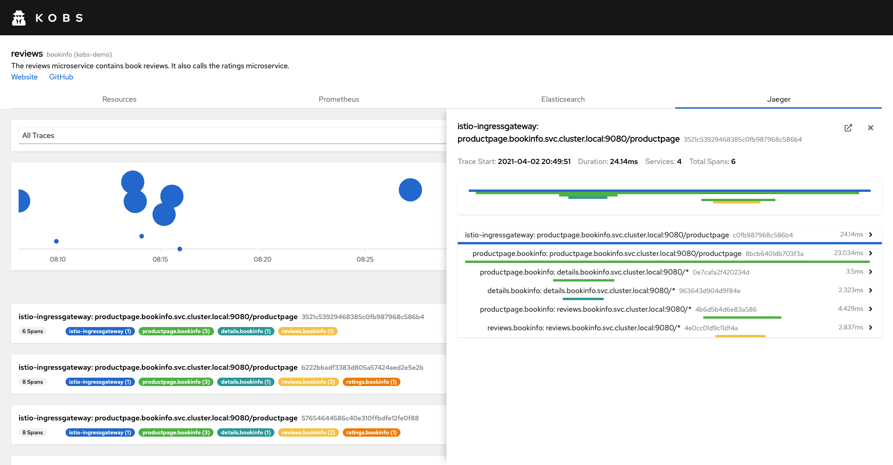

# Applications

Applications are an extension of kobs via the [Application Custom Resource Definition](https://github.com/kobsio/kobs/blob/main/deploy/kustomize/crds/kobs.io_applications.yaml). Applications can be used to define all resources, which are related to each other and to define metrics, logs and traces via the different plugins for these resources.

You can access all applications via the **Applications** item on the home page of kobs.


in the toolbar of the applications page you can select a list of clusters and namespaces for which you want to view the applications.

In the overview you will then see all the applications, with their descriptions or as in the screenshot below with the metrics of a defined plugin. When you select an application a details view on the left side of the page will open. This view contains all the defined links, resources and plugins for this application.



## Specification

In the following you can found the specification for the Application CRD. On the bottom of this page you also have a complete example for an Application CR. The specification for the different plugins can be found in the [plugins](../plugins/getting-started.md) section of the documentation.

| Field | Type | Description | Required |
| ----- | ---- | ----------- | -------- |
| teams | []string | A list of teams to define the ownership for the application. | No |
| details | [Details](#details) | Details for the application. | No |
| resources | [[]Resource](#resource) | Select resources, which are related to the application. | No |
| dependencies | [[]Dependency](#dependency) | Add other applications as dependencies for this application. This can be used to render a topology graph for your applications | No |
| plugins | [[]Plugin](../plugins/getting-started.md#specification) | No |

### Details

The following configuration will add a description for the application and displays a couple of links. It will also display a Prometheus chart for the *Incoming Success Rate* of the application.

```yaml
spec:
  details:
    description: The reviews microservice contains book reviews. It also calls the ratings microservice.
    links:
      - title: Website
        link: https://istio.io/latest/docs/examples/bookinfo/
      - title: GitHub
        link: https://github.com/istio/istio/tree/master/samples/bookinfo
      - title: Application CR
        link: https://github.com/kobsio/kobs/blob/main/deploy/demo/bookinfo/reviews-application.yaml
    plugin:
      name: Prometheus
      prometheus:
        charts:
          - title: Incoming Success Rate
            unit: "%"
            queries:
              - label: Incoming Success Rate
                query: sum(irate(istio_requests_total{reporter="destination",destination_workload_namespace=~"bookinfo",destination_workload=~"reviews-.*",response_code!~"5.*"}[5m])) / sum(irate(istio_requests_total{reporter="destination",destination_workload_namespace=~"bookinfo",destination_workload=~"reviews-.*"}[5m])) * 100
```

| Field | Type | Description | Required |
| ----- | ---- | ----------- | -------- |
| description | string | Provide a descriptions for the application with additional details. | No |
| links | [[]Link](#link) | A list of links (e.g. a link to the GitHub repository for this application) | No |
| plugin | [Plugin](../plugins/getting-started.md#specification) | A plugin, which is used in the overview page, to display additional information for the application, like a health metric. **Attention:** Not all plugins are supporting this preview mode and not all fields are available. For more information take a look at the corresponding plugin page. | No |

### Link

| Field | Type | Description | Required |
| ----- | ---- | ----------- | -------- |
| title | string | Title for the link | Yes |
| link | string | The actuall link | Yes |

### Resource

The following configuration will display all Deployments and Pods in the details view of the application, which are having the label `app=reviews`.

```yaml
spec:
  resources:
    - kinds: ["deployments", "pods"]
      selector: app=reviews
```

| Field | Type | Description | Required |
| ----- | ---- | ----------- | -------- |
| namespaces | []string | A list of namespace, for which the resources should be loaded. By default this will be the same namespace as for the application. | No |
| kinds | []string | A list of the resource types, which should be loaded by the specified selector. | Yes |
| selector | string | A label selector, which is used to load the correct resources (e.g. `app=reviews`). | No |

!!! note
    The following strings can be used as kinds: *cronjobs*, *daemonsets*, *deployments*, *jobs*, *pods*, *replicasets*, *statefulsets*, *endpoints*, *horizontalpodautoscalers*, *ingresses*, *networkpolicies*, *services*, *configmaps*, *persistentvolumeclaims*, *persistentvolumes*, *poddisruptionbudgets*, *secrets*, *serviceaccounts*, *storageclasses*, *clusterrolebindings*, *clusterroles*, *rolebindings*, *roles*, *events*, *nodes*, *podsecuritypolicies*.

    A Custom Resource can be specified in the following form `<name>.<group>/<version>` (e.g. `vaultsecrets.ricoberger.de/v1alpha1`).

### Dependency

Dependencies can be used to render a topology graph for all your applications. For that your have to add other applications as dependencies to the Application CR.

| Field | Type | Description | Required |
| ----- | ---- | ----------- | -------- |
| cluster | string | Cluster of the application, which should be added as dependency. If this field is omitted kobs will look in the same cluster for the application. | No |
| namespace | string | Namespace of the application, which should be added as dependency. If this field is omitted kobs will look in the same namespace for the application. | No |
| name | string | Name of the application, which should be added as dependency. | Yes |
| description | string | The description can be used to explain, why this application is a dependency of the current application. | No |



## Example

The following Application CR is used in the [demo](../installation/demo.md) to display the resources, metrics, logs and traces for the reviews service of the Bookinfo Application.

```yaml
---
apiVersion: kobs.io/v1alpha1
kind: Application
metadata:
  name: reviews
  namespace: bookinfo
spec:
  details:
    description: The reviews microservice contains book reviews. It also calls the ratings microservice.
    links:
      - title: Website
        link: https://istio.io/latest/docs/examples/bookinfo/
      - title: GitHub
        link: https://github.com/istio/istio/tree/master/samples/bookinfo
      - title: Application CR
        link: https://github.com/kobsio/kobs/blob/main/deploy/demo/bookinfo/reviews-application.yaml
    plugin:
      name: Prometheus
      prometheus:
        charts:
          - title: Incoming Success Rate
            unit: "%"
            queries:
              - label: Incoming Success Rate
                query: sum(irate(istio_requests_total{reporter="destination",destination_workload_namespace=~"bookinfo",destination_workload=~"reviews-.*",response_code!~"5.*"}[5m])) / sum(irate(istio_requests_total{reporter="destination",destination_workload_namespace=~"bookinfo",destination_workload=~"reviews-.*"}[5m])) * 100
  resources:
    - kinds: ["deployments", "pods"]
      selector: app=reviews
  plugins:
    - name: Prometheus
      prometheus:
        variables:
          - name: Workload
            label: destination_workload
            query: istio_requests_total{destination_workload_namespace=~"bookinfo",destination_workload=~"reviews-.*"}
            allowAll: true
        charts:
          - title: Incoming Request Volume
            type: sparkline
            unit: ops/s
            size: 6
            queries:
              - label: Incoming Request Volume
                query: round(sum(irate(istio_requests_total{reporter="destination",destination_workload_namespace=~"bookinfo",destination_workload=~"{{ .Workload }}"}[5m])), 0.001)
          - title: Incoming Success Rate
            type: sparkline
            unit: "%"
            size: 6
            queries:
              - label: Incoming Success Rate
                query: sum(irate(istio_requests_total{reporter="destination",destination_workload_namespace=~"bookinfo",destination_workload=~"{{ .Workload }}",response_code!~"5.*"}[5m])) / sum(irate(istio_requests_total{reporter="destination",destination_workload_namespace=~"bookinfo",destination_workload=~"{{ .Workload }}"}[5m])) * 100
          - title: Details
            type: divider
          - title: Request Duration
            type: line
            unit: ms
            size: 12
            queries:
              - label: P50
                query: (histogram_quantile(0.50, sum(irate(istio_request_duration_milliseconds_bucket{reporter="destination",destination_workload_namespace=~"bookinfo",destination_workload=~"{{ .Workload }}"}[1m])) by (le)) / 1000)
              - label: P90
                query: (histogram_quantile(0.90, sum(irate(istio_request_duration_milliseconds_bucket{reporter="destination",destination_workload_namespace=~"bookinfo",destination_workload=~"{{ .Workload }}"}[1m])) by (le)) / 1000)
              - label: P99
                query: (histogram_quantile(0.99, sum(irate(istio_request_duration_milliseconds_bucket{reporter="destination",destination_workload_namespace=~"bookinfo",destination_workload=~"{{ .Workload }}"}[1m])) by (le)) / 1000)
          - title: Incoming Requests By Source And Response Code
            type: line
            unit: ops/s
            size: 6
            queries:
              - label: "{{ .source_workload }}.{{ .source_workload_namespace }} : {{ .response_code }} (🔐 mTLS)"
                query: round(sum(irate(istio_requests_total{connection_security_policy="mutual_tls",destination_workload_namespace=~"bookinfo",destination_workload=~"{{ .Workload }}",reporter="destination"}[5m])) by (source_workload, source_workload_namespace, response_code), 0.001)
              - label: "{{ .source_workload }}.{{ .source_workload_namespace }} : {{ .response_code }}"
                query: round(sum(irate(istio_requests_total{connection_security_policy!="mutual_tls",destination_workload_namespace=~"bookinfo",destination_workload=~"{{ .Workload }}",reporter="destination"}[5m])) by (source_workload, source_workload_namespace, response_code), 0.001)
          - title: Incoming Success Rate (non-5xx responses) By Source
            type: line
            unit: "%"
            size: 6
            queries:
              - label: "{{ .source_workload }}.{{ .source_workload_namespace }} (🔐 mTLS)"
                query: sum(irate(istio_requests_total{reporter="destination",connection_security_policy="mutual_tls",destination_workload_namespace=~"bookinfo",destination_workload=~"{{ .Workload }}",response_code!~"5.*"}[5m])) by (source_workload, source_workload_namespace) / sum(irate(istio_requests_total{reporter="destination",connection_security_policy="mutual_tls",destination_workload_namespace=~"bookinfo",destination_workload=~"{{ .Workload }}"}[5m])) by (source_workload, source_workload_namespace) * 100
              - label: "{{ .source_workload }}.{{ .source_workload_namespace }}"
                query: sum(irate(istio_requests_total{reporter="destination",connection_security_policy!="mutual_tls",destination_workload_namespace=~"bookinfo",destination_workload=~"{{ .Workload }}",response_code!~"5.*"}[5m])) by (source_workload, source_workload_namespace) / sum(irate(istio_requests_total{reporter="destination",connection_security_policy!="mutual_tls",destination_workload_namespace=~"bookinfo",destination_workload=~"{{ .Workload }}"}[5m])) by (source_workload, source_workload_namespace) * 100
    - name: Elasticsearch
      elasticsearch:
        queries:
          - name: All Logs
            query: "kubernetes.namespace: bookinfo AND kubernetes.labels.app: reviews"
          - name: All istio-proxy Logs
            query: "kubernetes.namespace: bookinfo AND kubernetes.labels.app: reviews AND kubernetes.container.name: istio-proxy"
            fields: ["kubernetes.pod.name", "content.protocol", "content.method", "content.path", "content.response_code", "content.duration"]
    - name: Jaeger
      jaeger:
        queries:
          - name: All Traces
            service: reviews.bookinfo
```

In the folling you can find some screenshots how the above application will look in kobs. The application contains the Deployments and Pods, which are related to the reviews service of the Bookinfo Application. It also uses the Prometheus plugin to display metrics, the Elasticsearch plugin to display the logs and the Jaeger plugin to display the traces for the service.

### Resources







### Prometheus



### Elasticsearch





### Jaeger




