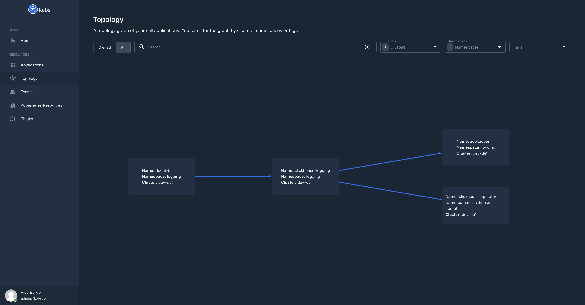

# Applications

Applications are an extension of kobs via the [Application Custom Resource Definition](https://github.com/kobsio/kobs/blob/main/deploy/kustomize/crds/kobs.io_applications.yaml). Applications can be used to monitor your Kubernetes workloads. For that you can add metrics, logs, traces and other information via the different plugins to your Kubernetes resources.

You can access all applications via the **Applications** item on the home page of kobs.


in the toolbar of the applications page you can select a list of clusters and namespaces for which you want to view the applications. You can also decide between the gallery and topology view.

In the overview you will then see all the applications, with their descriptions or as in the screenshot below with the result for the defined preview plugin. When you select an application a details view on the left side of the page will open. This view contains all the defined dashboards for your application.


## Specification

In the following you can found the specification for the Application CRD. On the bottom of this page you also have a complete example for an Application CR.

| Field | Type | Description | Required |
| ----- | ---- | ----------- | -------- |
| description | string | Provide a descriptions for the application with additional details. | No |
| tags | []string | A list of tags to describe the application. | No |
| links | [[]Link](#link) | A list of links (e.g. a link to the GitHub repository for this application). | No |
| teams | [[]Team](#team) | A list of teams to define the ownership for the application. | No |
| topology | [Topology](#topology) | Set the topology settings for your application like the type in the topology graph and dependencies to other applications. | No |
| preview | [Preview](#preview) | Show the most important metrics for your application in the gallery view. | No |
| dashboards | [[]Dashboard](#dashboard) | A list of dashboards, which should be shown for this application. | No |

### Link

| Field | Type | Description | Required |
| ----- | ---- | ----------- | -------- |
| title | string | Title for the link | Yes |
| link | string | The actuall link | Yes |

### Team

Teams can be used to define the ownership for an application. It is also possible to retrieve a list of applications by the name of a team.

| Field | Type | Description | Required |
| ----- | ---- | ----------- | -------- |
| cluster | string | Cluster of the team. If this field is omitted kobs will look in the same cluster as the application was created in. | No |
| namespace | string | Namespace of the team. If this field is omitted kobs will look in the same namespace as the application was created in. | No |
| name | string | Name of the team. | Yes |
| description | string | The description can be used to explain, why this team is the owner of the application. | No |

### Topology

| Field | Type | Description | Required |
| ----- | ---- | ----------- | -------- |
| type | string | The type of the application in the topology graph. This must be a node type as specified in the `topology` key in the [configuration](../plugins/applications#configuration). The default value is `application`. | No |
| external | boolean | When this `true` the application will be marked as external. This means that we do not show the cluster and namespace of the Application CR in the UI and that the node for the application is rendered outside the cluster in the topology graph. | No |
| dependencies | [[]Dependency](#dependency) | Add other applications as dependencies for this application. This can be used to render a topology graph for your applications. | No |

### Dependency

Dependencies can be used to render a topology graph for all your applications. For that your have to add other applications as dependencies to the Application CR.

| Field | Type | Description | Required |
| ----- | ---- | ----------- | -------- |
| cluster | string | Cluster of the application, which should be added as dependency. If this field is omitted kobs will look in the same cluster as the application was created in. | No |
| namespace | string | Namespace of the application, which should be added as dependency. If this field is omitted kobs will look in the same namespace as the application was created in. | No |
| name | string | Name of the application, which should be added as dependency. | Yes |
| description | string | The description can be used to explain, why this application is a dependency of the current application. | No |
| dashboards | [[]Dashboard](#dashboard) | A list of dashboards, which can be used to show the metrics for the dependency. The dashboards are shown in the topology graph, when the edge to the dependency is selected. | No |



### Preview

Define a preview for your application, which should be shown in the gallery view.

| Field | Type | Description | Required |
| ----- | ---- | ----------- | -------- |
| title | string | The title for the defined preview. | Yes |
| plugin | [Plugin](../plugins/getting-started.md#specification) | The plugin, which should be used for the preview. | Yes |

### Dashboard

Define the dashboards, which should be used for the application.

| Field | Type | Description | Required |
| ----- | ---- | ----------- | -------- |
| cluster | string | Cluster of the dashboard. If this field is omitted kobs will look in the same cluster as the application was created in. | No |
| namespace | string | Namespace of the dashboard. If this field is omitted kobs will look in the same namespace as the application was created in. | No |
| name | string | Name of the dashboard. **Note:** You have not to provide a name, if you use the **inline** property.  | Yes |
| title | string | Title for the dashboard | Yes |
| description | string | The description can be used to explain the content of the dashboard. | No |
| placeholders | map<string, string> | A map of placeholders, whith the name as key and the value for the placeholder as value. More information for placeholders can be found in the documentation for [Dashboards](./dashboards.md). | No |
| inline | [Inline](#inline) | Specify a complete dashboard within the reference. This can be used if you just use the dashboard within one application. | No |

### Inline

| Field | Type | Description | Required |
| ----- | ---- | ----------- | -------- |
| variables | [[]Variable](./dashboards.md#Variable) | A list of variables, where the values are loaded by the specified plugin. | No |
| rows | [[]Row](./dashboards.md#row) | A list of rows for the dashboard. | Yes |

## Example

The following Application CR is used in the [demo](../installation/demo.md) to display the resources, metrics, logs and traces for the reviews service of the Bookinfo Application.

```yaml
---
apiVersion: kobs.io/v1
kind: Application
metadata:
  name: reviews
  namespace: bookinfo
spec:
  description: The reviews microservice contains book reviews. It also calls the ratings microservice.
  links:
    - title: Website
      link: https://istio.io/latest/docs/examples/bookinfo/
    - title: GitHub
      link: https://github.com/istio/istio/tree/master/samples/bookinfo
    - title: Application CR
      link: https://github.com/kobsio/kobs/blob/main/deploy/demo/bookinfo/reviews-application.yaml
  teams:
    - name: squad-resident-evil
      namespace: kobs
  topology:
    dependencies:
      - name: ratings
        description: Get book ranking information.
  preview:
    title: Incoming Success Rate
    plugin:
      name: prometheus
      options:
        unit: "%"
        queries:
          - query: sum(irate(istio_requests_total{reporter="destination",destination_workload_namespace=~"bookinfo",destination_workload=~"reviews-.*",response_code!~"5.*"}[5m])) / sum(irate(istio_requests_total{reporter="destination",destination_workload_namespace=~"bookinfo",destination_workload=~"reviews-.*"}[5m])) * 100
  dashboards:
    - name: resources
      namespace: kobs
      title: Resources in the bookinfo namespace
      placeholders:
        namespace: bookinfo
    - name: resource-usage
      namespace: kobs
      title: Resource Usage
      placeholders:
        namespace: bookinfo
        pod: "reviews-.*-.*-.*"
    - name: istio-http
      namespace: kobs
      title: Istio HTTP Metrics
      placeholders:
        namespace: bookinfo
        app: reviews
    - name: istio-logs
      namespace: kobs
      title: Istio Logs
      placeholders:
        namespace: bookinfo
        app: reviews
    - name: traces
      namespace: kobs
      title: Traces
      placeholders:
        service: reviews.bookinfo
```

In the fowlling you can find some screenshots how the above application will look in kobs. The application contains the Deployments and Pods, which are related to the reviews service of the Bookinfo Application. It also uses the Prometheus plugin to display metrics, the Elasticsearch plugin to display the logs and the Jaeger plugin to display the traces for the service.

### Resources


### Prometheus


### Elasticsearch


### Jaeger


