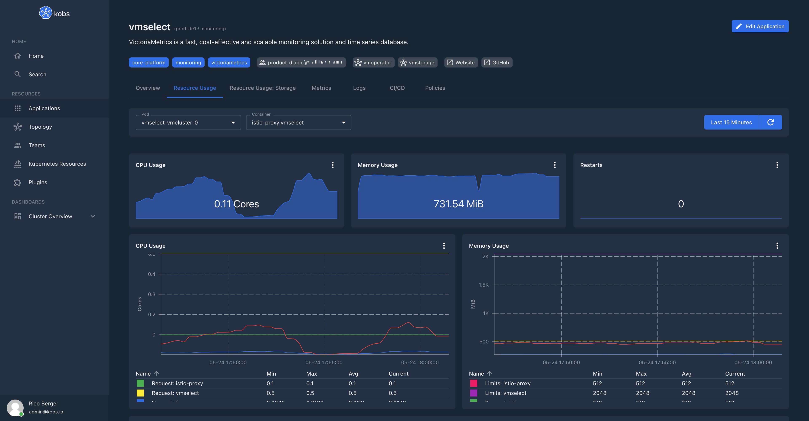

# Dashboards

Dashboards are defined via the [Dashboard Custom Resource Definition](https://github.com/kobsio/kobs/blob/main/deploy/kustomize/crds/kobs.io_dashboards.yaml). Dashboards are used to add additional information for applications, users and teams via all the configured plugins.

## Specification

| Field | Type | Description | Required |
| ----- | ---- | ----------- | -------- |
| description | string | Provide a descriptions for the dashboard with additional details. | No |
| hideToolbar | boolean | If this is `true` the toolbar will be hidden in the dashboard. | No |
| placeholders | [[]Placeholder](#placeholder) | A list of placeholders, which can be directly set by the user. | No |
| variables | [[]Variable](#variable) | A list of variables, where the values are loaded by the specified plugin. | No |
| rows | [[]Row](#row) | A list of rows for the dashboard. | Yes |

### Placeholder

| Field | Type | Description | Required |
| ----- | ---- | ----------- | -------- |
| name | string | The name for the placeholder, which can be used in the dashboard via ``. | Yes |
| description | string | An optional description, to provide more information how the placeholder is used. | No |
| default | string | A default value for the placeholder, when it is not provided in a dashboard reference. | No |
| type | string | The type of the placeholder value. This could be `string`, `number` or `object`. The default value is `string`. | No |

### Variable

| Field | Type | Description | Required |
| ----- | ---- | ----------- | -------- |
| name | string | The name of the variable, which can be used in the dashboard via ``. | Yes |
| label | string | An optional label, which is shown in the UI instead of the variable name. | No |
| hide | boolean | Hide the variable in the UI. | No |
| plugin | [Plugin](../plugins/index.md#specification) | The plugin, which should be used to get the values for the variable. | Yes |

!!! note
    Dashboards are also supporting some special variables, which always can be used and must not be defined by a users. These variables are:

    - `__timeStart`: The start time of the selected time range in seconds. This variable can be used via `` in a dashboard.
    - `__timeEnd`: The end time of the selected time range in seconds. This variable can be used via `` in a dashboard.

### Row

| Field | Type | Description | Required |
| ----- | ---- | ----------- | -------- |
| title | string | The title for a row. | No |
| description | string | The description for the row, to provide additional details about the content of the row. | No |
| size | number | The size of the row. This must be a value between `1` and `12`. The default value is `2`. You can also use the special value `-1` to not limit the height of the row. **Note:** When a dashboard makes use of the `-1` value the Intersection Observer API is disabled, so that all dashboard panels are loaded at once. | No |
| panels | [[]Panel](#panel) | A list of panels for the row. | Yes |

#### Panel

| Field | Type | Description | Required |
| ----- | ---- | ----------- | -------- |
| title | string | The title of the panel. | Yes |
| description | string | An optional description with additional information about the panel. | No |
| colSpan | number | The number of columns, which should be used by the panel. This must be a number between `1` and `12`. The default value is `12`. | No |
| rowSpan | number | The number of rows, which should be used by the panel. This must be a number between `1` and `12`. The default value is `1`. | No |
| plugin | [Plugin](../plugins/index.md#specification) | The plugin which should be displayed in the panel. | Yes |

## Example

The following dashboard can be used to display the resource usage of the containers in a pod. It can be used within an application and can be customized via the `namespace` and `pod` placeholders.

```yaml
---
apiVersion: kobs.io/v1
kind: Dashboard
metadata:
  name: resource-usage
  namespace: kobs
spec:
  description: Resources Usage of Pods
  placeholders:
    - name: namespace
      description: Namespace for the Pods
    - name: pod
      description: Pod selector
  variables:
    - name: var_pod
      label: Pod
      plugin:
        name: prometheus
        type: prometheus
        options:
          type: labelValues
          label: pod
          query: container_cpu_usage_seconds_total{namespace="", image!="", pod=~"", container!="POD", container!=""}
          allowAll: false
  rows:
    - size: 1
      panels:
        - title: CPU Usage
          colSpan: 4
          plugin:
            name: prometheus
            type: prometheus
            options:
              type: sparkline
              unit: Cores
              queries:
                - query: sum(rate(container_cpu_usage_seconds_total{namespace="", image!="", pod=~"", container!="POD", container!=""}[2m]))
        - title: Memory Usage
          colSpan: 4
          plugin:
            name: prometheus
            type: prometheus
            options:
              type: sparkline
              unit: MiB
              queries:
                - query: sum(container_memory_working_set_bytes{namespace="", pod=~"", container!="POD", container!=""}) / 1024 / 1024
        - title: Restarts
          colSpan: 4
          plugin:
            name: prometheus
            type: prometheus
            options:
              type: sparkline
              queries:
                - query: kube_pod_container_status_restarts_total{namespace="", pod=~""}
    - size: 3
      panels:
        - title: CPU Usage
          colSpan: 6
          plugin:
            name: prometheus
            type: prometheus
            options:
              type: line
              unit: Cores
              legend: table
              queries:
                - label: "Usage: "
                  query: sum(rate(container_cpu_usage_seconds_total{namespace="", image!="", pod=~"", container!="POD", container!=""}[2m])) by (container)
                - label: "Request: "
                  query: sum(kube_pod_container_resource_requests{namespace="", resource="cpu", pod=~"", container!="POD", container!=""}) by (container)
                - label: "Limits: "
                  query: sum(kube_pod_container_resource_limits{namespace="", resource="cpu", pod=~"", container!="POD", container!=""}) by (container)
        - title: Memory Usage
          colSpan: 6
          plugin:
            name: prometheus
            type: prometheus
            options:
              type: line
              unit: MiB
              legend: table
              queries:
                - label: "Usage: "
                  query: sum(container_memory_working_set_bytes{namespace="", pod=~"", container!="POD", container!=""}) by (container) / 1024 / 1024
                - label: "Request: "
                  query: sum(kube_pod_container_resource_requests{namespace="", resource="memory", pod=~"", container!="POD", container!=""}) by (container) / 1024 / 1024
                - label: "Limits: "
                  query: sum(kube_pod_container_resource_limits{namespace="", resource="memory", pod=~"", container!="POD", container!=""}) by (container) / 1024 / 1024
    - title: Network
      size: 3
      panels:
        - title: Bandwidth
          colSpan: 12
          plugin:
            name: prometheus
            type: prometheus
            options:
              type: area
              unit: bytes/s
              queries:
                - label: Received
                  query: sum(irate(container_network_receive_bytes_total{namespace="", pod=""}[2m])) by (pod)
                - label: Transmitted
                  query: -sum(irate(container_network_transmit_bytes_total{namespace="", pod=""}[2m])) by (pod)
        - title: Rate of Packets
          colSpan: 6
          plugin:
            name: prometheus
            type: prometheus
            options:
              type: area
              unit: bytes/s
              queries:
                - label: Received
                  query: sum(irate(container_network_receive_packets_total{namespace=~"", pod=~""}[2m])) by (pod)
                - label: Transmitted
                  query: -sum(irate(container_network_transmit_packets_total{namespace=~"", pod=~""}[2m])) by (pod)
        - title: Rate of Packets Dropped
          colSpan: 6
          plugin:
            name: prometheus
            type: prometheus
            options:
              type: area
              unit: bytes/s
              queries:
                - label: Received
                  query: sum(irate(container_network_receive_packets_dropped_total{namespace=~"", pod=~""}[2m])) by (pod)
                - label: Transmitted
                  query: -sum(irate(container_network_transmit_packets_dropped_total{namespace=~"", pod=~""}[2m])) by (pod)
    - title: "Resource Usage for all Pods"
      panels:
        - title: Table
          plugin:
            name: prometheus
            type: prometheus
            options:
              type: table
              queries:
                - label: ""
                  query: sum(rate(container_cpu_usage_seconds_total{namespace="", image!="", pod=~"", container!="POD", container!=""}[2m])) by (pod)
                - label: ""
                  query: sum(kube_pod_container_resource_requests{namespace="", resource="cpu", pod=~"", container!="POD", container!=""}) by (pod)
                - label: ""
                  query: sum(kube_pod_container_resource_limits{namespace="", resource="cpu", pod=~"", container!="POD", container!=""}) by (pod)
                - label: ""
                  query: sum(container_memory_working_set_bytes{namespace="", pod=~"", container!="POD", container!=""}) by (pod) / 1024 / 1024
                - label: ""
                  query: sum(kube_pod_container_resource_requests{namespace="", resource="memory", pod=~"", container!="POD", container!=""}) by (pod) / 1024 / 1024
                - label: ""
                  query: sum(kube_pod_container_resource_limits{namespace="", resource="memory", pod=~"", container!="POD", container!=""}) by (pod) / 1024 / 1024
              columns:
                - name: pod
                  title: Pod
                - name: value-1
                  title: CPU Usage
                  unit: Cores
                - name: value-2
                  title: CPU Requests
                  unit: Cores
                - name: value-3
                  title: CPU Limits
                  unit: Cores
                - name: value-4
                  title: Memory Usage
                  unit: MiB
                - name: value-5
                  title: Memory Requests
                  unit: MiB
                - name: value-6
                  title: Memory Limits
                  unit: MiB
```



The following example shows how complex types for placeholders can be used. In the example the `grafana-dashboards` dashboard requires a list of dashboards via the `dashboards` placeholder:

```yaml
---
apiVersion: kobs.io/v1
kind: Application
metadata:
  name: kobs
  namespace: kobs
spec:
  dashboards:
    - namespace: kobs
      name: test
      title: Grafana Dashboards
      placeholders:
        dashboards: |
          - "vErzsZIVk"
          - "Tf1skG8Mz"
          - "iyJszGUMk"

---
apiVersion: kobs.io/v1
kind: Dashboard
metadata:
  name: grafana-dashboards
  namespace: kobs
spec:
  placeholders:
    - name: dashboards
      type: object
  rows:
    - size: -1
      panels:
        - title: Grafana Dashboards
          plugin:
            name: grafana
            type: grafana
            options:
              type: dashboards
              dashboards: ''
```
