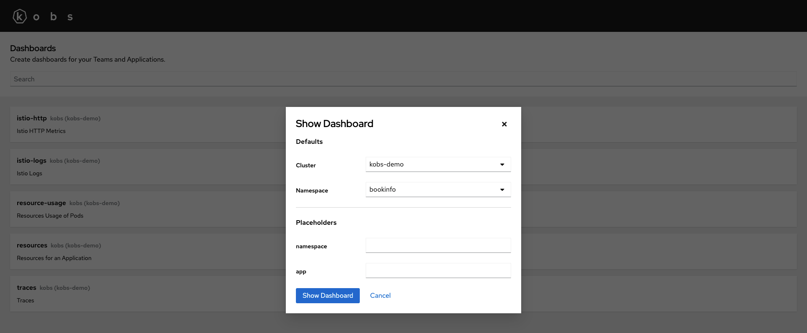
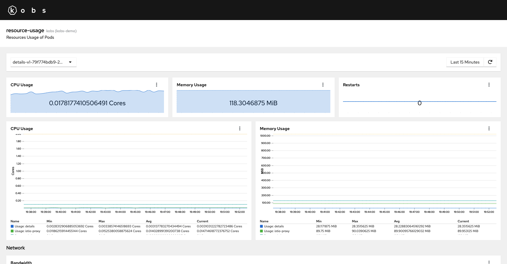

# Dashboards

Dashboards are an extension of kobs via the [Dashboard Custom Resource Definition](https://github.com/kobsio/kobs/blob/main/deploy/kustomize/crds/kobs.io_dashboards.yaml). Dashboards are used to add additional information for teams and applications via all the configured plugins.

You can access all dashboards via the **Dashboards** item on the home page of kobs.


On the dashboards page it will show all dashboards from all clusters and namespaces. When you click on one of the dashboards an modal will be shown, where you can provide the default cluster and namespace and placeholders



The dashboards page is only there to explore all the available dashboards, but for your daily work you should add the dashboards as reference in your [Team](./teams#dashboard) and [Applications](./applications#dashboard).

## Specification

In the following you can found the specification for the Dashboard CRD. On the bottom of this page you also have a complete example for a Dashboard CR.

| Field | Type | Description | Required |
| ----- | ---- | ----------- | -------- |
| description | string | Provide a descriptions for the dashboard with additional details. | No |
| placeholders | [[]Placeholder](#placeholder) | A list of placeholders, which can be directly set by the user. | No |
| variables | [[]Variable](#Variable) | A list of variables, where the values are loaded by the specified plugin. | No |
| rows | [[]Row](#row) | A list of rows for the dashboard. | Yes |

### Placeholder

Placeholders are providing a way to use custom values in the dashboard. The value for a placeholder must be set by the user in the dashboards reference of a [Team](./teams#dashboard) or an [Applications](./applications#dashboard).

The value of a placeholder can be used via the following templating string: `{{ .<placeholder-name> }}`. This string is then replaced with the provided value when the dashboard is loaded.

| Field | Type | Description | Required |
| ----- | ---- | ----------- | -------- |
| name | string | The name for the placeholder, which can be used in the dashboard via `{{ .<placeholder-name> }}`. | Yes |
| description | string | An optional description, to provide more information how the placeholder is used. | No |

### Variable

Variables can be used to select between different values in the dashboard. To use the variable in the dashboard, the following templating string can be used: ``.

| Field | Type | Description | Required |
| ----- | ---- | ----------- | -------- |
| name | string | The name of the variable, which can be used in the dashboard via ``. | Yes |
| label | string | An optional label, which is shown in the UI instead of the variable name. | No |
| hide | boolean | Hide the variable in the UI. | No |
| plugin | [Variable Plugin](#variable-plugin) | The plugin, which should be used to get the values for the variable. | Yes |

### Variable Plugin

| Field | Type | Description | Required |
| ----- | ---- | ----------- | -------- |
| name | string | The name of the plugin, this must be `core` or the name of an configured Prometheus instance. | Yes |
| options | [Variable Plugin Options](#variable-plugin-options) | Plugin specific options to retrieve the values for the variable. | Yes |

### Variable Plugin Options

If the `core` plugin is used to get the values for a variable the options from the following table can be used. The `clusters` type let you select a cluster from all the loaded cluster, the `plugins` type let you select the name of all configured plugins and the `static` type let you specify a list of static values.

| Field | Type | Description | Required |
| ----- | ---- | ----------- | -------- |
| type | string | The type for the `core` plugin. This must be `clusters`, `plugins` or `static`. | Yes |
| items | []string | A list of static values for the `static` type. | Yes |

??? note "Example"

    ```yaml
    ---
    apiVersion: kobs.io/v1beta1
    kind: Dashboard
    spec:
      variables:
        - name: cluster
          label: Cluster
          plugin:
            name: core
            options:
              type: clusters
        - name: plugin
          label: Plugins
          plugin:
            name: core
            options:
              type: plugins
        - name: mystaticvalues
          label: My Static Values
          plugin:
            name: core
            options:
              type: static
              items:
                - myvalue1
                - myvalue2
                - myvalue3
    ```

If a Prometheus instance is used to get the variable values, the options from the following table can be used.

| Field | Type | Description | Required |
| ----- | ---- | ----------- | -------- |
| type | string | The query type to get the values for the variable. At the moment this must be `labelValues` | Yes |
| label | string | The Prometheus label which should be used to get the values for the variable. | Yes |
| query | string | The PromQL query. | Yes |
| allowAll | boolean | If this is set to `true` an additional option for the variable will be added, which contains all other values. | No |

### Row

A row can be used to create logical groups in the dashboard.

| Field | Type | Description | Required |
| ----- | ---- | ----------- | -------- |
| title | string | The title for a row. | No |
| description | string | The description for the row, to provide additional details about the content of the row. | No |
| size | number | The size of the row. This must be a value between `1` and `12`. The default value is `2`. You can also use the special value `-1` to not limit the height of the row. | No |
| panels | [[]Panel](#panel) | A list of panels for the row. | Yes |

### Panel

All specified panels are rendered in a 12 column grid and they are containing the plugin specification.

| Field | Type | Description | Required |
| ----- | ---- | ----------- | -------- |
| title | string | The title of the panel. | Yes |
| description | string | An optional description with additional information about the panel. | No |
| colSpan | number | The number of columns, which should be used by the panel. This must be a number between `1` and `12`. The default value is `12`. | No |
| rowSpan | number | The number of rows, which should be used by the panel. This must be a number between `1` and `12`. The default value is `1`. | No |
| plugin | [Plugin](../plugins/getting-started.md#specification) | The plugin which should be displayed in the panel. | Yes |

## Example

The following dashboard, shows the CPU and Memory usage of a selected Pod. When this dashboard is used in via a team or application, it is possible to set the namespace and a regular expression to pre select all the Pods. These values are then used to get the names of all Pods and a user can then select the name of a Pod via the `var_pod` variable.

The dashboard only uses the Prometheus plugin to show the CPU Usage, Memory Usage, the Network Usage and some other information via different charts and tables.

```yaml
---
apiVersion: kobs.io/v1beta1
kind: Dashboard
metadata:
  name: resource-usage
  namespace: kobs
spec:
  description: Resources Usage of Pods
  placeholders:
    - name: namespace
      description: Namespace for the Pods
    - name: pod
      description: Pod selector
  variables:
    - name: var_pod
      label: Pod
      plugin:
        name: prometheus
        options:
          type: labelValues
          label: pod
          query: container_cpu_usage_seconds_total{namespace="{{ .namespace }}", image!="", pod=~"{{ .pod }}", container!="POD", container!=""}
          allowAll: false
  rows:
    - size: 1
      panels:
        - title: CPU Usage
          colSpan: 4
          plugin:
            name: prometheus
            options:
              type: sparkline
              unit: Cores
              queries:
                - query: sum(rate(container_cpu_usage_seconds_total{namespace="{{ .namespace }}", image!="", pod=~"", container!="POD", container!=""}[2m]))
        - title: Memory Usage
          colSpan: 4
          plugin:
            name: prometheus
            options:
              type: sparkline
              unit: MiB
              queries:
                - query: sum(container_memory_working_set_bytes{namespace="{{ .namespace }}", pod=~"", container!="POD", container!=""}) / 1024 / 1024
        - title: Restarts
          colSpan: 4
          plugin:
            name: prometheus
            options:
              type: sparkline
              queries:
                - query: kube_pod_container_status_restarts_total{namespace="{{ .namespace }}", pod=~""}
    - size: 3
      panels:
        - title: CPU Usage
          colSpan: 6
          plugin:
            name: prometheus
            options:
              type: line
              unit: Cores
              legend: table
              queries:
                - label: "Usage: "
                  query: sum(rate(container_cpu_usage_seconds_total{namespace="{{ .namespace }}", image!="", pod=~"", container!="POD", container!=""}[2m])) by (container)
                - label: "Request: "
                  query: sum(kube_pod_container_resource_requests{namespace="{{ .namespace }}", resource="cpu", pod=~"", container!="POD", container!=""}) by (container)
                - label: "Limits: "
                  query: sum(kube_pod_container_resource_limits{namespace="{{ .namespace }}", resource="cpu", pod=~"", container!="POD", container!=""}) by (container)
        - title: Memory Usage
          colSpan: 6
          plugin:
            name: prometheus
            options:
              type: line
              unit: MiB
              legend: table
              queries:
                - label: "Usage: "
                  query: sum(container_memory_working_set_bytes{namespace="{{ .namespace }}", pod=~"", container!="POD", container!=""}) by (container) / 1024 / 1024
                - label: "Request: "
                  query: sum(kube_pod_container_resource_requests{namespace="{{ .namespace }}", resource="memory", pod=~"", container!="POD", container!=""}) by (container) / 1024 / 1024
                - label: "Limits: "
                  query: sum(kube_pod_container_resource_limits{namespace="{{ .namespace }}", resource="memory", pod=~"", container!="POD", container!=""}) by (container) / 1024 / 1024
    - title: Network
      size: 3
      panels:
        - title: Bandwidth
          colSpan: 12
          plugin:
            name: prometheus
            options:
              type: area
              unit: bytes/s
              queries:
                - label: Received
                  query: sum(irate(container_network_receive_bytes_total{namespace="{{ .namespace }}", pod=""}[2m])) by (pod)
                - label: Transmitted
                  query: -sum(irate(container_network_transmit_bytes_total{namespace="{{ .namespace }}", pod=""}[2m])) by (pod)
        - title: Rate of Packets
          colSpan: 6
          plugin:
            name: prometheus
            options:
              type: area
              unit: bytes/s
              queries:
                - label: Received
                  query: sum(irate(container_network_receive_packets_total{namespace=~"{{ .namespace }}", pod=~""}[2m])) by (pod)
                - label: Transmitted
                  query: -sum(irate(container_network_transmit_packets_total{namespace=~"{{ .namespace }}", pod=~""}[2m])) by (pod)
        - title: Rate of Packets Dropped
          colSpan: 6
          plugin:
            name: prometheus
            options:
              type: area
              unit: bytes/s
              queries:
                - label: Received
                  query: sum(irate(container_network_receive_packets_dropped_total{namespace=~"{{ .namespace }}", pod=~""}[2m])) by (pod)
                - label: Transmitted
                  query: -sum(irate(container_network_transmit_packets_dropped_total{namespace=~"{{ .namespace }}", pod=~""}[2m])) by (pod)
    - title: "Resource Usage for all Pods"
      panels:
        - title: Table
          plugin:
            name: prometheus
            options:
              type: table
              queries:
                - label: ""
                  query: sum(rate(container_cpu_usage_seconds_total{namespace="{{ .namespace }}", image!="", pod=~"{{ .pod }}", container!="POD", container!=""}[2m])) by (pod)
                - label: ""
                  query: sum(kube_pod_container_resource_requests{namespace="{{ .namespace }}", resource="cpu", pod=~"{{ .pod }}", container!="POD", container!=""}) by (pod)
                - label: ""
                  query: sum(kube_pod_container_resource_limits{namespace="{{ .namespace }}", resource="cpu", pod=~"{{ .pod }}", container!="POD", container!=""}) by (pod)
                - label: ""
                  query: sum(container_memory_working_set_bytes{namespace="{{ .namespace }}", pod=~"{{ .pod }}", container!="POD", container!=""}) by (pod) / 1024 / 1024
                - label: ""
                  query: sum(kube_pod_container_resource_requests{namespace="{{ .namespace }}", resource="memory", pod=~"{{ .pod }}", container!="POD", container!=""}) by (pod) / 1024 / 1024
                - label: ""
                  query: sum(kube_pod_container_resource_limits{namespace="{{ .namespace }}", resource="memory", pod=~"{{ .pod }}", container!="POD", container!=""}) by (pod) / 1024 / 1024
              columns:
                - name: pod
                  title: Pod
                - name: value-1
                  title: CPU Usage
                  unit: Cores
                - name: value-2
                  title: CPU Requests
                  unit: Cores
                - name: value-3
                  title: CPU Limits
                  unit: Cores
                - name: value-4
                  title: Memory Usage
                  unit: MiB
                - name: value-5
                  title: Memory Requests
                  unit: MiB
                - name: value-6
                  title: Memory Limits
                  unit: MiB
```


