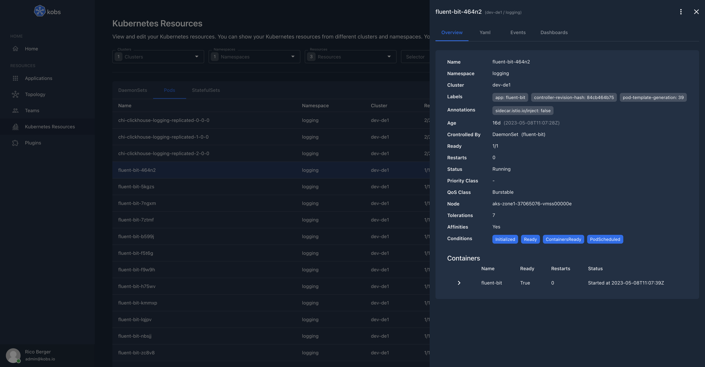
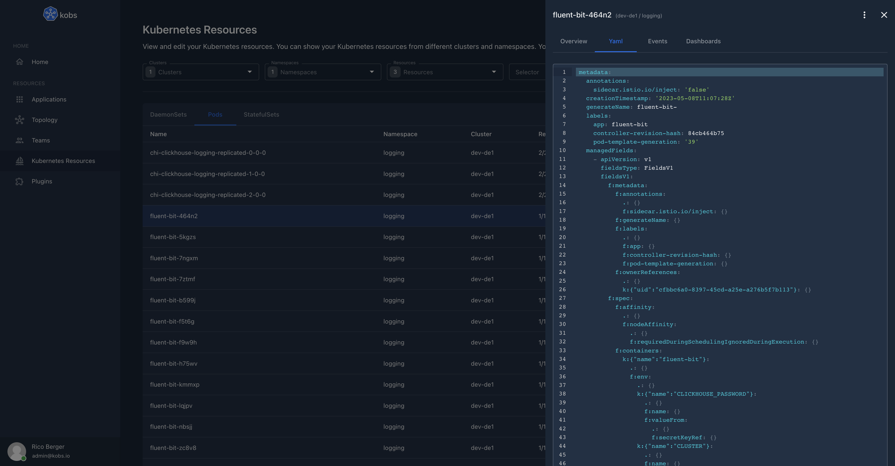
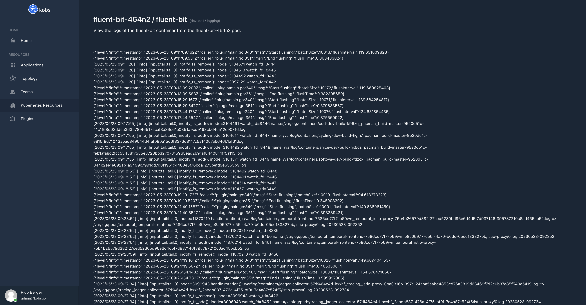

# Kubernetes Resources

kobs supports all Kubernetes objects like Pods, Deployments, StatefulSets and Custom Resources.

!!! note
    Ensure that the satellite has enough permissions to retrieve all these resources from the Kubernetes API server. If you are using the [Helm chart](../getting-started/installation//helm.md) or [Kustomize](../getting-started/installation/kustomize.md) to install kobs, it will automatically create the correct Cluster Role and Cluster Role Binding, so that you can view, but not edit all these resources.

On the Kubernetes Resources page in kobs you can view all the resources available in your clusters. You can filter the list by clusters, namespaces and resources. You can also specify a label or field selector.


By selecting an item in the table, you can view more details for this resource. All the details can be found in the "Overview" tab.



If you want to view the Yaml representation of the resource you can select the corresponding tab.



Next to the yaml representation, you find a second tab "Events", which shows all events, which are related to the selected object. The events are retrieved with a field selector and the name of the resource: `fieldSelector=involvedObject.name=<NAME-OF-THE-RESOURCE>`.


## Actions

kobs provides several actions for all Kubernetes resources. These actions can be found in the upper right corner in the details view next to the close icon. For each resource it is possible to edit and delete the selected resource.

Next to these default actions, kobs also has some other actions for some resources:

- Scale Deployments, StatefulSets and ReplicaSets (`kubectl scale --replicas=3 deployment/bookinfo`)
- Restart DaemonSets, Deployments and StatefulSets (`kubectl rollout restart deployment bookinfo`)
- Trigger a CronJob manually (`kubectl create job --from=cronjob/backup backup-manual-qg0qjf`)
- View the logs of a Pod (`kubectl logs productpage-v1-55fb45c999-c8bvg`).
- Get a shell into a Pod (`kubectl exec -it productpage-v1-55fb45c999-c8bvg -c istio-proxy -- bash`).



## Dashboards

You can specify a list of dashboards for your Kubernetes resources, to get additional information. For example you can add a dashboard to a Pod to get the resource usage metrics from Prometheus or you can add a dashboard to a Deployment to view all the logs from Elasticsearch for this Deployment.

The dashboards can be configured via the `kobs.io/dashboards` annotation. They follow the same syntax as they can be configured for [applications](applications.md#dashboard), [users](teams.md#dashboard) and [teams](teams.md#dashboard).

You can use [JSONPath](https://goessner.net/articles/JsonPath/) within the dashboard specification, to use a value from the resource manifest in the dashboard, e.g. the name of the Pod `<% $.metadata.name %>`.

!!! note
    We are using the [jsonpath-plus](https://www.npmjs.com/package/jsonpath-plus) to extract the content from the Kubernetes objects. A list of examples can be found within the documentation of the module.

In the following example we are adding the `resource-usage` dashboard to the `fluent-bit` daemonset and the `resource-usage` dashboard to the pods of the daemonset. We are also using the name of a pod (`<% $.metadata.name %>`) as placeholder in the dashboard.

```yaml
---
apiVersion: apps/v1
kind: DaemonSet
metadata:
  name: fluent-bit
  namespace: logging
  labels:
    app: productpage
    version: v1
  annotations:
    kobs.io/dashboards: |
      [
        {
          "name": "resource-usage",
          "namespace": "kobs",
          "title": "Resource Usage",
          "placeholders": {
            "namespace": "<% $.metadata.namespace %>",
            "pod": "<% $.metadata.name %>-.*"
          }
        },
      ]
spec:
  selector:
    matchLabels:
      app: fluent-bit
  template:
    metadata:
      annotations:
        kobs.io/dashboards: |
          [
            {
              "name": "resource-usage",
              "namespace": "kobs",
              "title": "Resource Usage",
              "placeholders": {
                "namespace": "<% $.metadata.namespace %>",
                "pod": "<% $.metadata.name %>"
              }
            },
          ]
      labels:
        app: fluent-bit
    spec:
      containers:
        - name: fluent-bit
```


