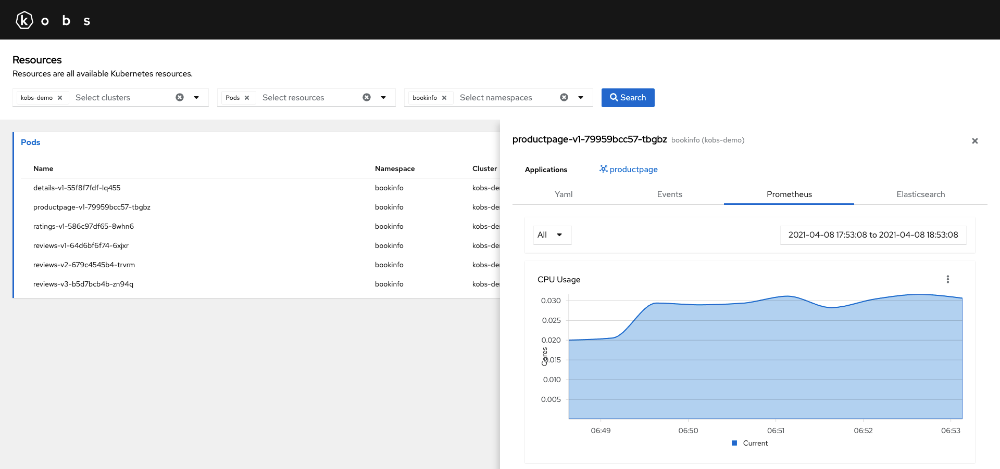

# Resources

kobs supports all Kubernetes objects like Pods, Deployments, StatefulSets and Custom Resources. Ensure that kobs has enough permissions to retrieve all these resources from the Kubernetes API server. If you are using the [Helm chart](../installation/helm.md) or [Kustomize](../installation/kustomize.md) to install kobs, it will automatically create the correct Cluster Role and Cluster Role Binding, so that you can view all these resources.

You can access the Kubernetes objects via the **Resources** item on the home page of kobs.


In the toolbar of the resources page, you can select the clusters, resources and namespaces for which you want to view the resources. The results are group by the resource type. The table for each resource contains the same fields as `kubectl` for the standard Kubernetes objects. For Custom Resources the fields defined in the `additionalPrinterColumns` of the Custom Resource Definition are shown.


By selecting an item in the table, you can view some details for this resource. For example you can view the yaml representation for the selected resource.


Next to the yaml representation, you find a seconde tab events, which shows all events, which are related to the selected object. The events are retrieved with a field selector and the name of the resource: `fieldSelector=involvedObject.name=<NAME-OF-THE-RESOURCE>`.


## Annotations

You can extend your resources with additional information for kobs, by using annotations. This allows you to specify applications and plugins for your Kubernetes objects like Pods, Deployments, etc.

| Annotations | Format | Description |
| ----------- | ------ | ----------- |
| `kobs.io/applications` | `[{"name": "application1"}, {"namespace": "namespace2", "name": "applications2"}]` | Specify a list of applications. You have to provide the name of the application and an optional namespace. If the namespace is not specified, the namespace of the resource will be used. |
| `kobs.io/plugin` | [[]Plugin](../plugins/getting-started.md#specification) | A list of plugins in the same format as it is used for applications. |

### Applications

Specify a list of applications within the `kobs.io/applications` annotation. The list contains multiple objects with the `name` of the application and an optional `namespace`, when the application is in another namespace then the Kubernetes resource.

```yaml
apiVersion: apps/v1
kind: Deployment
metadata:
  name: productpage-v1
  namespace: bookinfo
  labels:
    app: productpage
    version: v1
  annotations:
    kobs.io/applications: |
      [{"name": "productpage"}]
```

### Plugins

Specify a list of plugins within the `kobs.io/plugins` annotation. The list contains multiple plugins, which follow the same sepecification as it is used for applications ([[]Plugin](../plugins/getting-started.md#specification)).

Within each plugin you can use the templating feature to replace values in the annotation with values from the resource. A template starts with `<<` and end with `>>`, between the angle brackets you have to specify a [JSONPath](https://goessner.net/articles/JsonPath/). The JSONPath is run against the resource manifest and the brackets are replaced with the result of the JSONPath expression. For example the following expression will be replaced with the name of the resource: `<< $.metadata.name >>`.

!!! note
    We are using the [jsonpath-plus](https://www.npmjs.com/package/jsonpath-plus) to extract the content from the Kubernetes objects. A list of examples can be found within the documentation of the module.

The following example adds the `kobs.io/plugins` annotation to each Pod of an Deployment. The corresponding Pods will then use the Prometheus plugin, to show the resource usage of the Pod and the Elasticsearch plugin to get all the logs for this Pod.

```yaml
---
apiVersion: apps/v1
kind: Deployment
metadata:
  name: productpage-v1
  namespace: bookinfo
  labels:
    app: productpage
    version: v1
spec:
  template:
    metadata:
      annotations:
        kobs.io/plugins: |
          [
            {
              "name": "Prometheus",
              "prometheus": {
                "variables": [
                  { "name": "Container", "label": "container", "query": "container_cpu_usage_seconds_total{namespace=\"<< $.metadata.namespace >>\", image!=\"\", pod=\"<< $.metadata.name >>\", container!=\"POD\", container!=\"\"}", "allowAll": true }
                ],
                "charts": [
                  {
                    "title": "CPU Usage",
                    "type": "area",
                    "unit": "Cores",
                    "queries": [
                      { "label": "Current", "query": "sum(max(rate(container_cpu_usage_seconds_total{namespace=\"<< $.metadata.namespace >>\", image!=\"\", pod=\"<< $.metadata.name >>\", container=~\"{{ .Container }}\", container!=\"POD\", container!=\"\"}[2m])) by (container))" }
                    ]
                  },
                  {
                    "title": "Memory Usage",
                    "type": "area",
                    "unit": "MiB",
                    "queries": [
                      { "label": "Current", "query": "sum(max(rate(container_memory_usage_bytes{namespace=\"<< $.metadata.namespace >>\", image!=\"\", pod=\"<< $.metadata.name >>\", container=~\"{{ .Container }}\", container!=\"POD\", container!=\"\"}[2m])) by (container)) / 1024 / 1024" }
                    ]
                  },
                  {
                    "title": "Network I/O",
                    "type": "area",
                    "unit": "MiB",
                    "queries": [
                      { "label": "Receive", "query": "sum(rate(container_network_receive_bytes_total{namespace=\"<< $.metadata.namespace >>\", pod=\"<< $.metadata.name >>\"}[2m])) by (pod) / 1024 / 1024" },
                      { "label": "Transmit", "query": "-sum(rate(container_network_transmit_bytes_total{namespace=\"<< $.metadata.namespace >>\", pod=\"<< $.metadata.name >>\"}[2m])) by (pod) / 1024 / 1024" }
                    ]
                  }
                ]
              }
            },
            {
              "name": "Elasticsearch",
              "elasticsearch": {
                "queries": [
                  { "name": "Container Logs: productpage", "query": "kubernetes.namespace: << $.metadata.namespace >> AND kubernetes.pod.name: << $.metadata.name >> AND kubernetes.container.name: productpage" },
                  { "name": "Container Logs: istio-proxy", "query": "kubernetes.namespace: << $.metadata.namespace >> AND kubernetes.pod.name: << $.metadata.name >> AND kubernetes.container.name: istio-proxy", "fields": ["kubernetes.pod.name", "content.protocol", "content.method", "content.path", "content.response_code", "content.duration"] }
                ]
              }
            }
          ]
```


