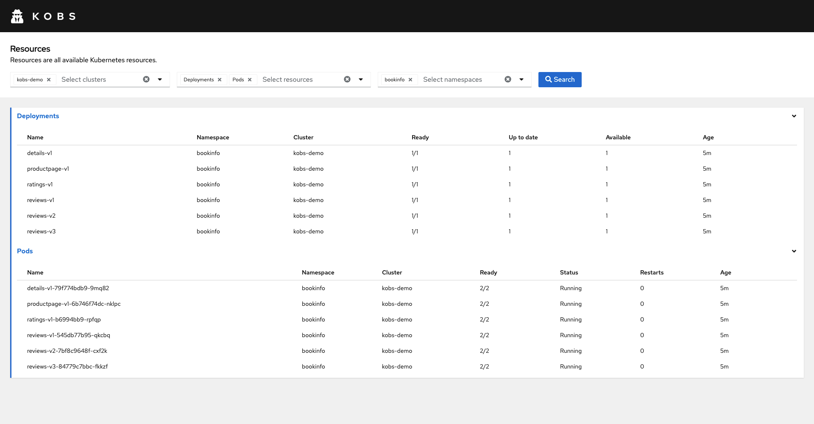
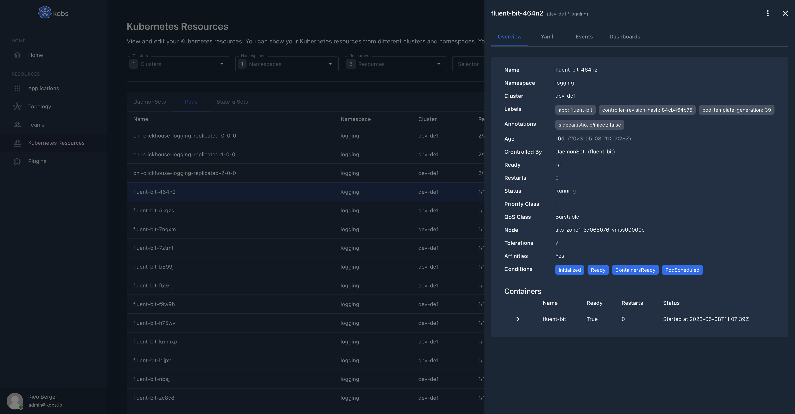
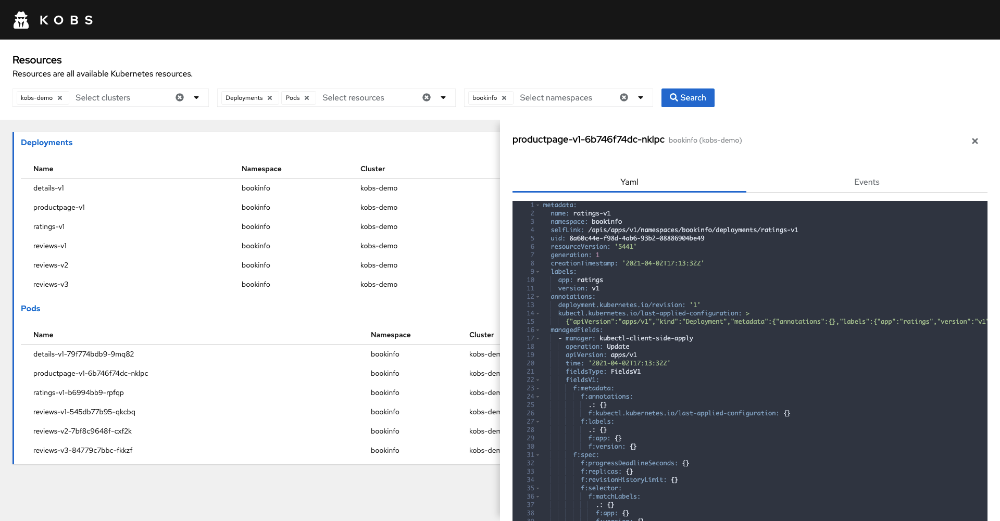
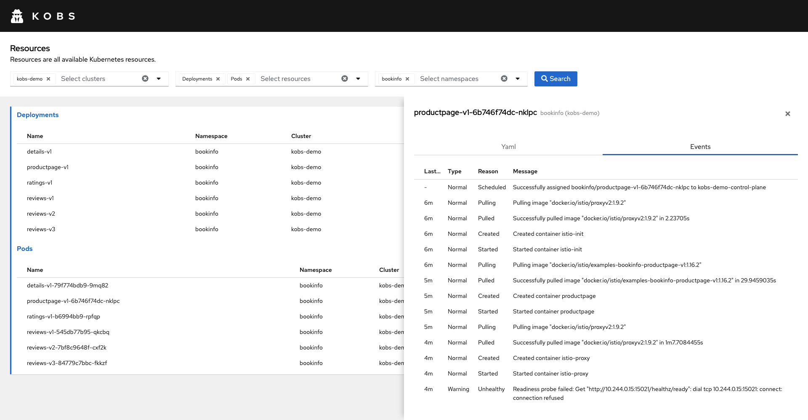
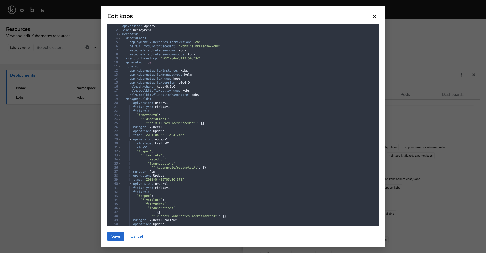
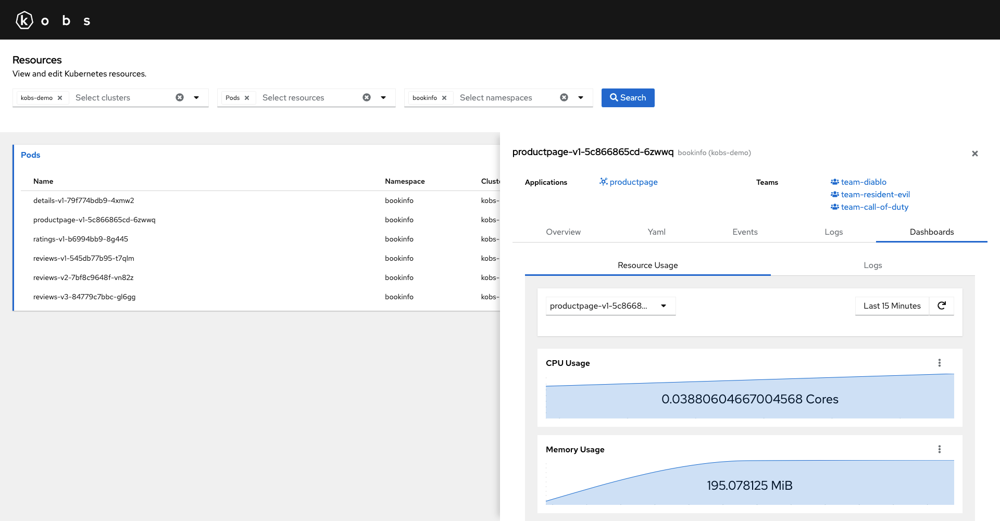

# Resources

kobs supports all Kubernetes objects like Pods, Deployments, StatefulSets and Custom Resources. Ensure that kobs has enough permissions to retrieve all these resources from the Kubernetes API server. If you are using the [Helm chart](../installation/helm.md) or [Kustomize](../installation/kustomize.md) to install kobs, it will automatically create the correct Cluster Role and Cluster Role Binding, so that you can view all these resources.

You can access the Kubernetes objects via the **Resources** item on the home page of kobs.


In the toolbar of the resources page, you can select the clusters, resources and namespaces for which you want to view the resources. The results are group by the resource type. The table for each resource contains the same fields as `kubectl` for the standard Kubernetes objects. For Custom Resources the fields defined in the `additionalPrinterColumns` of the Custom Resource Definition are shown.



By selecting an item in the table, you can view some details for this resource. All the details can be found in the overview tab.



If you want to view the Yaml representation of the resource you can select the corresponding tab.



Next to the yaml representation, you find a seconde tab events, which shows all events, which are related to the selected object. The events are retrieved with a field selector and the name of the resource: `fieldSelector=involvedObject.name=<NAME-OF-THE-RESOURCE>`.



## Actions

kobs provides several actions for all Kubernetes resources. These actions can be found in the upper right corner in the details view next to the close icon. For each resource it is possible to edit and delete the selected resource.

Next to these default actions, kobs also has some other actions for some resources:

- Scale Deployments, StatefulSets and ReplicaSets (`kubectl scale --replicas=3 deployment/bookinfo`)
- Restart DaemonSets, Deployments and StatefulSets (`kubectl rollout restart deployment bookinfo`)
- Trigger a CronJob manually (`kubectl create job --from=cronjob/backup backup-manual-qg0qjf`)



!!! note
    Make sure, that kobs has enough permissions to create, edit and delete resource. If the permissions are missing an error will be returned when a user triggers one of the actions.

## Annotations

You can extend your resources with additional information for kobs, by using annotations. This allows you to specify teams, applications and dashboards for your Kubernetes objects like Pods, Deployments, etc.

| Annotations | Format | Description |
| ----------- | ------ | ----------- |
| `kobs.io/teams` | `[{"cluster": "<cluster-name>", "namespace": "<namespace-name>", "name": "<team-name>"}, {...}]` | Specify a list of teams. You have to provide the name of the team and an optional cluster / namespace. If the cluster / namespace is not specified, the cluster / namespace of the resource will be used. |
| `kobs.io/applications` | `[{"cluster": "<cluster-name>", "namespace": "<namespace-name>", "name": "<application-name>"}, {...}]` | Specify a list of applications. You have to provide the name of the application and an optional cluster / namespace. If the cluster / namespace is not specified, the cluster / namespace of the resource will be used. |
| `kobs.io/dashboards` | `[{"cluster": "<cluster-name>", "namespace": "<namespace-name>", "name": "<application-name>", "title": "<dashboard-title>", "placeholders": {"placeholder1": "<placeholder1-value>", "placeholder2": "<placeholder2-value>"}}, {...}]` | | Specify a list of dashboards. You have to provide the name of the dashboard and an optional cluster / namespace. If the cluster / namespace is not specified, the cluster / namespace of the resource will be used. You can also set the values for placeholders. |

### Teams

Specify a list of teams within the `kobs.io/teams` annotation. The list contains an array of teams, where each team is identified by a cluster, namespace and name. If the cluster or namespace isn't set the cluster / namespace of the Kubernetes resource will be used.

```yaml
apiVersion: apps/v1
kind: Deployment
metadata:
  name: productpage-v1
  namespace: bookinfo
  labels:
    app: productpage
    version: v1
  annotations:
    kobs.io/teams: |
      [{"namespace": "kobs", "name": "team-diablo"},
      {"namespace": "kobs", "name": "team-resident-evil"},
      {"namespace": "kobs", "name": "team-call-of-duty"}]
```

### Applications

Specify a list of applications within the `kobs.io/applications` annotation. The list contains an array of applications, where each application is identified by a cluster, namespace and name. If the cluster or namespace isn't set the cluster / namespace of the Kubernetes resource will be used.

```yaml
apiVersion: apps/v1
kind: Deployment
metadata:
  name: productpage-v1
  namespace: bookinfo
  labels:
    app: productpage
    version: v1
  annotations:
    kobs.io/applications: |
      [{"name": "productpage"}]
```

### Dashboards

Specify a list of dashboards within the `kobs.io/dashboards` annotation. The list contains multiple dashboards, as they can be set for [applications](applications.md#dashboard) and [teams](teams.md#dashboard).

To set the value of a placeholder, you can use a [JSONPath](https://goessner.net/articles/JsonPath/). The JSONPath is run against the resource manifest, so that for example `$.metadata.name` will use the name of the resource as value for a placeholder.

!!! note
    We are using the [jsonpath-plus](https://www.npmjs.com/package/jsonpath-plus) to extract the content from the Kubernetes objects. A list of examples can be found within the documentation of the module.

The following example adds the `kobs.io/teams`, `kobs.io/applications` and `kobs.io/dashboards` annotation to each Pod of the `productpage-v1` Deployment. The corresponding Pods will then have a dashboard which can be used to view the resource usage of this Pod and the logs for the Pods from Elasticsearch.

```yaml
---
apiVersion: apps/v1
kind: Deployment
metadata:
  name: productpage-v1
  namespace: bookinfo
spec:
  selector:
    matchLabels:
      app: productpage
      version: v1
  template:
    metadata:
      labels:
        app: productpage
        version: v1
      annotations:
        kobs.io/teams: |
          [{"namespace": "kobs", "name": "team-diablo"},
          {"namespace": "kobs", "name": "team-resident-evil"},
          {"namespace": "kobs", "name": "team-call-of-duty"}]
        kobs.io/applications: |
          [{"name": "productpage"}]
        kobs.io/dashboards: |
          [{"namespace": "kobs", "name": "resource-usage", "title": "Resource Usage", "placeholders": {"namespace": "bookinfo", "pod": "$.metadata.name"}},
          {"namespace": "kobs", "name": "pod-logs", "title": "Logs", "placeholders": {"namespace": "bookinfo", "name": "$.metadata.name"}}]
```


